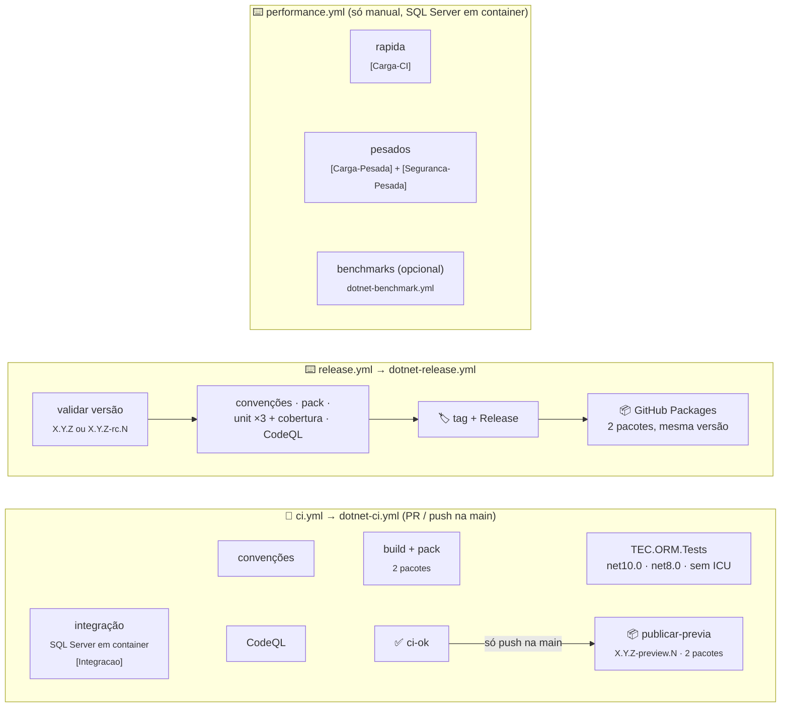
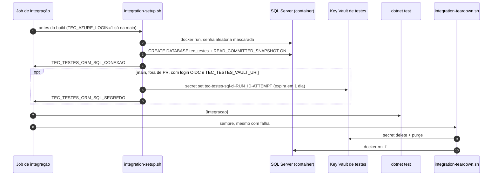

[🏠 TEC.ORM](../../README.md) › [📚 Documentação](../../docs/README.md) › ⚙️ CI/CD

# ⚙️ CI/CD e publicação

> Os três workflows do TEC.ORM são curtos: chamam os workflows reutilizáveis do
> [tec-workflows](https://github.com/tudoemcodigo/tec-workflows) e só declaram o que é deste repositório (solução, testes,
> SQL Server em container e o segredo temporário do Key Vault de testes).

## 📑 Sumário

- [🎯 Visão geral](#-visão-geral)
- [📂 Arquivos](#-arquivos)
- [🔀 ci.yml](#-ciyml)
- [🧪 Integração: SQL Server e Key Vault](#-integração-sql-server-e-key-vault)
- [📦 release.yml](#-releaseyml)
- [⏱️ performance.yml](#️-performanceyml)
- [🔑 Variables e Secrets](#-variables-e-secrets)
- [🚀 Como publicar](#-como-publicar)
- [🛡️ Segurança](#️-segurança)
- [❓ Solução de problemas](#-solução-de-problemas)

---

## 🎯 Visão geral

| Evento | Workflow | O que roda | Publica? |
|---|---|---|:---:|
| `pull_request` para a `main` / `merge_group` | `ci.yml` | Convenções, build + pack, unitários em matriz, integração (SQL Server em container) e CodeQL em paralelo → `ci-ok` | ❌ |
| `push` na `main` (merge) | `ci.yml` | O mesmo, **com** o login OIDC (integração também lendo a conexão do Key Vault de testes), e, com `ci-ok` verde, `publicar-previa` | ✅ `<Version>-preview.N` |
| `schedule` segunda 06:00 UTC / manual | `ci.yml` | O mesmo na `main`, **com** o login OIDC: integração também lendo a conexão do Key Vault de testes; CodeQL e auditoria com consultas/vulnerabilidades novas | ❌ |
| Manual (**Performance**) | `performance.yml` | Input `suite`: `pesadas` (padrão), `rapida` (`Carga-CI`) ou `todas`; benchmarks opcionais | ❌ |
| Manual (**Publicar versão**) | `release.yml` | Convenções, pack, unitários ×3 + cobertura e CodeQL, depois tag, Release e push dos 2 pacotes | ✅ `X.Y.Z` ou `-rc.N` |

Os testes de carga não rodam no PR nem na publicação: tempo de parede em runner compartilhado é ruidoso e não pode
bloquear PR nem versão.

> [!NOTE]
> Os antigos `codeql.yml` e `resumo-testes.py` foram **removidos**: o CodeQL roda dentro do CI central (`dotnet-ci.yml`)
> e o resumo dos testes é feito pela action `test-summary` do tec-workflows.

---

## 📂 Arquivos

| Arquivo | Função |
|---|---|
| [`ci.yml`](ci.yml) | Validação de PR, do push na `main` (com publicação da prévia) e semanal na `main`, com `dotnet-ci.yml@v1` |
| [`release.yml`](release.yml) | Publicação de versão estável ou `-rc.N`, com `dotnet-release.yml@v1` |
| [`performance.yml`](performance.yml) | Testes de carga só sob demanda, manual (`dotnet-test.yml@v1`), e benchmarks (`dotnet-benchmark.yml@v1`) |
| [`../scripts/integration-setup.sh`](../scripts/integration-setup.sh) | Sobe o SQL Server descartável (integração e `performance.yml`) e, na `main`, cria o segredo temporário no Key Vault |
| [`../scripts/integration-teardown.sh`](../scripts/integration-teardown.sh) | Apaga e purga o segredo e remove o container (sempre, mesmo com falha) |
| [`../dependabot.yml`](../dependabot.yml) · [`../zizmor.yml`](../zizmor.yml) | Canônicos do tec-workflows (não editar aqui) |

---

## 🔀 ci.yml

| Entrada | Valor |
|---|---|
| `solution` | `TEC.ORM.slnx` |
| `private-feed` | `true` (depende de `TEC.Core`, `TEC.Vault` e `TEC.Cqrs` do feed `tec-interno`) |
| `unit-tests` | `TEC.ORM.Tests /*/*/*/*[Category!=Integracao]` |
| `integration-tests` | `TEC.ORM.Tests /*/*/*/*[Category=Integracao]` |
| `integration-setup` / `integration-teardown` | `.github/scripts/integration-setup.sh` / `integration-teardown.sh` |
| `azure-client-id` / `azure-tenant-id` | `vars.AZURE_CLIENT_ID` / `vars.TEC_TESTES_TENANT_ID` |
| `azure-env` | `TEC_TESTES_VAULT_URI` e `TEC_TESTES_TENANT_ID`, aplicadas **só depois** do login no Azure |

- Unitários em matriz: `net10.0` (com cobertura), `net8.0` e `net10.0` sem ICU.
- Gatilhos: `pull_request` e `merge_group` para a `main`, `push` na `main`, `schedule` (segunda 06:00 UTC) e manual.
- Sem testes de carga: a `Carga-CI` (que precisa do SQL Server) roda só no job `rapida` do `performance.yml`, com os
  mesmos scripts de setup/teardown.
- Permissões: `contents: read` no topo; o job recebe `pull-requests`, `actions`, `security-events` (leitura),
  `packages: write` (só o `publicar-previa` publica, no push na `main`) e `id-token: write` (OIDC, usado só na `main`
  fora de PR).
- No push na `main`, depois do `ci-ok` verde, o job `publicar-previa` publica os 2 pacotes como
  `<Version do Directory.Build.props>-preview.N` (N sequencial por versão, reinicia a cada nova `<Version>`; ex.: `0.0.1-preview.3`). Se a tag `v<Version>` já existe,
  o CI não falha: valida tudo normalmente, o `build + pack` emite um `::notice::` e o `publicar-previa` é pulado (suba a
  `<Version>` para voltar a gerar prévias). Em PR nada é publicado.
- `concurrency` por ref no PR, cancelando execuções antigas do mesmo PR; fora de PR, um grupo por execução (nenhum push na `main` perde a prévia). PR só de documentação (docs, LICENSE, CHANGELOG,
  READMEs de `.github/`) pula os jobs pesados; os READMEs das pastas `TEC.ORM/` e `TEC.ORM.SqlServer/` vão no `.nupkg` e
  **não** contam como só documentação.

---

## 🧪 Integração: SQL Server e Key Vault

| Item | Como |
|---|---|
| SQL Server | `mcr.microsoft.com/mssql/server:2022-latest`, só em `127.0.0.1:1433`, senha `Tec1!` + 32 hex aleatórios por execução, passada por variável de ambiente (fora da linha de comando) e mascarada |
| Banco | `tec_testes` com `READ_COMMITTED_SNAPSHOT ON` (como no Azure SQL) |
| PR | Conexão em `TEC_TESTES_ORM_SQL_CONEXAO`, entregue ao TEC.Vault em memória; o teste do Key Vault se pula com motivo |
| `main` (OIDC) | A mesma conexão gravada num segredo **temporário e exclusivo da execução** (`tec-testes-sql-ci-$GITHUB_RUN_ID-$GITHUB_RUN_ATTEMPT`, expiração de 1 dia) e lida pelo TEC.Vault.AzureKeyVault, como em produção |
| Limpeza | O teardown apaga e purga o segredo (sem permissão de purga, ele expira sozinho) e remove o container |

---

## 📦 release.yml

Disparo manual (**Actions → Publicar versão → Run workflow**) com a entrada `versao` (`X.Y.Z` ou `X.Y.Z-rc.N`; prévias
saem do `ci.yml` no push na `main`).

| Entrada | Valor |
|---|---|
| `version` | `${{ inputs.versao }}` |
| `solution` / `private-feed` / `unit-tests` | Os mesmos do `ci.yml` |

Sequência: valida a versão (disparo **da `main`**; a tag `vX.Y.Z` não pode existir) → convenções, pack, unitários ×3
(com relatório de cobertura) e CodeQL em paralelo → só com **todos** verdes cria a tag e o Release e publica os 2
pacotes. Sem integração (já passou no PR e no push da `main`), sem SQL Server e sem carga.
`concurrency: publicar-versao`, sem cancelamento. Permissões: `contents: write`, `packages: write`,
`actions`/`security-events: read`, `id-token: write`.

---

## ⏱️ performance.yml

Só manual (`workflow_dispatch`): os testes de carga não rodam no PR nem na publicação, porque tempo de parede em runner
compartilhado é ruidoso e não pode bloquear PR nem versão.

| Input | Padrão | Variável repassada | Efeito |
|---|---|---|---|
| `suite` | `pesadas` | — | `pesadas` (job `pesados`), `rapida` (job `rapida`) ou `todas` |
| `soak_segundos` | `600` | `TEC_CARGA_SOAK_SEGUNDOS` | Duração do soak |
| `duracao_segundos` | `120` | `TEC_CARGA_DURACAO_SEGUNDOS` | Carga sustentada no SQL Server |
| `concorrencia` | `32` | `TEC_CARGA_CONCORRENCIA` | Workers da sustentada e do soak |
| `linhas` | `200000` | `TEC_CARGA_LINHAS` | Contas do teste de volume |
| `benchmarks` | `false` | — | Roda também o job de benchmarks |
| `benchmark_filtro` | `*` | — | Filtro do BenchmarkDotNet |

- Job `rapida` (`dotnet-test.yml`): `TEC.ORM.LoadTests [Carga-CI]` (segundos), com o SQL Server dos scripts de
  integração (`setup-script`/`teardown-script`) e artefato `carga`.
- Job `pesados` (`dotnet-test.yml`): `TEC.ORM.LoadTests [Carga-Pesada]` e `TEC.ORM.Tests [Seguranca-Pesada]`, com o SQL
  Server dos mesmos scripts, `timeout-minutes: 120` e artefato `pesados`. O relatório `carga.md` (em
  `TEC_CARGA_RELATORIOS`, definido pelo CI) vai para o resumo da execução.
- Job `benchmarks` (`dotnet-benchmark.yml`): `TEC.ORM.Benchmarks`, `net8.0` × `net10.0`, só quando `benchmarks = true`.

> [!TIP]
> Runner compartilhado tem ruído: compare **tendências** entre execuções, não números absolutos.

---

## 🔑 Variables e Secrets

Configurados **na organização** `tudoemcodigo` (*Settings → Secrets and variables*), com acesso aos repositórios `lib-tec-*`:

| Nome | Tipo | Uso |
|---|---|---|
| `AZURE_CLIENT_ID` | Variable | Application ID da aplicação federada de CI (OIDC) |
| `TEC_TESTES_TENANT_ID` | Variable | Tenant do login e do cofre de testes |
| `TEC_TESTES_VAULT_URI` | Variable | URI do Key Vault exclusivo de testes (`https://<cofre-de-testes>.vault.azure.net/`) |
| `PACKAGES_READ_TOKEN` | Secret **do Dependabot** | PAT classic `read:packages` para o Dependabot restaurar os TEC.* |

Nenhum Secret de Actions: o restore e a publicação usam o `GITHUB_TOKEN` efêmero, o banco é criado no job e o Azure usa
OIDC.

Configurar o login federado (uma vez)

1. Entra ID → *App registrations* → aplicação dedicada aos testes.
2. *Certificates & secrets* → **Federated credentials** → *GitHub Actions deploying Azure resources*: organização
   `tudoemcodigo`, repositório `lib-tec-orm`, entidade **Branch**, branch `main`. A organização usa o *subject* com IDs
   numéricos: `repo:tudoemcodigo@336660522/lib-tec-orm@<id-do-repositorio>:ref:refs/heads/main` (o ID sai de
   `gh api repos/tudoemcodigo/lib-tec-orm --jq .id`), issuer `https://token.actions.githubusercontent.com`, audience
   `api://AzureADTokenExchange`.
3. No cofre de testes → *Access control (IAM)*: um papel que permita **gravar e apagar** segredos (ex.: **Key Vault
   Secrets Officer**) para a aplicação, **somente nesse cofre**. A purga é opcional (sem ela, o segredo expira em 1 dia).
4. Crie as Variables da tabela acima.

---

## 🚀 Como publicar

1. `TEC.Core`, `TEC.Vault` e `TEC.Cqrs` já estão no feed na versão referenciada (o TEC.ORM é o último da ordem).
2. Regenere e commite os locks em modo pacote: `dotnet restore TEC.ORM.slnx --force-evaluate`.
3. Atualize o [CHANGELOG](../../CHANGELOG.md) e confira a `Version` do `Directory.Build.props`.
4. PR → `ci / ci-ok` verde → merge. O CI do push na `main` publica a prévia `<Version>-preview.N`.
5. Versão estável ou rc: **Actions → Publicar versão → Run workflow** (da `main`) com a versão (ex.: `0.0.1` ou
   `0.0.1-rc.1`).
6. Primeira publicação: em *Package settings* de cada pacote, visibilidade **pública** e acesso dos repositórios da
   organização.
7. Para gerar novas prévias depois de publicar `X.Y.Z`, suba a `Version` do `Directory.Build.props` para a próxima
   (com a tag `v<Version>` existente, o CI da `main` valida tudo, mas não publica prévia até esse ajuste).

| Pacote publicado | Pasta | Observação |
|---|---|---|
| `TEC.ORM` | `TEC.ORM/` | Inclui o gerador `TEC.ORM.Mapping.Generator` em `analyzers/dotnet/cs` |
| `TEC.ORM.SqlServer` | `TEC.ORM.SqlServer/` | — |

> [!IMPORTANT]
> Os dois pacotes saem sempre juntos e com a **mesma versão**: o satélite usa internos do núcleo (`InternalsVisibleTo`).
> O GitHub Packages não permite sobrescrever uma versão publicada.

---

## 🛡️ Segurança

| Controle | Como |
|---|---|
| Menor privilégio | `contents: read` no topo; escrita só no `release.yml` e no `publicar-previa` do `ci.yml` (`packages: write`, push na `main`); `id-token: write` só nos jobs de teste |
| Azure sem segredo | OIDC só na `main` e fora de PR; papel restrito ao cofre de testes; segredo temporário por execução, apagado e purgado |
| Banco descartável | Senha aleatória mascarada, container só em `127.0.0.1`, removido no teardown |
| Actions fixadas | Terceiros por SHA, tec-workflows por `v1`; `zizmor` audita; Dependabot com cooldown de 7 dias |
| Sem credencial no disco | `persist-credentials: false` em todo checkout (workflows centrais) |
| Sem pacote órfão | Tag + Release antes do push; release só com todos os portões verdes |
| Cadeia de suprimentos | `restore --locked-mode`, `NuGetAudit` como erro, `packageSourceMapping`, CodeQL `security-extended` |

---

## ❓ Solução de problemas

<code>O SQL Server não ficou pronto em 3 minutos</code>

O setup mostra as últimas 30 linhas do log do container. Normalmente é lentidão do runner: rode de novo.

Testes de integração pulados no PR

Só o `Connection_read_from_azure_key_vault_through_tec_vault` deve ser pulado em PR (não há login OIDC). Se todos
pularem, o setup não exportou `TEC_TESTES_ORM_SQL_CONEXAO`: veja o passo de preparação.

Falha "o segredo não pôde ser lido do Key Vault de testes" na main

A aplicação federada não tem permissão no cofre, a Variable `TEC_TESTES_VAULT_URI` está errada ou a credencial federada
não corresponde ao *subject* da `main`.

<code>NU1100</code>, <code>401</code> ou <code>403</code> ao restaurar os TEC.*

Pacote ainda não publicado, privado ou sem acesso deste repositório. Publique as dependências antes e libere o acesso em
*Package settings*.

<code>A tag vX.Y.Z já existe</code> / <code>Execute a partir da main</code>

Escolha outra versão ou dispare o **Publicar versão** selecionando a branch `main`.

Push na <code>main</code> não gerou prévia

A `Version` do `Directory.Build.props` já foi lançada (a tag `v<Version>` existe). O CI não falha: valida tudo
(convenções, build + pack, unitários, integração, CodeQL, `ci-ok`), o `build + pack` emite o aviso *"A versão X já foi
publicada (tag vX): nenhuma prévia gerada..."* e o `publicar-previa` é pulado. É o esperado quando o componente fica
numa versão publicada e recebe só correções. Para voltar a gerar prévias, abra um PR subindo a `Version` para a próxima.

---
[🏠 TEC.ORM](../../README.md) · [📚 Documentação](../../docs/README.md) · [🧪 Testes](../../docs/testes.md)
