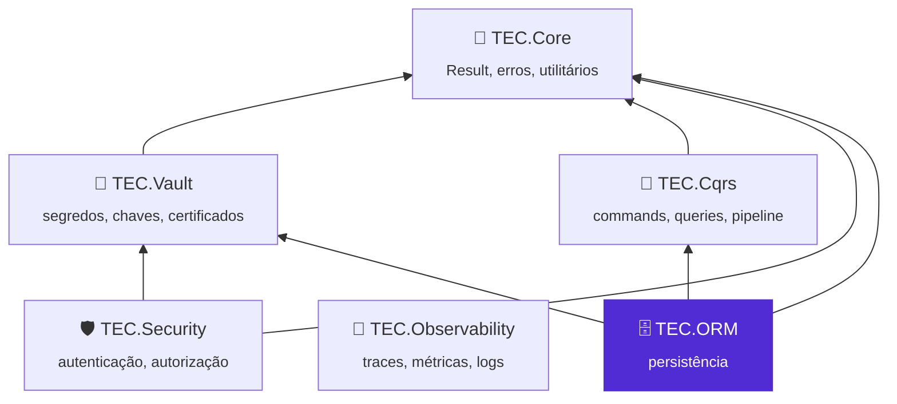
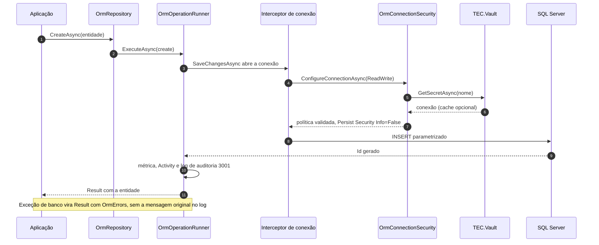

<div align="center">


# 🗄️ TEC.ORM

**Persistência padronizada e segura por padrão: CRUD para qualquer entidade, consultas SQL sempre parametrizadas, exclusão lógica, auditoria e conversão entidade ↔ DTO gerada na compilação, com a conexão lida só do cofre.**

EF Core · Dapper · SQL Server / Azure SQL · `Result` em vez de exceção · Exclusão lógica · Auditoria · Mapeamento por *source generator* · Novas tentativas seguras · .NET 8 e 10

[](https://github.com/tudoemcodigo/lib-tec-orm/actions/workflows/ci.yml)
[](#-compatibilidade)
[](#-compatibilidade)
[](CHANGELOG.md)
[](LICENSE)

[📥 Instalação](#-instalação) · [🚀 Início rápido](#-início-rápido) · [📚 Documentação](docs/README.md) · [📝 Changelog](CHANGELOG.md) · [⚙️ CI/CD](.github/workflows/README.md)

</div>

---

## 📑 Sumário

- [✨ Por que usar](#-por-que-usar)
- [📦 Pacotes](#-pacotes)
- [🧬 Ecossistema TEC](#-ecossistema-tec)
- [📥 Instalação](#-instalação)
- [🚀 Início rápido](#-início-rápido)
- [🗺️ Como funciona](#️-como-funciona)
- [📚 Documentação](#-documentação)
- [⚡ Compatibilidade](#-compatibilidade)
- [🛡️ Segurança](#️-segurança)
- [🧪 Testes](#-testes)
- [🤝 Contribuição](#-contribuição)
- [🏷️ Versionamento](#️-versionamento)
- [📄 Licença](#-licença)

---

## ✨ Por que usar

| Sem o TEC.ORM | Com o TEC.ORM |
|---|---|
| Um repositório escrito à mão por entidade | Um único `IOrmRepository<TEntity, TKey>` para qualquer entidade e tipo de chave: criar, ler, atualizar, excluir, buscar, listar paginado, existência, contagem e projeção para DTO |
| Exceções de banco vazando até a API | Todo método devolve `Result` com os códigos de `OrmErrors`; falhas de infraestrutura saem como 502 sem detalhes |
| String de conexão em `appsettings`, variável de ambiente ou log | A conexão é um **segredo lido do cofre** (TEC.Vault) na abertura, validado por uma política (criptografia obrigatória) |
| `WHERE IsDeleted = 0` esquecido; `DELETE` físico por engano | Exclusão lógica automática com filtro global; exclusão física só explícita, com aviso de build `TECORM014` e log `Warning` |
| `CreatedBy` preenchido à mão (ou esquecido) | Auditoria pela identidade (`ICurrentUser`), com falha fechada sem identidade |
| SQL concatenado com valores da requisição | `SqlQuery` sempre parametrizada, conexão somente leitura, SQL de escrita recusado e teto de linhas |
| Código de cópia entidade ↔ DTO ou mapeador por reflexão | `[MapFrom]` e o gerador escreve a conversão: `SELECT` só das colunas do DTO, aninhados, volta protegida contra *overposting*; **erro de mapeamento é erro de build** |
| Retry genérico que repete escritas e quebra transações | Novas tentativas **só em leituras fora de transação**, com espera exponencial; escritas nunca são repetidas |

- ✅ **Clean Architecture:** domínio e aplicação dependem só do `TEC.ORM` (compatível com Native AOT); EF Core, Dapper e
  SqlClient ficam no `TEC.ORM.SqlServer`.
- ✅ **Observável sem dependência:** `ActivitySource` e `Meter` `TEC.ORM` da BCL; o TEC.Observability apenas os assina.
- ✅ **Substituível:** todos os serviços com `TryAdd`; repositório e executor com membros `virtual`.

## 📦 Pacotes

| Pacote | Para que serve | Quando instalar | Depende de |
|---|---|---|---|
| [`TEC.ORM`](TEC.ORM/README.md) | Contratos (`IOrmRepository`, `IOrmQueryExecutor`, `SqlQuery`, `Specification<T>`, `PageRequest`, entidades, `OrmErrors`) e mapeamento entidade ↔ DTO. **Leva o gerador `TEC.ORM.Mapping.Generator`** em `analyzers/dotnet/cs` (não é pacote próprio) | Domínio, aplicação e todo projeto com DTOs `[MapFrom]` | `TEC.Core` |
| [`TEC.ORM.SqlServer`](TEC.ORM.SqlServer/README.md) | Implementação com EF Core e Dapper, conexão do cofre, exclusão lógica, auditoria, `IUnitOfWork`, resiliência, telemetria e health check | Infraestrutura e host (API, worker) | `TEC.ORM`, `TEC.Vault`, `TEC.Cqrs`, EF Core (8.x no `net8.0`, 10.x no `net10.0`), Dapper |

> [!IMPORTANT]
> **Use `TEC.ORM` e `TEC.ORM.SqlServer` na mesma versão.** O satélite usa tipos internos do núcleo (`InternalsVisibleTo`)
> e os dois são publicados juntos, com a mesma versão. Misturar versões pode falhar em execução com
> `MissingMethodException` ou `TypeLoadException`.

## 🧬 Ecossistema TEC



| Componente | Relação com o TEC.ORM |
|---|---|
| 🧰 [TEC.Core](https://github.com/tudoemcodigo/lib-tec-core) | Dependência: `Result`/`Error`, `PagedResult`, `Guard`, `ICurrentUser`, `InvalidConfigurationException`, `SensitiveDataMasker` |
| 🔐 [TEC.Vault](https://github.com/tudoemcodigo/lib-tec-vault) | Dependência do `TEC.ORM.SqlServer`: a conexão vem **sempre** de um cofre (`ISecretReader`), com cache opcional |
| 🧭 [TEC.Cqrs](https://github.com/tudoemcodigo/lib-tec-cqrs) | Dependência do `TEC.ORM.SqlServer`: `OrmUnitOfWork` implementa o `IUnitOfWork`; cada command roda numa transação e um command aninhado que falha desfaz o pai |
| 🛡️ [TEC.Security](https://github.com/tudoemcodigo/lib-tec-security) | Sem dependência: registra o `ICurrentUser` que a auditoria grava |
| 📡 [TEC.Observability](https://github.com/tudoemcodigo/lib-tec-observability) | Sem dependência: `AddTecObservability` já assina as fontes `TEC.*` (inclusive `TEC.ORM`); o health check `tec-orm` entra no `/health/ready` |

## 📥 Instalação

Os pacotes estão no **GitHub Packages** da organização `tudoemcodigo`, que exige autenticação mesmo para leitura. Crie um
PAT *classic* com o escopo `read:packages`, registre a origem `tec-interno` e instale:

```bash
dotnet nuget add source https://nuget.pkg.github.com/tudoemcodigo/index.json -n tec-interno -u <usuario> -p <PAT>

dotnet add package TEC.ORM.SqlServer --version 0.0.1   # infraestrutura/host (traz o TEC.ORM)
dotnet add package TEC.ORM --version 0.0.1             # domínio/aplicação: abstrações + mapeamento
```

> [!IMPORTANT]
> Versão atual: **0.0.1** (ainda não publicada). Mapeie `TEC.*` só para a origem `tec-interno` no `nuget.config` da
> aplicação (`packageSourceMapping`) contra *dependency confusion*. O gerador exige Visual Studio 17.12 / .NET SDK
> 9.0.100 ou mais novo.

## 🚀 Início rápido

**1. Guarde a conexão no cofre** (fora do código), com servidor, banco e criptografia:
`Server=<servidor>;Database=<banco>;User ID=<login>;Password=<senha>;Encrypt=True`.

**2. Registre o TEC.Vault e o TEC.ORM:**

```csharp
using TEC.ORM.SqlServer.DependencyInjection;
using TEC.ORM.SqlServer.HealthChecks;
using TEC.Vault.AzureKeyVault;
using TEC.Vault.DependencyInjection;

builder.Services.AddTecVault(vault => vault
    .UseAzureKeyVault(o => o.VaultUri = new Uri("https://<nome-do-cofre>.vault.azure.net/"))
    .EnableSecretCache(TimeSpan.FromMinutes(5)));

builder.Services.AddTecOrm<SalesContext>(orm =>
{
    orm.ConnectionSecretName = "sales-sql-rw";           // NOME do segredo, não a conexão
    orm.ReadOnlyConnectionSecretName = "sales-sql-ro";   // recomendado: login só com SELECT
});

builder.Services.AddHealthChecks().AddTecOrm();
```

**3. Declare entidade, DTO e contexto:**

```csharp
using Microsoft.EntityFrameworkCore;
using TEC.ORM.Entities;
using TEC.ORM.Mapping;
using TEC.ORM.SqlServer.SoftDelete;

public sealed class Customer : Entity<Guid>                    // Id + IsDeleted/DeletedAt
{
    public string Name { get; set; } = "";
    public string Email { get; set; } = "";
}

[MapFrom(typeof(Customer))]
public partial class CustomerDto                               // o gerador completa a classe
{
    public Guid Id { get; set; }
    public string Name { get; set; } = "";
    public string Email { get; set; } = "";
}

public sealed class SalesContext(DbContextOptions<SalesContext> options) : OrmDbContext(options)
{
    public DbSet<Customer> Customers => Set<Customer>();

    protected override void OnModelCreating(ModelBuilder modelBuilder) =>
        modelBuilder.Entity<Customer>(e =>
        {
            e.HasIndex(c => c.Email).IsUnique().HasFilter("[IsDeleted] = 0");
            e.HasSoftDelete();
        });
}
```

**4. Use o repositório:**

```csharp
using TEC.Core.Common.Results;
using TEC.ORM.Abstractions;

app.MapPost("/clientes", async (CustomerDto input, IOrmRepository<Customer, Guid> customers, CancellationToken ct) =>
{
    var created = await customers.CreateAsync(input.ToEntity(), ct);   // Id nunca vem do DTO; ORM_CONFLITO se o e-mail existe
    return created.IsSuccess
        ? Results.Created($"/clientes/{created.Value.Id}", created.Value.ToCustomerDto())
        : Results.Problem(statusCode: created.Error!.Type.ToHttpStatusCode(), title: created.Error.Code);
});

app.MapGet("/clientes/{id:guid}", async (Guid id, IOrmRepository<Customer, Guid> customers, CancellationToken ct) =>
    await customers.GetByIdAsync<CustomerDto>(id, ct) is { IsSuccess: true } found
        ? Results.Ok(found.Value)
        : Results.NotFound());
```

Opções inválidas derrubam a **subida** (`InvalidConfigurationException`, sem valores). Detalhes em
[🗄️ SQL Server](docs/sqlserver.md) e [📝 Repositório](docs/repositorio-crud.md).

## 🗺️ Como funciona



| Peça | Pacote | Responsabilidade |
|---|---|---|
| `IOrmRepository<,>` / `OrmRepository<,>` | `TEC.ORM` / `TEC.ORM.SqlServer` | CRUD, busca, listagem, projeção para DTO |
| `IOrmQueryExecutor` / `OrmQueryExecutor` | `TEC.ORM` / `TEC.ORM.SqlServer` | Leituras complexas parametrizadas, somente leitura, com teto de linhas |
| `IOrmOperationRunner` / `OrmOperationRunner` | `TEC.ORM.SqlServer` | `Result`, novas tentativas, log de auditoria, trace e métrica |
| `IOrmConnectionSecurity` / `OrmConnectionSecurity` | `TEC.ORM.SqlServer` | Conexão a partir do segredo, com política |
| `OrmUnitOfWork` | `TEC.ORM.SqlServer` | `IUnitOfWork` do TEC.Cqrs sobre o `DbContext` |
| `TEC.ORM.Mapping.Generator` | dentro do `TEC.ORM` | Mapeamento gerado e diagnósticos `TECORMxxx` |

## 📚 Documentação

| Arquivo | O que responde |
|---|---|
| [📝 Repositório genérico](docs/repositorio-crud.md) | Como fazer CRUD, exclusão física com alerta, projeção para DTO e especializar o repositório |
| [🔎 Especificações e paginação](docs/especificacoes-e-paginacao.md) | Como montar critérios, paginar e restringir a ordenação com `[Sortable]` |
| [📊 Consultas SQL](docs/consultas-sql.md) | Como escrever leituras complexas seguras com `SqlQuery`, limites e join |
| [🗑️ Exclusão lógica](docs/exclusao-logica.md) | Como o filtro global e a propagação funcionam; database first; restauração |
| [🕵️ Auditoria](docs/auditoria.md) | Como a autoria é gravada e de onde vem a identidade em cada cenário |
| [🔁 Transação](docs/transacao.md) | Como agrupar escritas com o `IUnitOfWork` e o pipeline do TEC.Cqrs |
| [🔄 Mapeamento](docs/mapeamento.md) | Como declarar DTOs, aninhados, ciclos, conversores e `ApplyTo`/`ToEntity` |
| [🛑 Diagnósticos do gerador](docs/diagnosticos-do-gerador.md) | O que significa cada `TECORMxxx` e como corrigir |
| [🗄️ SQL Server](docs/sqlserver.md) | Registro, conexão do cofre, política, health check e vários contextos |
| [⚙️ Opções](docs/opcoes.md) | Todas as opções, padrões e limites |
| [🔁 Resiliência](docs/resiliencia.md) | Novas tentativas, falhas transitórias (Azure SQL), pool esgotado e limites |
| [📈 Observabilidade](docs/observabilidade.md) | Traces, métricas e eventos de log |
| [❌ Erros](docs/erros.md) | Códigos de `OrmErrors` e tradução das exceções do banco |
| [🛡️ Segurança](docs/seguranca.md) | Ameaças, controles, responsabilidades e checklist de produção |
| [🧪 Testes](docs/testes.md) | Categorias, como rodar local e variáveis `TEC_TESTES_*`/`TEC_CARGA_*` |
| [💻 Desenvolvimento local](docs/desenvolvimento.md) | Como compilar (feed `tec-interno` por padrão, repositórios vizinhos sob demanda) e regenerar lock files |
| [⚙️ CI/CD](.github/workflows/README.md) | Workflows, Variables/Secrets e como publicar |

## ⚡ Compatibilidade

| Item | Suporte |
|---|---|
| .NET | `net8.0` e `net10.0` (LTS); EF Core 8.x e 10.x respectivamente |
| Native AOT / trimming | ✅ `TEC.ORM` (o mapeamento gerado não usa reflexão) · ❌ `TEC.ORM.SqlServer` (EF Core e Dapper) |
| Sem ICU (`InvariantGlobalization`) | ✅ `TEC.ORM` · ❌ `TEC.ORM.SqlServer` (o SqlClient exige ICU) |
| Banco | SQL Server (testado com 2022 no CI) e Azure SQL (erros transitórios do Azure tratados) |
| Compilador | Visual Studio 17.12 / .NET SDK 9.0.100+ (Roslyn 4.12) para o gerador; C# 11+ |
| Sistemas | Windows, Linux e macOS |

## 🛡️ Segurança

Conexão só do cofre e validada; nenhum SQL, valor, servidor ou mensagem do banco em logs, traces ou mensagens de erro;
`SortBy` em lista branca; leituras complexas parametrizadas, somente leitura e com teto de linhas; identificadores no log
sem caracteres de controle ou de formatação (ou com HMAC); auditoria com falha fechada; mapeamento sem *overposting*.

> [!CAUTION]
> Conexão entregue já com servidor (`UseSqlServer("Server=...")`) pula a política do segredo. Modelo de ameaças e
> checklist: [docs/seguranca.md](docs/seguranca.md). Vulnerabilidades: não abra *issue* pública; escreva para
> [roberto@roberto.inf.br](mailto:roberto@roberto.inf.br).

## 🧪 Testes

```bash
dotnet test --project TEC.ORM.Tests -c Release --treenode-filter "/*/*/*/*[Category!=Integracao]"                # unitários
dotnet test --project TEC.ORM.Tests -c Release -f net10.0 --treenode-filter "/*/*/*/*[Category=Integracao]"      # com SQL Server
dotnet test --project TEC.ORM.LoadTests -c Release -f net10.0 --treenode-filter "/*/*/*/*[Category=Carga-CI]"    # carga rápida
```

**288** testes unitários em `net10.0` e **286** em `net8.0` (também sem ICU), **40** de integração com SQL Server real
(+1 que só roda na `main`, com o Key Vault de testes) a cada PR; **13** de carga rápida (`Carga-CI`), carga pesada,
soak, volume e fuzzing diferencial estendido só sob demanda, no `performance.yml` manual. Os testes com banco usam
`TEC_TESTES_ORM_SQL_CONEXAO` e se pulam com motivo sem ela. Detalhes em [docs/testes.md](docs/testes.md).

## 🤝 Contribuição

Branch a partir da `main` → código **e** testes (inclusive o caminho inválido) → `dotnet test` nos dois alvos → CHANGELOG
e `docs/` atualizados → pull request com o check `ci / ci-ok` verde. Regras novas do gerador entram em
`TEC.ORM.Mapping.Generator/AnalyzerReleases.Unshipped.md`. Como compilar (credencial do feed `tec-interno`, modo local
com `-p:TecUseLocalProjects=true`): [docs/desenvolvimento.md](docs/desenvolvimento.md).

## 🏷️ Versionamento

[SemVer](https://semver.org/lang/pt-BR/), **uma versão para os dois pacotes** (`Directory.Build.props`), sempre
publicados juntos (o gerador vai dentro do `TEC.ORM`, na mesma versão). Enquanto for `0.x`, mudanças incompatíveis podem
ocorrer em versões MINOR. Cada merge na `main` publica a prévia `<Version>-preview.N`; versões estáveis e `-rc.N` saem
só pelo workflow **Publicar versão** ([CI/CD](.github/workflows/README.md)).

## 📄 Licença

[MIT](LICENSE) · Criado e mantido por **Roberto Oliveira**, equipe **Tudo em Código** · [github.com/tudoemcodigo](https://github.com/tudoemcodigo)
