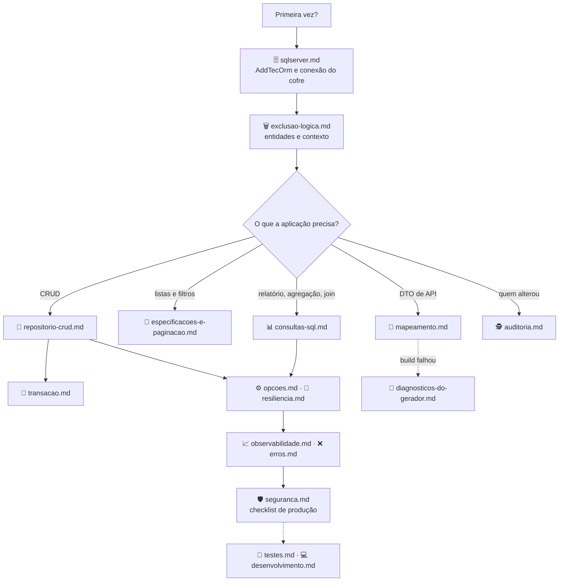

[🏠 TEC.ORM](../README.md) › 📚 Documentação

# 📚 Documentação do TEC.ORM

> Referência completa dos pacotes `TEC.ORM` (abstrações e mapeamento entidade ↔ DTO, com o gerador embutido) e
> `TEC.ORM.SqlServer` (EF Core + Dapper): como usar, opções, erros e cuidados de segurança, conferidos com o código.

## 📑 Sumário

- [🗂️ Temas](#️-temas)
- [🗺️ Mapa dos temas](#️-mapa-dos-temas)
- [📐 Convenções desta documentação](#-convenções-desta-documentação)

---

## 🗂️ Temas

| # | Tema | O que responde |
|:-:|---|---|
| 1 | [📝 Repositório genérico (CRUD)](repositorio-crud.md) | `IOrmRepository<TEntity, TKey>`, `OrmRepositoryExtensions` e `OrmRepository<TEntity, TKey>`: criar, ler, atualizar, excluir (lógica e física), buscar, listar, projetar para DTO e especializar |
| 2 | [🔎 Especificações e paginação](especificacoes-e-paginacao.md) | `Specification<T>`, `PageRequest`, `[Sortable]` e como a listagem monta a consulta |
| 3 | [📊 Consultas SQL](consultas-sql.md) | `IOrmQueryExecutor`, `SqlQuery`, `MaxQueryRows`, join com `splitOn` e verificação de somente leitura |
| 4 | [🗑️ Exclusão lógica](exclusao-logica.md) | `ISoftDelete`, `Entity<TKey>`, `OrmDbContext`, convenções, filtro global (EF 8/10) e propagação |
| 5 | [🕵️ Auditoria](auditoria.md) | `IAuditable`, `AuditableEntity<TKey>`, `OrmIdentity`, `UseTecOrmIdentity` e identidade em cada cenário |
| 6 | [🔁 Transação](transacao.md) | `OrmUnitOfWork` (`IUnitOfWork` do TEC.Cqrs), commands aninhados e uso manual |
| 7 | [🔂 Idempotência](idempotencia.md) | `EfIdempotencyStore<TContext>`, `AddTecIdempotency`, `AddTecOrmIdempotency` e limpeza: `Idempotency-Key` com reserva atômica no banco |
| 8 | [🔄 Mapeamento entidade ↔ DTO](mapeamento.md) | `[MapFrom]` e demais atributos, conversões, aninhados, coleções, `MaxDepth`, conversores, `ApplyTo`/`ToEntity` |
| 9 | [🛑 Diagnósticos do gerador](diagnosticos-do-gerador.md) | Todos os `TECORM001`–`TECORM016`: mensagem, exemplo e correção |
| 10 | [🗄️ SQL Server](sqlserver.md) | `AddTecOrm`, `UseTecOrm`, conexão do cofre e política, health check, vários contextos e extensão |
| 11 | [⚙️ Opções](opcoes.md) | `OrmOptions`, `IdentifierLogMode`, limites e `appsettings.json` |
| 12 | [🔁 Resiliência](resiliencia.md) | Novas tentativas só em leituras, falhas transitórias (Azure SQL), pool esgotado e limites |
| 13 | [📈 Observabilidade](observabilidade.md) | `IOrmOperationRunner`, `OrmOperation`, `OrmDiagnostics`, traces, métricas e eventos de log |
| 14 | [❌ Erros](erros.md) | `OrmErrors`: códigos, `ErrorType`, HTTP e tradução das exceções do banco |
| 15 | [🛡️ Segurança](seguranca.md) | Ameaças e controles, o que nunca é registrado, responsabilidades e checklist de produção |
| 16 | [🧪 Testes](testes.md) | Categorias, como rodar local, SQL Server descartável, variáveis `TEC_TESTES_*`/`TEC_CARGA_*` e suítes |
| 17 | [💻 Desenvolvimento local](desenvolvimento.md) | Compilar (feed `tec-interno` por padrão, repositórios vizinhos sob demanda), empacotar e regenerar lock files |

Fora de `docs/`: [⚙️ CI/CD](../.github/workflows/README.md) · [📝 Changelog](../CHANGELOG.md) · READMEs dos pacotes
([TEC.ORM](../TEC.ORM/README.md), [TEC.ORM.SqlServer](../TEC.ORM.SqlServer/README.md)).

---

## 🗺️ Mapa dos temas

---

## 📐 Convenções desta documentação

| Convenção | Significado |
|---|---|
| Fonte da verdade | O código atual de `TEC.ORM`, `TEC.ORM.SqlServer` e `TEC.ORM.Mapping.Generator` |
| Estrutura | Breadcrumb, 📑 Sumário, 🎯 Visão geral, 🚀 Uso, ⚙️ Opções, ❌ Erros, 🛡️ Segurança, ❓ Perguntas frequentes e rodapé de navegação |
| Exemplos | Domínio fictício de vendas (`Customer`, `Order`, `Product`, `Account`, `SalesContext`): tipos da aplicação, não da biblioteca. Identificadores em inglês; comentários e mensagens em português |
| `Result`, `Error`, `ErrorType`, `PagedResult`, `ICurrentUser` | Vêm do [TEC.Core](https://github.com/tudoemcodigo/lib-tec-core) |
| Status HTTP por `ErrorType` | `Validation` 400 · `Unauthorized` 401 · `NotFound` 404 · `Conflict` 409 · `Failure` 500 · `ExternalService` 502 (🔒 mensagem oculta do cliente) |
| Configuração inválida | Falha na **inicialização** (`AddTecOrm`), não na primeira requisição |
| Placeholders | Valores entre `< >` (`<nome-do-cofre>`, `<usuario>`, `<PAT>`) são do seu ambiente |
| Alertas | `[!NOTE]` comportamento · `[!TIP]` boa prática · `[!IMPORTANT]` requisito · `[!WARNING]` armadilha · `[!CAUTION]` risco de segurança ou perda de dados |

---
[🏠 README](../README.md) · [📝 Repositório genérico](repositorio-crud.md) ➡️
