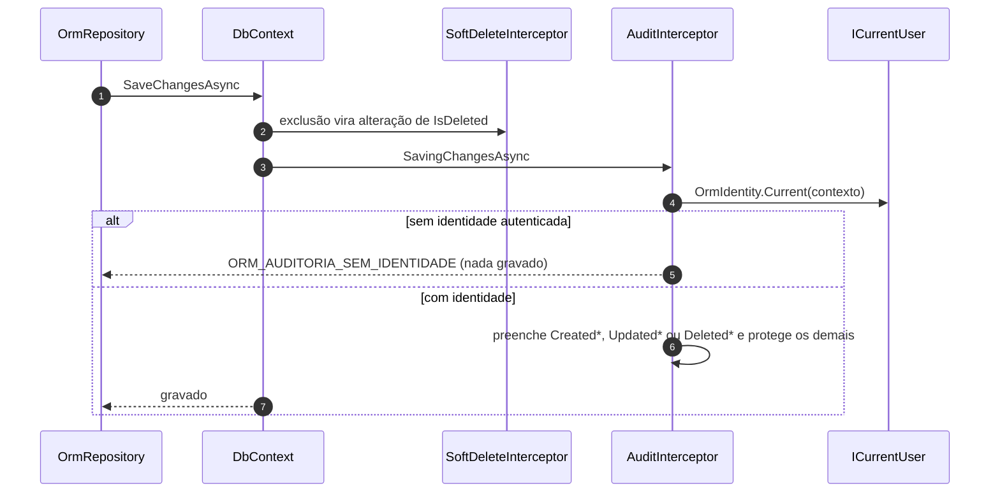

[🏠 TEC.ORM](../README.md) › [📚 Documentação](README.md) › 🕵️ Auditoria

# 🕵️ Auditoria

> Quem criou, alterou e excluiu cada registro, de qual tenant e quando, gravado pelo próprio ORM a partir do
> `ICurrentUser` do TEC.Core, com falha fechada quando não há identidade.

## 📑 Sumário

- [🎯 Visão geral](#-visão-geral)
- [🚀 Uso](#-uso)
  - [IAuditable e AuditableEntity](#iauditable-e-auditableentity)
  - [Configuração por cenário](#configuração-por-cenário)
  - [OrmIdentity e UseTecOrmIdentity](#ormidentity-e-usetecormidentity)
  - [Regras ao gravar](#regras-ao-gravar)
  - [Migração do banco](#migração-do-banco)
- [⚙️ Opções](#️-opções)
- [❌ Erros](#-erros)
- [🛡️ Segurança](#️-segurança)
- [❓ Perguntas frequentes](#-perguntas-frequentes)

---

## 🎯 Visão geral

O TEC.ORM **não depende** do TEC.Security: qualquer implementação de `ICurrentUser` (TEC.Core, `TEC.Core.Security`) serve.
O [TEC.Security](https://github.com/tudoemcodigo/lib-tec-security) registra a dele, inclusive para workers.

| Operação | Quando | Quem (`ICurrentUser.Id`) | Tenant de quem fez (`ICurrentUser.TenantId`) |
|---|---|---|---|
| Criação | `CreatedAt` | `CreatedBy` | `CreatedByTenant` |
| Última alteração | `UpdatedAt` | `UpdatedBy` | `UpdatedByTenant` |
| Exclusão lógica | `DeletedAt` (de `ISoftDelete`) | `DeletedBy` | `DeletedByTenant` |



> [!IMPORTANT]
> **Os registros são globais.** O tenant é só informação de auditoria: o ORM **não** filtra consultas nem restringe
> gravações por tenant ou usuário. Quem pode ler ou alterar o quê é decidido pela aplicação.

---

## 🚀 Uso

### IAuditable e AuditableEntity

> `TEC.ORM.Entities` · `interface IAuditable` / `abstract class AuditableEntity<TKey>` · pacote `TEC.ORM`

| Membro | Tipo | Descrição |
|---|---|---|
| `CreatedAt` | `DateTimeOffset` | Quando foi criada (UTC) |
| `CreatedBy` / `CreatedByTenant` | `string?` | Id e tenant de quem criou |
| `UpdatedAt` | `DateTimeOffset?` | Última alteração (UTC); `null` se nunca foi alterada |
| `UpdatedBy` / `UpdatedByTenant` | `string?` | Id e tenant de quem alterou por último |
| `DeletedBy` / `DeletedByTenant` | `string?` | Id e tenant de quem excluiu logicamente |

`AuditableEntity<TKey>` = `Entity<TKey>` + `IAuditable`, todos com `set` privado.

```csharp
using TEC.ORM.Entities;

public sealed class Order : AuditableEntity<Guid>
{
    public string Number { get; set; } = string.Empty;
}

// Database first: a entidade gerada implementa as interfaces numa partial
public partial class Product : IEntity<int>, ISoftDelete, IAuditable { }
```

Os "por" guardam `ICurrentUser.Id`: identificador **estável** (`oid` do Entra ID, `apikey:{id}`, `system:{nome}`), nunca
nome ou e-mail. O mapeamento gerado (`ApplyTo`/`ToEntity`) nunca copia esses campos.

### Configuração por cenário

| Cenário | O que fazer |
|---|---|
| Contexto registrado com `AddTecOrm<TContext>` | Nada: o contexto recebe o `ICurrentUser` **do escopo de DI** (o mesmo da requisição) |
| `AddDbContextFactory` ou contexto montado à mão com `optionsBuilder.UseTecOrm(provider)` | Nada para `ICurrentUser` **ambiental** (as implementações do TEC.Security leem o usuário do `HttpContext` ou do `AsyncLocal`): a cada gravação o `UseTecOrm` resolve o `ICurrentUser` num escopo próprio e guarda uma **cópia imutável** (tipo, id e tenant) antes de descartar o escopo |
| `ICurrentUser` que depende de **estado do escopo da requisição** (preenchido por um middleware num serviço *scoped*, por exemplo) | Chame `UseTecOrmIdentity(() => ...)` **depois** do `UseTecOrm`, entregando a identidade certa |
| Testes, ferramentas, importadores | `UseTecOrmIdentity(() => systemUser)` com uma identidade de sistema (`Id = "system:importador"`) |

> [!WARNING]
> Com `UseTecOrm`, o `ICurrentUser` resolvido num escopo novo **não** enxerga o estado *scoped* da requisição. Se a sua
> implementação depende dele, use `UseTecOrmIdentity`; senão a gravação falha com `ORM_AUDITORIA_SEM_IDENTIDADE` (falha
> fechada, nunca grava a identidade errada).

```csharp
using TEC.ORM.SqlServer.Auditing;
using TEC.ORM.SqlServer.DependencyInjection;

builder.Services.AddDbContextFactory<ReportsContext>((sp, options) => options
    .UseTecOrm(sp)                                                  // pipeline e conexão do contexto principal
    .UseTecOrmIdentity(() => sp.GetRequiredService<IHttpContextAccessor>().HttpContext?.RequestServices
        .GetService<ICurrentUser>()));                              // identidade do escopo da requisição atual
```

### OrmIdentity e UseTecOrmIdentity

> `TEC.ORM.SqlServer.Auditing` · `static class OrmIdentity` · pacote `TEC.ORM.SqlServer`

| Membro | Retorno | Descrição |
|---|---|---|
| `Current(DbContext context)` | `ICurrentUser?` | Identidade atual do contexto; `null` se ele não foi configurado pelo TEC.ORM ou não há `ICurrentUser` |
| `UseTecOrmIdentity(this DbContextOptionsBuilder builder, Func<ICurrentUser?> currentUser)` | `DbContextOptionsBuilder` | Informa de onde vem a identidade; a função é chamada **a cada gravação** |

```csharp
var options = new DbContextOptionsBuilder<SalesContext>()
    .UseTecOrm(provider)                         // requer AddTecOrm no provider
    .UseTecOrmIdentity(() => systemUser)         // ICurrentUser com Id "system:importador"
    .Options;

await using var db = new SalesContext(options);
ICurrentUser? current = OrmIdentity.Current(db);
```

### Regras ao gravar

O `AuditInterceptor` (interno) roda **depois** do interceptor de exclusão lógica, para toda entidade `IAuditable`
adicionada, alterada ou excluída:

| Situação | Comportamento |
|---|---|
| Sem identidade autenticada (`ICurrentUser` ausente, anônimo ou sem `Id`) | **Recusa** com `ORM_AUDITORIA_SEM_IDENTIDADE`; nada é gravado |
| Criação | `CreatedAt`/`CreatedBy`/`CreatedByTenant` do relógio (`TimeProvider`) e da identidade; o que vier no objeto é ignorado; campos de alteração e exclusão zerados |
| Alteração | Grava `UpdatedAt`/`UpdatedBy`/`UpdatedByTenant`; criação e exclusão ficam fora do `UPDATE` |
| Exclusão lógica | Grava `DeletedBy`/`DeletedByTenant`; os de alteração ficam fora do `UPDATE` |
| Identidade sem tenant | Grava com os "por tenant" `null` |

### Migração do banco

A convenção (aplicada por `AddTecOrm`/`UseTecOrm`, `OrmDbContext` e `AddTecOrmConventions`) define, quando a entidade não
define outro tamanho, `CreatedBy`/`UpdatedBy`/`DeletedBy` com até 256 caracteres e os `*ByTenant` com até 64, todas
anuláveis. Em tabelas existentes, adicione as colunas com valor inicial (`CreatedAt` = data da migração, `CreatedBy` =
`system:migracao`) antes de trocar a base da entidade.

---

## ⚙️ Opções

Não há opção em `OrmOptions`. O relógio é o `TimeProvider` registrado e a identidade é a de `UseTecOrmIdentity` (o
`AddTecOrm` e o `UseTecOrm` a configuram).

---

## ❌ Erros

| Código | Quando ocorre | O que fazer |
|---|---|---|
| `ORM_AUDITORIA_SEM_IDENTIDADE` (HTTP 401) | Escrita de entidade auditada sem identidade autenticada | Autenticar a requisição; em workers, usar identidade de sistema ou `UseTecOrmIdentity` |

---

## 🛡️ Segurança

- **Falha fechada:** sem identidade, nada é gravado (nunca "anônimo").
- **Sem autoria forjada:** valores enviados no objeto são ignorados; os campos de criação nunca entram no `UPDATE`.
- **Cópia imutável no `UseTecOrm`:** a auditoria nunca usa um `ICurrentUser` de escopo já descartado.

> [!CAUTION]
> Nunca use nome ou e-mail como `ICurrentUser.Id`: são dados pessoais e mudam. Use o identificador estável do provedor.

---

## ❓ Perguntas frequentes

<details>
<summary>Como consultar as colunas de auditoria com SQL próprio?</summary>

São colunas comuns: `SELECT Id, UpdatedBy, UpdatedByTenant, UpdatedAt FROM Orders WHERE UpdatedAt >= @Since AND IsDeleted = 0`
pelo `IOrmQueryExecutor`.

</details>

<details>
<summary>Uma identidade de outro tenant consegue alterar o registro?</summary>

Sim: os registros são globais e o ORM não restringe por tenant. A autorização é da aplicação (por exemplo, com o pipeline
do TEC.Cqrs).

</details>

---
⬅️ [🗑️ Exclusão lógica](exclusao-logica.md) · [📚 Índice](README.md) · [🔁 Transação](transacao.md) ➡️
