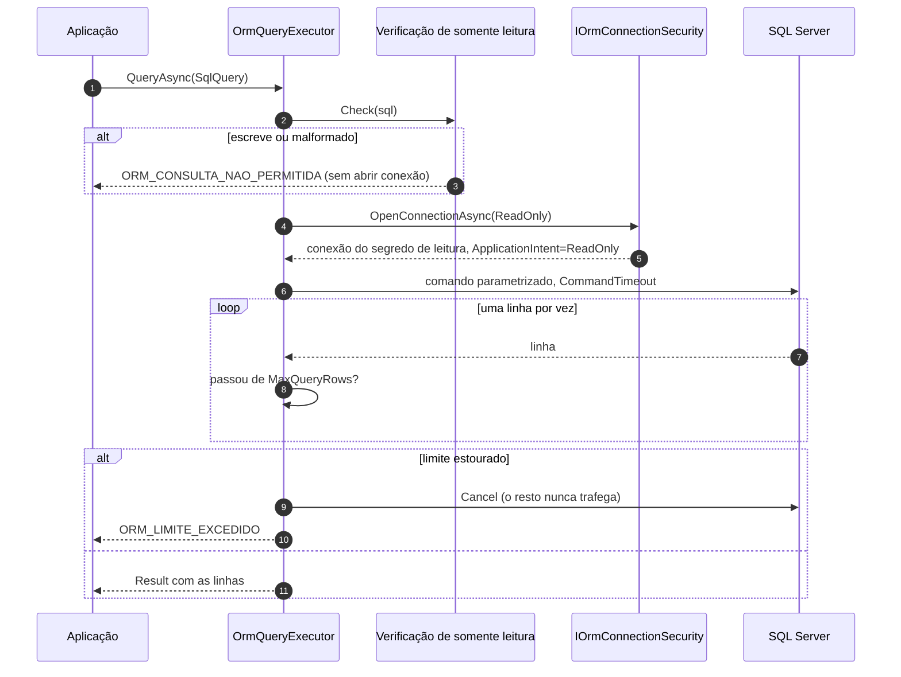
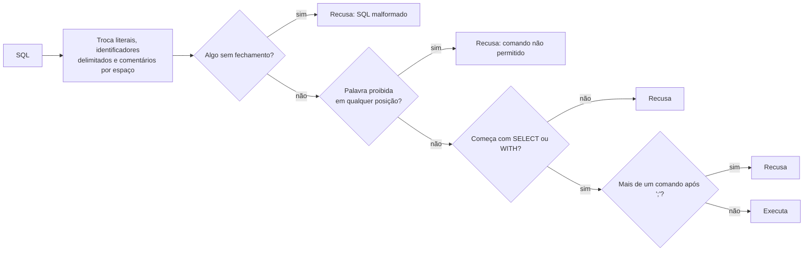

[🏠 TEC.ORM](../README.md) › [📚 Documentação](README.md) › 📊 Consultas SQL

# 📊 Consultas SQL

> Leituras complexas (agregações, joins, relatórios) com SQL escrito à mão, mas sempre parametrizado, executadas numa
> conexão somente leitura, com teto de linhas e recusadas se tentarem escrever.

## 📑 Sumário

- [🎯 Visão geral](#-visão-geral)
- [🚀 Uso](#-uso)
  - [IOrmQueryExecutor](#iormqueryexecutor)
  - [SqlQuery](#sqlquery)
  - [OrmQueryExecutor (Dapper)](#ormqueryexecutor-dapper)
  - [Limite de linhas](#limite-de-linhas)
  - [Verificação de somente leitura](#verificação-de-somente-leitura)
- [⚙️ Opções](#️-opções)
- [❌ Erros](#-erros)
- [🛡️ Segurança](#️-segurança)
- [❓ Perguntas frequentes](#-perguntas-frequentes)

---

## 🎯 Visão geral



| Característica | Detalhe |
|---|---|
| Entrada | Só `SqlQuery` (sempre parametrizada): não existe sobrecarga com `string` solta |
| Conexão | `OrmConnectionKind.ReadOnly`: segredo `ReadOnlyConnectionSecretName` (ou o principal) com `ApplicationIntent=ReadOnly`; uma conexão por chamada (o pool reaproveita) |
| Transação | **Não** participa da transação do EF Core / `IUnitOfWork` |
| Exclusão lógica | **Não** aplica o filtro global: escreva `IsDeleted = 0` no SQL |
| Limites | `CommandTimeoutSeconds` e `MaxQueryRows`; resultado lido em fluxo, sem carregar tudo antes |
| Resiliência | Sempre leitura e conexão própria: repetida em falha transitória ([🔁 Resiliência](resiliencia.md)) |

---

## 🚀 Uso

### IOrmQueryExecutor

> `TEC.ORM.Abstractions` · `interface` · pacote `TEC.ORM` · registrado como *scoped* pelo `AddTecOrm`

| Membro | Retorno | Descrição |
|---|---|---|
| `QueryAsync<T>(SqlQuery query, CancellationToken ct = default)` | `Task<Result<IReadOnlyList<T>>>` | Mapeia cada linha para `T`; acima de `MaxQueryRows`: `ORM_LIMITE_EXCEDIDO` |
| `QuerySingleOrDefaultAsync<T>(SqlQuery query, CancellationToken ct = default)` | `Task<Result<T?>>` | A única linha ou `default`; lê no máximo **2** linhas e, com mais de uma, devolve `ORM_ENTRADA_INVALIDA` |
| `ExecuteScalarAsync<T>(SqlQuery query, CancellationToken ct = default)` | `Task<Result<T?>>` | Primeira coluna da primeira linha (`COUNT`, `SUM`...); só a primeira linha é lida. Sem linhas ou `NULL`: `default` (inclusive em tipo valor: `int` → `0`) |
| `QueryAsync<TFirst, TSecond, TResult>(SqlQuery query, Func<TFirst, TSecond, TResult> map, string splitOn = "Id", CancellationToken ct = default)` | `Task<Result<IReadOnlyList<TResult>>>` | Join: a segunda parte começa na **última** coluna chamada `splitOn` (exceto a primeira coluna); `TSecond` é `null` quando a primeira coluna dela é `NULL` (`LEFT JOIN`). Coluna ausente: `ORM_ENTRADA_INVALIDA` |

```csharp
using TEC.Core.Common.Results;
using TEC.ORM.Abstractions;
using TEC.ORM.Queries;

public sealed record CustomerSummary(string Name, int Orders, decimal Total);

public sealed class ReportService(IOrmQueryExecutor queries)
{
    // Interpolada: {customerId} vira @p0
    public Task<Result<IReadOnlyList<CustomerSummary>>> SummaryAsync(Guid customerId, CancellationToken ct) =>
        queries.QueryAsync<CustomerSummary>(SqlQuery.Interpolated("customers.summary",
            $"""
            SELECT c.Name, COUNT(o.Id) AS Orders, SUM(o.Amount) AS Total
            FROM Customers c JOIN Orders o ON o.CustomerId = c.Id AND o.IsDeleted = 0
            WHERE c.Id = {customerId} AND c.IsDeleted = 0
            GROUP BY c.Name
            """), ct);

    // SQL constante + objeto de parâmetros
    public Task<Result<decimal>> TotalSinceAsync(DateTimeOffset start, CancellationToken ct) =>
        queries.ExecuteScalarAsync<decimal>(SqlQuery.Create("sales.total",
            "SELECT SUM(Amount) FROM Orders WHERE CreatedAt >= @Start AND IsDeleted = 0", new { Start = start }), ct);

    // Join com LEFT JOIN: Customer nulo quando não há cliente
    public Task<Result<IReadOnlyList<Order>>> OrdersWithCustomerAsync(CancellationToken ct) =>
        queries.QueryAsync<Order, Customer, Order>(SqlQuery.Create("orders.with-customer",
            """
            SELECT o.Id, o.Amount, c.Id, c.Name
            FROM Orders o LEFT JOIN Customers c ON c.Id = o.CustomerId AND c.IsDeleted = 0
            WHERE o.IsDeleted = 0
            ORDER BY o.Id OFFSET 0 ROWS FETCH NEXT 500 ROWS ONLY
            """),
            (order, customer) => { order.Customer = customer; return order; }, splitOn: "Id", ct);
}
```

### SqlQuery

> `TEC.ORM.Queries` · `sealed class` · pacote `TEC.ORM`

| Membro | Retorno | Descrição |
|---|---|---|
| `Interpolated(string name, FormattableString sql)` | `SqlQuery` | Cada valor interpolado vira `@p0`, `@p1`...; o valor nunca entra no texto. `{{`/`}}` são preservados |
| `Create<TParameters>(string name, string sql, TParameters parameters)` | `SqlQuery` | SQL **constante** + objeto (cada propriedade pública legível vira `@Propriedade`). Um `IReadOnlyDictionary<string, object?>` é encaminhado à sobrecarga de dicionário. Anotado para trimming |
| `Create(string name, string sql, IReadOnlyDictionary<string, object?>? parameters = null)` | `SqlQuery` | SQL constante + parâmetros nomeados (sem `@`), nomes validados; o dicionário é **copiado** |
| `Name` | `string` | Nome para logs, traces e métricas (baixa cardinalidade) |
| `Sql` | `string` | Texto com marcadores `@nome` |
| `Parameters` | `IReadOnlyDictionary<string, object?>` | **Somente leitura** (não pode ser trocado depois da validação); nomes sem diferenciar maiúsculas |
| `ToString()` | `string` | `SqlQuery { Name = ..., Parameters = N }`, sem SQL nem valores |
| `MaxSqlLength` / `MaxParameters` | `const int` | `32768` / `2000` (o SQL Server aceita 2100) |

| Validação | Regra | Violação |
|---|---|---|
| `name` | Letras, dígitos, `.`, `-`, `_`; começa com letra ou dígito; até 100 caracteres | `ArgumentException` |
| `sql` | Não vazio; até 32.768 caracteres | `ArgumentException` |
| Nome de parâmetro | `^[A-Za-z_][A-Za-z0-9_]{0,127}$` | `ArgumentException` |
| Quantidade de parâmetros | Até 2.000 | `ArgumentException` |

### OrmQueryExecutor (Dapper)

> `TEC.ORM.SqlServer` · `class` (membros `virtual`) · pacote `TEC.ORM.SqlServer`

Construtor: `OrmQueryExecutor(IOrmConnectionSecurity security, IOrmOperationRunner runner, OrmOptions options)`.

| Comportamento | Detalhe |
|---|---|
| Validação | Dentro da operação observada e **antes** de abrir a conexão: consulta nula, `map`/`splitOn` do join e somente leitura |
| Leitura | Linha a linha do `DbDataReader`, com as regras de conversão do Dapper (tipo compatível, `NULL` → `default`, senão `Convert.ChangeType` invariante) |
| Saída antecipada | Limite atingido, segunda linha no `QuerySingleOrDefaultAsync`, escalar com mais linhas ou erro: o comando é **cancelado no servidor** antes de fechar o leitor (sem isso o SqlClient leria e descartaria o resto) |
| Observabilidade | Provedor `dapper`; operações `query`, `query-single`, `scalar`, `query-join`; alvo = `SqlQuery.Name` (ou `invalida` com consulta nula) |

### Limite de linhas

`OrmOptions.MaxQueryRows` (padrão **10.000**, de 1 a 1.000.000) vale para `QueryAsync` e para o join. A linha
`MaxQueryRows + 1` dispara `ORM_LIMITE_EXCEDIDO` (`OrmErrors.QueryTooManyRows(limit)`, campo `sql`) e o comando é
cancelado: a memória nunca recebe mais que o limite.

> [!TIP]
> Para relatórios grandes, pagine no próprio SQL (`ORDER BY ... OFFSET @Skip ROWS FETCH NEXT @Take ROWS ONLY`) em vez de
> subir o limite.

### Verificação de somente leitura

Com `EnforceReadOnlyQueries = true` (padrão), o SQL é analisado antes de executar. É **defesa em profundidade**: a
proteção principal é o segredo de leitura ser de um login só com `SELECT`.



Palavras recusadas (sem diferenciar maiúsculas): `INSERT`, `UPDATE`, `DELETE`, `MERGE`, `TRUNCATE`, `INTO`, `CREATE`,
`ALTER`, `DROP`, `GRANT`, `REVOKE`, `DENY`, `EXEC`, `EXECUTE`, `SP_EXECUTESQL`, `DECLARE`, `SET`, `USE`, `GO`, `BEGIN`,
`COMMIT`, `ROLLBACK`, `SAVE`, `WAITFOR`, `SHUTDOWN`, `KILL`, `RECONFIGURE`, `BACKUP`, `RESTORE`, `DBCC`, `BULK`,
`OPENROWSET`, `OPENQUERY`, `OPENDATASOURCE`, `UPDATETEXT`, `WRITETEXT`, `CHECKPOINT`, `SETUSER`, `REVERT`, `RECEIVE`, `ADD`,
`DISABLE`, `ENABLE`, `OPEN`, `CLOSE`, `DEALLOCATE`, `SEND`, `CONVERSATION` e a sequência `NEXT VALUE FOR`. Coluna com um
desses nomes precisa de colchetes (`[Open]`, `[Set]`). O que vem colado a um literal numérico (`SELECT 1DROP TABLE x`)
também é conferido. A verificação é comparada com o parser oficial do T-SQL por fuzzing diferencial ([🧪 Testes](testes.md)).

| SQL | Resultado |
|---|---|
| `SELECT * FROM Orders WHERE Status = 'DELETE'` | ✅ literal ignorado |
| `SELECT [Update] FROM Log` | ✅ identificador delimitado ignorado |
| `WITH t AS (SELECT 1 AS x) SELECT x FROM t` | ✅ |
| `SELECT Id FROM Orders ORDER BY Id OFFSET 0 ROWS FETCH NEXT 10 ROWS ONLY` | ✅ (`FETCH NEXT` não é `NEXT VALUE FOR`) |
| `SELECT 1 DROP TABLE x` / `SELECT 1DROP TABLE x` | ❌ o T-SQL não exige `;` nem espaço entre comandos |
| `SELECT * INTO Copy FROM Orders` | ❌ `INTO` |
| `SELECT 1; SELECT 2` | ❌ mais de um comando |
| `SELECT 'abc` | ❌ literal sem fechamento |

---

## ⚙️ Opções

| Opção (`OrmOptions`) | Padrão | Limites | Descrição |
|---|---|---|---|
| `ReadOnlyConnectionSecretName` | `null` | não vazio, se informado | Segredo da conexão de leitura (login só com `SELECT`); `null` usa `ConnectionSecretName` |
| `MaxQueryRows` | `10000` | 1 a 1.000.000 | Linhas máximas por leitura |
| `CommandTimeoutSeconds` | `30` | 1 a 600 | Tempo limite do comando |
| `EnforceReadOnlyQueries` | `true` | — | Verificação de somente leitura |
| `TransientRetryCount` / `TransientRetryDelay` | `2` / `200 ms` | 0 a 5 / 10 ms a 10 s | Novas tentativas em falha transitória |

---

## ❌ Erros

| Código | Quando ocorre | O que fazer |
|---|---|---|
| `ORM_ENTRADA_INVALIDA` | Consulta nula; `map` nulo ou `splitOn` vazio; `splitOn` ausente no resultado; mais de uma linha em `QuerySingleOrDefaultAsync` | Corrigir a consulta |
| `ORM_LIMITE_EXCEDIDO` | Mais linhas que `MaxQueryRows` | Paginar no SQL ou restringir o filtro |
| `ORM_CONSULTA_NAO_PERMITIDA` | SQL recusado pela verificação (o motivo vem na mensagem, sem o SQL) | Reescrever sem as palavras proibidas |
| `ORM_CONEXAO_INDISPONIVEL` · `ORM_CONEXAO_INVALIDA` | Segredo de leitura ausente, fora da política, login recusado, pool esgotado | Ver [🗄️ SQL Server](sqlserver.md) |
| `ORM_TEMPO_ESGOTADO` | `CommandTimeoutSeconds` excedido (não é repetido) | Otimizar a consulta ou o índice |
| `ORM_FALHA` | Erro SQL não classificado (ex.: coluna inexistente) ou de conversão | Corrigir o SQL ou o tipo `T` |
| `ArgumentException` | `SqlQuery` com nome, SQL ou parâmetro inválido (erro de programação) | Corrigir a construção |

---

## 🛡️ Segurança

> [!CAUTION]
> Nunca monte o texto antes (`string.Format`, concatenação ou interpolação numa `string`) e passe já pronto. `$"...
> {valor}"` só é seguro quando vai **direto** para `SqlQuery.Interpolated`, que recebe um `FormattableString`.

```csharp
string name = "' OR 1=1 --";
var result = await queries.QueryAsync<Customer>(SqlQuery.Interpolated("customers.by-name",
    $"SELECT Id, Name FROM Customers WHERE Name = {name} AND IsDeleted = 0"), ct);
// Enviado: ... WHERE Name = @p0 ...  com @p0 = "' OR 1=1 --"  → nenhuma linha
```

- O texto do SQL e os valores dos parâmetros nunca vão para logs, traces ou métricas (só `SqlQuery.Name`).
- Use um login só com `SELECT` em `ReadOnlyConnectionSecretName`; a verificação de somente leitura é a segunda barreira.

---

## ❓ Perguntas frequentes

<details>
<summary>Por que a consulta não enxerga o que acabei de gravar na transação?</summary>

O `IOrmQueryExecutor` usa outra conexão e não participa da transação do EF Core. Leia pelo `IOrmRepository` dentro da
transação.

</details>

<details>
<summary>Recebo <code>ORM_CONSULTA_NAO_PERMITIDA</code> numa consulta que só lê.</summary>

Uma palavra proibida aparece fora de literal e de comentário (ex.: `SET`, `INTO`, `DECLARE`, uma coluna `Open` sem
colchetes) ou o SQL não começa com `SELECT`/`WITH`. Reescreva; desligar `EnforceReadOnlyQueries` só é aceitável com login
de leitura restrito a `SELECT`.

</details>

---
⬅️ [🔎 Especificações e paginação](especificacoes-e-paginacao.md) · [📚 Índice](README.md) · [🗑️ Exclusão lógica](exclusao-logica.md) ➡️
