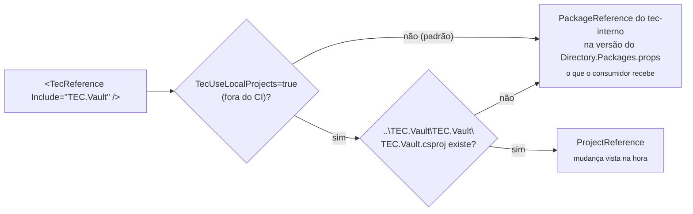

[🏠 TEC.ORM](../README.md) › [📚 Documentação](README.md) › 💻 Desenvolvimento local

# 💻 Desenvolvimento local

> Como compilar, testar e empacotar o TEC.ORM na sua máquina: por padrão com os TEC.* do feed `tec-interno` (o que o
> consumidor recebe) e, sob demanda, com os repositórios TEC.* vizinhos, sem publicar pacote.

## 📑 Sumário

- [🎯 Visão geral](#-visão-geral)
- [🚀 Uso](#-uso)
  - [Pré-requisitos](#pré-requisitos)
  - [Clonar lado a lado](#clonar-lado-a-lado)
  - [Compilar, testar e empacotar](#compilar-testar-e-empacotar)
  - [Lock files](#lock-files)
  - [Arquivos canônicos](#arquivos-canônicos)
  - [Contribuição](#contribuição)
- [⚙️ Opções](#️-opções)
- [❌ Erros](#-erros)
- [🛡️ Segurança](#️-segurança)
- [❓ Perguntas frequentes](#-perguntas-frequentes)

---

## 🎯 Visão geral

| Projeto | Depende de | Como |
|---|---|---|
| `TEC.ORM` | `TEC.Core` | `<TecReference Include="TEC.Core" />` |
| `TEC.ORM` | `TEC.ORM.Mapping.Generator` | `ProjectReference` sem o assembly; a DLL vai no pacote em `analyzers/dotnet/cs` |
| `TEC.ORM.SqlServer` | `TEC.ORM`, `TEC.Vault`, `TEC.Cqrs` | `ProjectReference` + `<TecReference Include="TEC.Vault" />`, `<TecReference Include="TEC.Cqrs" />` |
| Testes, carga, benchmarks | `TEC.Vault.InMemory`, `TEC.Vault.AzureKeyVault` | `TecReference` |

O `build/Tec.Build.targets` decide como resolver cada `TecReference`:



| Modo | Quando | Lock file |
|---|---|---|
| Pacote | **Padrão**, na máquina e no CI (`CI=true` sempre usa pacote) | `packages.lock.json` (versionado) |
| Local | Sob demanda: `-p:TecUseLocalProjects=true` fora do CI, com os repositórios vizinhos presentes (sem o vizinho, aquela referência continua pacote) | `packages.local.lock.json` (fora do git) |

> [!IMPORTANT]
> Como o padrão é o pacote, compilar o TEC.ORM exige **leitura do feed `tec-interno`** na máquina (credencial
> configurada uma vez; veja [Pré-requisitos](#pré-requisitos)). O modo local serve para alterar o TEC.Core, o TEC.Vault
> ou o TEC.Cqrs e testar a mudança aqui sem publicar pacote.

> [!TIP]
> **Versão dos TEC.* consumidos:** no modo pacote, cada `TecReference` vira `PackageReference` na versão publicada
> declarada no `Directory.Packages.props` deste repositório, uma por pacote
> (`<PackageVersion Include="TEC.Core" Version="0.0.1" />`, idem para `TEC.Vault`, `TEC.Cqrs`...); os csproj mantêm só
> `<TecReference Include="..." />`, sem versão. Para usar outra versão publicada, altere o `PackageVersion` (o
> Dependabot abre o PR) e regenere os `packages.lock.json` ([Lock files](#lock-files)). Os componentes evoluem de forma
> independente: o TEC.Core pode ficar em `0.0.1` enquanto o TEC.Vault ou o TEC.ORM sobem a própria `<Version>`.

---

## 🚀 Uso

### Pré-requisitos

| Item | Detalhe |
|---|---|
| SDK | .NET 10 (`global.json`: `10.0.100`, `rollForward: latestFeature`) e o runtime 8.0 para os testes em `net8.0` |
| Feed `tec-interno` | Leitura obrigatória no modo pacote, o padrão (PAT classic com `read:packages`; o GitHub Packages exige token mesmo para pacote público) |
| Docker | Para os testes de integração e de carga com SQL Server ([🧪 Testes](testes.md#sql-server-local-descartável)) |
| `dotnet-ef` | Ferramenta local (`dotnet tool restore`), para migrations do banco de testes |

```bash
# Credencial do feed (uma vez por máquina, fora do repositório; no Linux/macOS acrescente --store-password-in-clear-text)
dotnet nuget update source tec-interno -u <usuario-github> -p <PAT>
# ou, se a origem ainda não existir no NuGet.Config do usuário:
dotnet nuget add source https://nuget.pkg.github.com/tudoemcodigo/index.json -n tec-interno -u <usuario-github> -p <PAT>
```

### Clonar lado a lado

```text
D:\Projetos\Componentes\
├── tec-workflows\   CI/CD e arquivos canônicos
├── TEC.Core\        ⟵ dependência
├── TEC.Vault\       ⟵ dependência (inclui TEC.Vault.InMemory e TEC.Vault.AzureKeyVault)
├── TEC.Cqrs\        ⟵ dependência
├── TEC.ORM\         este repositório
└── ...              TEC.Security, TEC.Observability
```

Só é necessário para o modo local, sob demanda:

```bash
dotnet build TEC.ORM.slnx -p:TecUseLocalProjects=true
dotnet test --project TEC.ORM.Tests -p:TecUseLocalProjects=true --treenode-filter "/*/*/*/*[Category!=Integracao]"
```

### Compilar, testar e empacotar

```bash
dotnet build TEC.ORM.slnx -c Release
dotnet test --project TEC.ORM.Tests -c Release --treenode-filter "/*/*/*/*[Category!=Integracao]"
dotnet pack TEC.ORM.slnx -c Release -o ./pacotes
```

O `dotnet pack` gera **dois** pacotes, com a mesma versão (`Directory.Build.props`):

| Pacote | Conteúdo |
|---|---|
| `TEC.ORM` | `lib/net8.0`, `lib/net10.0`, documentação XML, `README.md` da pasta `TEC.ORM/` e o gerador em `analyzers/dotnet/cs/TEC.ORM.Mapping.Generator.dll` |
| `TEC.ORM.SqlServer` | `lib/net8.0`, `lib/net10.0`, documentação XML e `README.md` da pasta `TEC.ORM.SqlServer/` |

O gerador **não** é publicado sozinho. Testes, carga e benchmarks não são empacotados.

> [!IMPORTANT]
> Nos pacotes **todo aviso é erro** (CA, IDE, nullable, XML doc e, no `TEC.ORM`, IL de AOT/trimming). O
> `TEC.ORM.SqlServer` desliga só o `IsAotCompatible` (EF Core e Dapper), com comentário no csproj.

> [!NOTE]
> O núcleo expõe internos ao satélite (`InternalsVisibleTo Include="TEC.ORM.SqlServer"`), inclusive os polyfills do
> `net8.0`; por isso o `TEC.ORM.SqlServer` remove a cópia local (`<Compile Remove="$(TecRepoRoot)build/Polyfills/*.cs" />`)
> e os dois pacotes precisam ser usados **na mesma versão**.

### Lock files

O `packages.lock.json` versionado é sempre o do **modo pacote**, o padrão (o CI restaura com `--locked-mode`). No modo
local (`-p:TecUseLocalProjects=true`) o NuGet usa `packages.local.lock.json`, ignorado pelo git. Depois de mudar uma
dependência, regenere o versionado:

```bash
dotnet restore TEC.ORM.slnx --force-evaluate
```

> [!WARNING]
> Isso (e compilar no modo padrão) exige que `TEC.Core`, `TEC.Vault` e `TEC.Cqrs` na versão referenciada **já estejam publicados** no feed (ordem:
> Core → Vault → Cqrs → Security → Observability → ORM).

### Arquivos canônicos

`build/`, `Directory.Build.targets`, `.editorconfig`, `nuget.config`, `.gitignore`, `.gitattributes`, `global.json`,
`LICENSE`, `Images/Logo.png`, `.github/dependabot.yml` e `.github/zizmor.yml` vêm do
[tec-workflows](https://github.com/tudoemcodigo/tec-workflows) e **não são editados aqui** (altere lá e rode
`scripts/sync-template.sh TEC.ORM`). Deste repositório: `Directory.Build.props` (`TecComponent`, `Version`),
`Directory.Packages.props` e os csproj.

### Contribuição

1. Branch a partir da `main` (push direto é bloqueado).
2. Identificadores em inglês; comentários, XML docs, mensagens e documentação em português.
3. Teste para todo comportamento novo ou corrigido (inclusive o caminho inválido); regra nova do gerador com linha em
   `AnalyzerReleases.Unshipped.md`.
4. Atualize `docs/`, os READMEs dos pacotes afetados e o [CHANGELOG](../CHANGELOG.md).
5. PR com o check **`ci / ci-ok`** verde.

---

## ⚙️ Opções

| Propriedade MSBuild | Padrão | Descrição |
|---|---|---|
| `TecUseLocalProjects` | `false` (sempre `false` com `CI=true`) | `true` liga a troca de `TecReference` por `ProjectReference` quando o vizinho existe |
| `TecComponentsRoot` | Pasta acima do repositório | Onde procurar os vizinhos |
| `PackageVersion` dos TEC.* (`Directory.Packages.props`) | `0.0.1` | Versão publicada de cada TEC.* consumido no modo pacote (o Dependabot atualiza) |
| `Version` (`Directory.Build.props`) | `0.1.0` | Versão única dos dois pacotes; base das prévias do CI (`<Version>-preview.N` a cada push na `main`). Suba depois de publicar `X.Y.Z` |
| `EmitCompilerGeneratedFiles` | `false` | Grava o código do gerador em `obj/` |

---

## ❌ Erros

| Erro | Quando ocorre | O que fazer |
|---|---|---|
| `NU1100 Unable to resolve 'TEC.Vault'` | Modo pacote sem a origem `tec-interno` | Adicione a origem com esse nome (ou use o modo local com o vizinho clonado) |
| `401`/`403` no restore | PAT sem `read:packages` ou expirado | Gere outro PAT e refaça o `dotnet nuget update source tec-interno` |
| `NU1004` | Lock file desatualizado | Regenere com `dotnet restore TEC.ORM.slnx --force-evaluate` |
| `NU1901`–`NU1904` | Vulnerabilidade conhecida | Atualize no `Directory.Packages.props` e regenere os locks |
| `CS0436` (tipo duplicado) no `TEC.ORM.SqlServer` | Polyfill compilado de novo | Mantenha o `<Compile Remove=...Polyfills/*.cs />` |
| `dotnet test` roda 0 testes (código 5) | `-nologo` | Remova `-nologo` |
| Métodos gerados não aparecem | Gerador não referenciado | Projetos da solução usam `OutputItemType="Analyzer"` no `ProjectReference` do gerador |

---

## 🛡️ Segurança

> [!WARNING]
> Nunca coloque o PAT do feed no `nuget.config` do repositório, nem conexões de banco em arquivos versionados.

- `packageSourceMapping`: `TEC.*` só do `tec-interno`.
- `packages.local.lock.json` e `appsettings.Local.json` ficam fora do git.

---

## ❓ Perguntas frequentes

<details>
<summary>Mudei o TEC.Vault e o TEC.ORM não viu.</summary>

Por padrão o TEC.ORM usa o pacote publicado. Compile com `-p:TecUseLocalProjects=true`, confira o caminho
`..\TEC.Vault\TEC.Vault\TEC.Vault.csproj` e se a variável `CI` não está como `true` no terminal (no CI a opção é
ignorada).

</details>

<details>
<summary>Preciso commitar o <code>packages.local.lock.json</code>?</summary>

Não. Só o `packages.lock.json` (modo pacote).

</details>

---
⬅️ [🧪 Testes](testes.md) · [📚 Índice](README.md)
