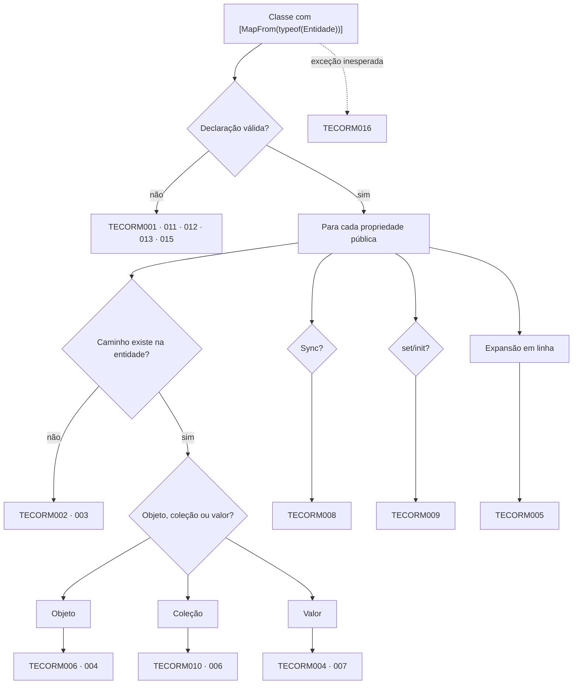

[🏠 TEC.ORM](../README.md) › [📚 Documentação](README.md) › 🛑 Diagnósticos do gerador

# 🛑 Diagnósticos do gerador

> Todos os códigos `TECORMxxx`: o que significam, um exemplo do erro e a correção. Um campo renomeado na entidade quebra
> a compilação, não a API em produção.

## 📑 Sumário

- [🎯 Visão geral](#-visão-geral)
- [🚀 Uso](#-uso)
  - [Tabela de referência](#tabela-de-referência)
  - [TECORM001 · DTO mapeado precisa ser partial](#tecorm001--dto-mapeado-precisa-ser-partial)
  - [TECORM002 · Propriedade do DTO sem origem](#tecorm002--propriedade-do-dto-sem-origem)
  - [TECORM003 · Caminho de origem inválido](#tecorm003--caminho-de-origem-inválido)
  - [TECORM004 · Tipos incompatíveis](#tecorm004--tipos-incompatíveis)
  - [TECORM005 · Ciclo entre DTOs sem MaxDepth](#tecorm005--ciclo-entre-dtos-sem-maxdepth)
  - [TECORM006 · Tipo aninhado não é um DTO mapeado](#tecorm006--tipo-aninhado-não-é-um-dto-mapeado)
  - [TECORM007 · Conversor inválido](#tecorm007--conversor-inválido)
  - [TECORM008 · Sincronização impossível](#tecorm008--sincronização-impossível)
  - [TECORM009 · Propriedade do DTO sem set/init](#tecorm009--propriedade-do-dto-sem-setinit)
  - [TECORM010 · Coleção não suportada](#tecorm010--coleção-não-suportada)
  - [TECORM011 · Forma de DTO não suportada](#tecorm011--forma-de-dto-não-suportada)
  - [TECORM012 · Declaração de mapeamento inválida](#tecorm012--declaração-de-mapeamento-inválida)
  - [TECORM013 · Membro do DTO colide com o código gerado](#tecorm013--membro-do-dto-colide-com-o-código-gerado)
  - [TECORM014 · Exclusão física: o registro será excluído de fato](#tecorm014--exclusão-física-o-registro-será-excluído-de-fato)
  - [TECORM015 · Entidade não suportada](#tecorm015--entidade-não-suportada)
  - [TECORM016 · Falha interna do gerador de mapeamento](#tecorm016--falha-interna-do-gerador-de-mapeamento)
- [⚙️ Opções](#️-opções)
- [❌ Erros](#-erros)
- [🛡️ Segurança](#️-segurança)
- [❓ Perguntas frequentes](#-perguntas-frequentes)

---

## 🎯 Visão geral

> `TEC.ORM.Mapping.Generator` · *source generator* incremental (`DtoMappingGenerator`) e analisador (`HardDeleteUsageAnalyzer`)
> · embutidos no pacote `TEC.ORM` (`analyzers/dotnet/cs`), sem pacote próprio

- `TECORM001`–`TECORM013`, `TECORM015` e `TECORM016`: categoria `TEC.ORM.Mapping`, severidade **Error**.
- `TECORM014`: categoria `TEC.ORM.Usage`, severidade **Warning** (exclusão física).
- As regras são versionadas em `TEC.ORM.Mapping.Generator/AnalyzerReleases.Shipped.md` e `AnalyzerReleases.Unshipped.md`
  (todas ainda em *Unshipped*: nada foi publicado).
- **Um DTO com erro não é gerado**, e os DTOs que o usam como aninhado apontam `TECORM006` ("tem erros de mapeamento"):
  corrija primeiro o de dentro.
- O gerador nunca derruba a compilação: uma exceção interna ao processar um DTO vira `TECORM016` só para aquele DTO.



---

## 🚀 Uso

### Tabela de referência

| Código | Severidade | Título | Mensagem (modelo) |
|---|---|---|---|
| `TECORM001` | Error | DTO mapeado precisa ser partial | O DTO '{0}' tem [MapFrom] e precisa ser declarado como partial para receber o mapeamento gerado |
| `TECORM002` | Error | Propriedade do DTO sem origem | A propriedade '{0}' do DTO '{1}' não existe na entidade '{2}'; use [MapFrom("caminho")] para indicar a origem ou [MapIgnore] para ignorá-la |
| `TECORM003` | Error | Caminho de origem inválido | O caminho '{0}' da propriedade '{1}' é inválido: {2} |
| `TECORM004` | Error | Tipos incompatíveis | A propriedade '{0}' ({1}) não pode receber '{2}' ({3}) sem perda; use [MapConverter] ou ajuste o tipo |
| `TECORM005` | Error | Ciclo entre DTOs sem MaxDepth | O DTO '{0}' entra em ciclo pelo caminho {1}; defina MaxDepth em [MapObject]/[MapList] de alguma propriedade do ciclo |
| `TECORM006` | Error | Tipo aninhado não é um DTO mapeado | A propriedade '{0}' usa o tipo '{1}', que {2} |
| `TECORM007` | Error | Conversor inválido | O conversor '{0}' da propriedade '{1}' {2} |
| `TECORM008` | Error | Sincronização impossível | A propriedade '{0}' não pode usar Sync = true: {1} |
| `TECORM009` | Error | Propriedade do DTO sem set/init | A propriedade '{0}' do DTO '{1}' precisa de set ou init para ser preenchida; use [MapIgnore] se ela for calculada |
| `TECORM010` | Error | Coleção não suportada | A propriedade '{0}' ({1}) {2} |
| `TECORM011` | Error | Forma de DTO não suportada | O DTO '{0}' não pode ser {1} |
| `TECORM012` | Error | Declaração de mapeamento inválida | O mapeamento do DTO '{0}' é inválido: {1} |
| `TECORM013` | Error | Membro do DTO colide com o código gerado | O membro '{0}' do DTO '{1}' tem o nome de um membro gerado pelo mapeamento (Projection, FromEntity, ApplyTo, ToEntity ou __TecOrm*); renomeie-o |
| `TECORM014` | ⚠️ Warning | Exclusão física: o registro será excluído de fato | ATENÇÃO: '{0}' faz exclusão física: o registro será excluído de fato do banco (DELETE), sem exclusão lógica e sem como desfazer. Se for intencional, suprima este aviso no local da chamada (#pragma warning disable TECORM014); para o fluxo normal, use DeleteAsync (exclusão lógica). |
| `TECORM015` | Error | Entidade não suportada | A entidade '{0}' do DTO '{1}' não pode ser mapeada: {2} |
| `TECORM016` | Error | Falha interna do gerador de mapeamento | O gerador do TEC.ORM falhou ao processar o DTO '{0}' ({1}: {2}); o mapeamento não foi gerado. Relate o problema com o trecho do DTO |

### TECORM001 · DTO mapeado precisa ser partial

```csharp
[MapFrom(typeof(Customer))]
public class CustomerDto { public Guid Id { get; set; } }          // ❌
[MapFrom(typeof(Customer))]
public partial class CustomerDto { public Guid Id { get; set; } }  // ✅
```

### TECORM002 · Propriedade do DTO sem origem

```csharp
public string Nickname { get; set; } = "";                         // ❌ Customer não tem Nickname

[MapFrom(nameof(Customer.Name))] public string Nickname { get; set; } = "";   // ✅ outra origem
[MapIgnore] public string Nickname { get; set; } = "";                        // ✅ fora do mapeamento
[MapIgnore(MapDirection.ToDto)] public string Password { get; set; } = "";    // ✅ só de entrada
```

### TECORM003 · Caminho de origem inválido

Segmento vazio, segmento inexistente/ilegível ou `Nullable<T>` de struct no meio do caminho.

```text
error TECORM003: O caminho 'Address.District' da propriedade 'District' é inválido: 'District' não existe (ou não é legível) em 'Address'
error TECORM003: O caminho 'Payment.Date.Year' da propriedade 'Year' é inválido: 'Date' é Nullable<T> no meio do caminho; use um conversor
error TECORM003: O caminho 'Customer..Name' da propriedade 'Name' é inválido: segmento vazio
```

```csharp
public sealed class YearConverter : IMapConverter<DateTime?, int>
{
    public int Convert(DateTime? value) => value?.Year ?? 0;
}

[MapFrom("Payment.Date"), MapConverter(typeof(YearConverter))]
public int Year { get; set; }                                       // ✅ Nullable no fim do caminho + conversor
```

### TECORM004 · Tipos incompatíveis

```csharp
public int Amount { get; set; }                                     // ❌ Order.Amount é decimal
public decimal Amount { get; set; }                                 // ✅ mesmo tipo
[MapConverter(typeof(RoundConverter))] public int Amount { get; set; }   // ✅ IMapConverter<decimal, int>
```

### TECORM005 · Ciclo entre DTOs sem MaxDepth

```text
error TECORM005: O DTO 'CustomerDto' entra em ciclo pelo caminho CustomerDto → OrderDto → CustomerDto; defina MaxDepth em [MapObject]/[MapList] de alguma propriedade do ciclo
error TECORM005: O DTO 'CustomerDto' entra em ciclo pelo caminho mais de 32 níveis de aninhamento (reduza MaxDepth)
```

```csharp
[MapObject(MaxDepth = 1)] public CustomerDto? Customer { get; set; }   // ✅ basta uma propriedade do ciclo
```

### TECORM006 · Tipo aninhado não é um DTO mapeado

O tipo não tem `[MapFrom]`, é de outro assembly, tem erros próprios ou é coleção de valores sem conversão implícita.

```text
error TECORM006: A propriedade 'Address' usa o tipo 'AddressDto', que não tem [MapFrom(typeof(Entidade))]
error TECORM006: A propriedade 'Address' usa o tipo 'AddressDto', que é declarado em outro assembly; DTOs aninhados precisam estar no mesmo projeto
error TECORM006: A propriedade 'Address' usa o tipo 'AddressDto', que tem erros de mapeamento (veja os erros desse DTO)
error TECORM006: A propriedade 'Codes' usa o tipo 'System.Guid', que não tem [MapFrom] e não recebe 'int' sem conversão
```

### TECORM007 · Conversor inválido

Conversor ausente, abstrato, genérico aberto, sem construtor sem parâmetros ou sem `IMapConverter<origem, destino>` com os
tipos **exatos**.

```text
error TECORM007: O conversor 'Sales.TextConverter' da propriedade 'Quantity' precisa implementar IMapConverter<int, string>
error TECORM007: O conversor 'Sales.Conv' da propriedade 'Amount' precisa ser uma classe concreta com construtor público sem parâmetros
```

### TECORM008 · Sincronização impossível

| Motivo na mensagem | Correção |
|---|---|
| o caminho achatado (com '.') só vai da entidade para o DTO | Retire `Sync` ou use caminho direto |
| só coleções de DTOs mapeados são sincronizadas | Use uma coleção de DTOs com `[MapFrom]` |
| o elemento 'X' não implementa IEntity\<TKey\> | Implemente `IEntity<TKey>` na entidade do item |
| o DTO do elemento 'XDto' precisa de uma propriedade Id do tipo T | Adicione `Id` do mesmo tipo da chave |
| a coleção da entidade (...) precisa implementar ICollection\<X\> (Add/Remove) | Use `List<T>`/`ICollection<T>` na entidade |
| a entidade 'X' não tem construtor público sem parâmetros | Adicione o construtor |

### TECORM009 · Propriedade do DTO sem set/init

```csharp
public string Name { get; } = "";                                   // ❌
public string Name { get; init; } = "";                             // ✅
[MapIgnore] public string Initials => Name[..1];                    // ✅ calculada, fora do mapeamento
```

### TECORM010 · Coleção não suportada

```text
error TECORM010: A propriedade 'Orders' (System.Collections.Generic.HashSet<OrderDto>) não é uma coleção suportada no DTO: use List<T>, T[], IList<T>, ICollection<T>, IEnumerable<T>, IReadOnlyList<T> ou IReadOnlyCollection<T>
error TECORM010: A propriedade 'Letters' (string) não é uma coleção na entidade (IEnumerable<T>)
```

### TECORM011 · Forma de DTO não suportada

```text
error TECORM011: O DTO 'CustomerDto' não pode ser declarado dentro de outro tipo
error TECORM011: O DTO 'PageDto' não pode ser genérico
error TECORM011: O DTO 'BaseDto' não pode ser abstrato ou estático
error TECORM011: O DTO 'CustomerDto' não pode ser struct ou record struct (use class ou record)
```

### TECORM012 · Declaração de mapeamento inválida

| Motivo na mensagem | Correção |
|---|---|
| na classe, use [MapFrom(typeof(Entidade))]; o caminho em texto é só para propriedades | Use `typeof` na classe |
| o DTO precisa de construtor público (ou internal) sem parâmetros | Adicione o construtor |
| a entidade 'X' precisa ser uma classe | Aponte para uma classe ou interface |
| 'Prop' não pode ter [MapObject] e [MapList] ao mesmo tempo | Deixe um só |
| MaxDepth de 'Prop' não pode ser negativo | Use `0` ou mais |

### TECORM013 · Membro do DTO colide com o código gerado

```csharp
public string Projection { get; set; } = "";                          // ❌ colide com o Projection gerado
[MapFrom("Projection")] public string ProjectionText { get; set; } = "";   // ✅ outro nome, mesma origem
```

### TECORM014 · Exclusão física: o registro será excluído de fato

**Aviso.** Toda chamada a um método marcado com `[HardDelete]` (`TEC.ORM.Abstractions`): `IOrmRepository.HardDeleteAsync`
(por `Id` e em lote), o atalho `OrmRepositoryExtensions.HardDeleteAsync` e `OrmRepository.HardDeleteAsync`. Também quando
o método chamado sobrescreve ou implementa um marcado, mesmo sem repetir o atributo. Chamadas feitas **de dentro** de um
método marcado não avisam: o alerta passa para quem chama esse método.

```text
warning TECORM014: ATENÇÃO: 'IOrmRepository.HardDeleteAsync' faz exclusão física: o registro será excluído de fato do banco (DELETE), sem exclusão lógica e sem como desfazer. ...
```

```csharp
#pragma warning disable TECORM014 // LGPD: eliminação definitiva pedida pelo titular
await customers.HardDeleteAsync(id, ct);
#pragma warning restore TECORM014
```

> [!TIP]
> Para proibir a exclusão física numa camada (ex.: a API), use no `.editorconfig`:
> `dotnet_diagnostic.TECORM014.severity = error`. Evite `NoWarn` no projeto: o alerta sumiria dos próximos usos.

### TECORM015 · Entidade não suportada

A entidade de `[MapFrom(typeof(...))]` é um **genérico aberto** ou um tipo que não foi encontrado.

```csharp
public class Box<T> : Entity<int> { public T? Value { get; set; } }

[MapFrom(typeof(Box<>))] public partial class BoxDto { public int Id { get; set; } }      // ❌ genérico aberto
[MapFrom(typeof(Box<int>))] public partial class BoxDto { public int Id { get; set; } }   // ✅ argumentos informados
```

```text
error TECORM015: A entidade 'Box' do DTO 'BoxDto' não pode ser mapeada: tipo genérico aberto (informe os argumentos, ex.: typeof(Entidade<int>))
```

### TECORM016 · Falha interna do gerador de mapeamento

Uma exceção inesperada ao processar um DTO. Em vez de derrubar o gerador inteiro (aviso CS8785 e nenhum código gerado),
o erro fica só naquele DTO; os demais continuam gerados.

```text
error TECORM016: O gerador do TEC.ORM falhou ao processar o DTO 'OrderDto' (InvalidOperationException: ...); o mapeamento não foi gerado. Relate o problema com o trecho do DTO
```

O que fazer: abra uma *issue* com o trecho do DTO e da entidade. Enquanto isso, simplifique a propriedade suspeita (ex.:
troque por `[MapIgnore]` e preencha à mão).

---

## ⚙️ Opções

| Configuração | Onde | Efeito |
|---|---|---|
| `dotnet_diagnostic.TECORM0xx.severity = error\|warning\|none` | `.editorconfig` | Ajusta a severidade (recomendado só para `TECORM014`; os erros de mapeamento indicam código que não seria gerado) |
| `#pragma warning disable TECORM014` | Local da chamada | Confirma uma exclusão física intencional |
| `[SuppressMessage("TEC.ORM.Usage", "TECORM014")]` | Método | Mesmo efeito, com justificativa |

---

## ❌ Erros

Os próprios códigos acima: `TECORM001`–`TECORM013`, `TECORM015` e `TECORM016` impedem a compilação do DTO afetado;
`TECORM014` é só aviso. Não há erro em execução gerado pelo gerador.

---

## 🛡️ Segurança

- O gerador roda dentro do compilador do consumidor (`netstandard2.0`) sem rede nem arquivo: só lê o código.
- `TECORM014` torna visível, na revisão de código, toda remoção irreversível de dados.

---

## ❓ Perguntas frequentes

<details>
<summary>Corrigi o erro, mas o DTO que usa o aninhado continua com <code>TECORM006</code>.</summary>

Recompile: o `TECORM006` "tem erros de mapeamento" some quando o DTO aninhado volta a ser gerado.

</details>

<details>
<summary>Como adiciono uma regra nova ao gerador?</summary>

Descritor em `MappingDiagnostics` (ou `UsageDiagnostics`), linha em `AnalyzerReleases.Unshipped.md` e um caso em
`GeneratorDiagnosticsTests` ([🧪 Testes](testes.md)).

</details>

---
⬅️ [🔄 Mapeamento](mapeamento.md) · [📚 Índice](README.md) · [🗄️ SQL Server](sqlserver.md) ➡️
