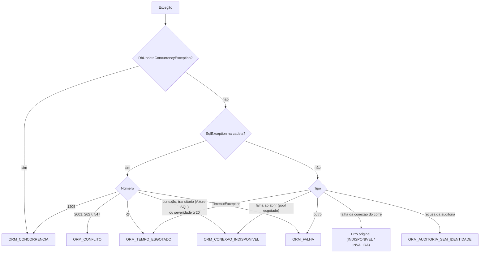

[🏠 TEC.ORM](../README.md) › [📚 Documentação](README.md) › ❌ Erros

# ❌ Erros

> Todo resultado de falha do TEC.ORM usa os mesmos códigos, qualquer que seja o banco, para que o consumidor trate o
> `Result` de um único jeito e nenhuma mensagem exponha dados sensíveis.

## 📑 Sumário

- [🎯 Visão geral](#-visão-geral)
- [🚀 Uso](#-uso)
  - [Tratar por código](#tratar-por-código)
  - [Com o TEC.Cqrs e o ApiResponse](#com-o-teccqrs-e-o-apiresponse)
  - [Repetir em concorrência](#repetir-em-concorrência)
- [⚙️ Opções](#️-opções)
- [❌ Erros](#-erros-1)
  - [OrmErrors](#ormerrors)
  - [Tradução das exceções do banco](#tradução-das-exceções-do-banco)
  - [Erros de configuração e de programação](#erros-de-configuração-e-de-programação)
- [🛡️ Segurança](#️-segurança)
- [❓ Perguntas frequentes](#-perguntas-frequentes)

---

## 🎯 Visão geral



Só o cancelamento (`OperationCanceledException` com o token cancelado) é relançado; o resto vira `Result`.

---

## 🚀 Uso

### Tratar por código

```csharp
using TEC.ORM.Common;

var result = await customers.CreateAsync(customer, ct);
if (result.IsFailure)
{
    return result.Error!.Code switch
    {
        OrmErrors.ConflictCode => Results.Conflict("E-mail já cadastrado."),
        OrmErrors.InvalidInputCode => Results.BadRequest(new { field = result.Error.Field, result.Error.Message }),
        _ => Results.StatusCode(result.Error.Type.ToHttpStatusCode())
    };
}
```

### Com o TEC.Cqrs e o ApiResponse

Devolva o `Result` do repositório no handler: o pipeline e o `ApiResponse` do TEC.Core convertem pelo `ErrorType` e
escondem as mensagens 🔒.

```csharp
public Task<Result<Customer>> Handle(GetCustomerQuery query, CancellationToken cancellationToken) =>
    customers.GetByIdAsync(query.Id, cancellationToken);           // ORM_NAO_ENCONTRADO → 404
```

### Exceções fora do repositório

O repositório já devolve `Result`. Mas o `SaveChangesAsync` do commit do `IUnitOfWork` (chamado pelo `TransactionBehavior`) e
o código que usa o `DbContext` direto **lançam** exceções. O `AddTecOrm` registra um `IExceptionErrorMapper` do TEC.Cqrs que
converte, no pipeline e no `UseTecExceptionHandler`:

| Exceção | Código | HTTP |
|---|---|---|
| `DbUpdateConcurrencyException` (concorrência otimista, `rowversion`) | `ORM_CONCORRENCIA` | 409 |
| `SqlException` 1205 (deadlock) | `ORM_CONCORRENCIA` | 409 |
| `SqlException` 2601, 2627, 547 (chave única, chave estrangeira) | `ORM_CONFLITO` | 409 |

As demais exceções de banco não são mapeadas: continuam como erro interno (500, sem detalhes). Assim, uma aplicação com
`DbContext` próprio não precisa traduzir `DbUpdateConcurrencyException` à mão.

### Repetir em concorrência

```csharp
for (int attempt = 1; attempt <= 3; attempt++)
{
    var current = await accounts.GetByIdAsync(id, ct);
    if (current.IsFailure)
        return current.ToFailure();

    current.Value.Debit(amount);
    var saved = await accounts.UpdateAsync(current.Value, ct);
    if (saved.IsSuccess)
        return Result.Success();
    if (saved.Error!.Code != OrmErrors.ConcurrencyCode)
        return saved.ToFailure();
}
return OrmErrors.Concurrency();     // desistiu após 3 tentativas
```

---

## ⚙️ Opções

Não há opções de erro. Os limites que geram `ORM_LIMITE_EXCEDIDO` e as novas tentativas que evitam parte dos
`ORM_CONEXAO_INDISPONIVEL` estão em [⚙️ Opções](opcoes.md).

---

## ❌ Erros

### OrmErrors

> `TEC.ORM.Common` · `static class` · pacote `TEC.ORM`

| Código (constante) | Fábrica | `ErrorType` | HTTP | Mensagem | Quando |
|---|---|---|:---:|---|---|
| `ORM_ENTRADA_INVALIDA` (`InvalidInputCode`) | `InvalidInput(field, message)` | Validation | 400 | variável, com `Field` | Entrada nula/inválida, `SortBy` fora da lista, `splitOn` ausente, mais de uma linha no `QuerySingleOrDefaultAsync` |
| `ORM_LIMITE_EXCEDIDO` (`TooManyResultsCode`) | `TooManyResults(limit)` | Validation | 400 | A busca retornaria mais de N registros. Use a listagem paginada. | `FindAsync` acima de `MaxFindResults` (campo `specification`) |
| `ORM_LIMITE_EXCEDIDO` (`TooManyResultsCode`) | `QueryTooManyRows(limit)` | Validation | 400 | A consulta retornaria mais de N linhas. Pagine no SQL (OFFSET/FETCH) ou restrinja o filtro. | Leitura complexa acima de `MaxQueryRows` (campo `sql`) |
| `ORM_CONSULTA_NAO_PERMITIDA` (`QueryNotAllowedCode`) | `QueryNotAllowed(reason)` | Validation | 400 | Consulta recusada: {motivo} | SQL que não é somente leitura |
| `ORM_NAO_ENCONTRADO` (`NotFoundCode`) | `NotFound()` | NotFound | 404 | Registro não encontrado. | Inexistente ou excluído logicamente |
| `ORM_CONFLITO` (`ConflictCode`) | `Conflict()` | Conflict | 409 | A operação viola uma restrição de unicidade ou de integridade referencial. | SQL 2601, 2627, 547 |
| `ORM_CONCORRENCIA` (`ConcurrencyCode`) | `Concurrency()` | Conflict | 409 | O registro foi alterado ou excluído por outra operação. Leia novamente e repita. | Concorrência otimista, deadlock (1205) |
| `ORM_AUDITORIA_SEM_IDENTIDADE` (`AuditIdentityRequiredCode`) | `AuditIdentityRequired()` | Unauthorized | 401 | Identificação necessária para gravar o registro. | `IAuditable` sem identidade |
| `ORM_CONEXAO_INDISPONIVEL` (`ConnectionUnavailableCode`) | `ConnectionUnavailable()` | ExternalService | 502 🔒 | Banco de dados indisponível. | Segredo indisponível, login, rede, transitório do Azure SQL, pool esgotado, erro fatal |
| `ORM_CONEXAO_INVALIDA` (`InvalidConnectionSecretCode`) | `InvalidConnectionSecret()` | ExternalService | 502 🔒 | Configuração de conexão com o banco de dados inválida. | Segredo fora da política |
| `ORM_TEMPO_ESGOTADO` (`TimeoutCode`) | `Timeout()` | ExternalService | 502 🔒 | O banco de dados não respondeu a tempo. | Tempo limite do comando |
| `ORM_FALHA` (`FailureCode`) | `Failure()` | Failure | 500 🔒 | Falha ao acessar o banco de dados. | Não classificado |

🔒 Mensagem nunca exposta ao cliente da API (regra do `ApiResponse` do TEC.Core).

### Tradução das exceções do banco

| Número SQL | Significado | Código |
|---|---|---|
| 2601 / 2627 | Índice ou restrição única violada | `ORM_CONFLITO` |
| 547 | Chave estrangeira ou *check* (inclusive exclusão física com dependente restrito) | `ORM_CONFLITO` |
| 1205 | Deadlock | `ORM_CONCORRENCIA` |
| -2 | Tempo limite do cliente | `ORM_TEMPO_ESGOTADO` |
| -1, 40, 53, 233, 258, 4060, 10053, 10054, 10060, 10061, 18456, 18452 | Rede, servidor não encontrado, conexão encerrada/recusada, banco do login, login falhou | `ORM_CONEXAO_INDISPONIVEL` |
| 20, 64, 121, 4221, 10928, 10929, 40143, 40197, 40501, 40540, 40613, 42108, 42109, 49918, 49919, 49920 | Transitórios (inclusive Azure SQL) | `ORM_CONEXAO_INDISPONIVEL` |
| Severidade ≥ 20 | Erro fatal que encerra a conexão | `ORM_CONEXAO_INDISPONIVEL` |
| Outro | — | `ORM_FALHA` |

Falhas de infraestrutura vão ao log 3004 com o tipo da exceção e o número do erro, **sem a mensagem**.

### Erros de configuração e de programação

Não viram `Result`: indicam código ou configuração errados e devem aparecer cedo.

| Situação | Exceção |
|---|---|
| Opções inválidas no `AddTecOrm` | `InvalidConfigurationException` (TEC.Core), só com o nome da opção |
| `SqlQuery` com nome, SQL ou parâmetro inválido | `ArgumentException` (`Guard` do TEC.Core) |
| `BeginTransactionAsync` com transação ativa / `CommitAsync` sem transação | `InvalidOperationException` |
| `AddTecOrm<TContext>` duas vezes; `OrmRepository` sem o filtro de exclusão lógica | `InvalidOperationException` |
| Cancelamento | `OperationCanceledException` (relançada) |
| Mapeamento inválido | Erro de **compilação** `TECORMxxx` ([🛑 Diagnósticos](diagnosticos-do-gerador.md)) |

---

## 🛡️ Segurança

As mensagens **nunca** incluem SQL, valores de colunas, servidor, banco, nome do segredo ou a mensagem original do banco
(que costuma trazer o valor duplicado de uma chave única). Falhas de infraestrutura usam `ErrorType.ExternalService`,
cuja mensagem não chega ao cliente.

---

## ❓ Perguntas frequentes

<details>
<summary>Por que <code>ORM_CONEXAO_INDISPONIVEL</code> e não <code>ORM_FALHA</code> quando o pool esgota?</summary>

Pool esgotado é falha de infraestrutura (o banco não atende a tempo), não erro de programação: sai como 502, sem pilha no
log ([🔁 Resiliência](resiliencia.md#pool-de-conexões-esgotado)).

</details>

<details>
<summary>Como diferenciar o limite da busca do limite da consulta SQL?</summary>

Mesmo código (`ORM_LIMITE_EXCEDIDO`), campos diferentes: `specification` na busca e `sql` na leitura complexa.

</details>

---
⬅️ [📈 Observabilidade](observabilidade.md) · [📚 Índice](README.md) · [🛡️ Segurança](seguranca.md) ➡️
