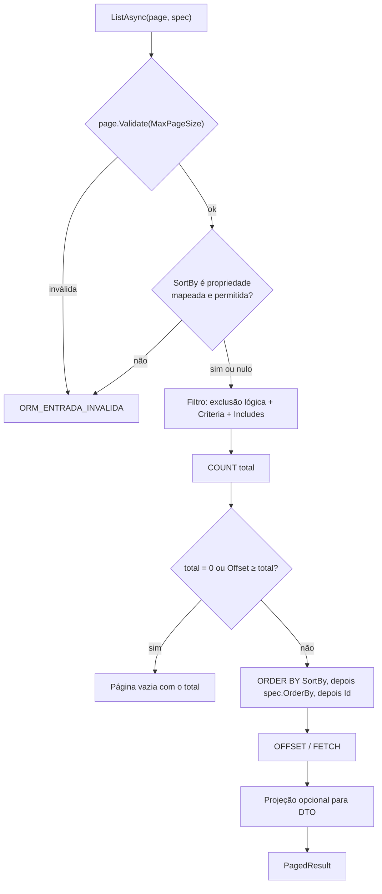

[🏠 TEC.ORM](../README.md) › [📚 Documentação](README.md) › 🔎 Especificações e paginação

# 🔎 Especificações e paginação

> Critérios de busca reutilizáveis e testáveis, que mantêm a consulta no domínio sem expor `IQueryable`, e paginação
> validada com ordenação segura mesmo quando o campo vem da requisição.

## 📑 Sumário

- [🎯 Visão geral](#-visão-geral)
- [🚀 Uso](#-uso)
  - [ISpecification\<T\> e Specification\<T\>](#ispecificationt-e-specificationt)
  - [PageRequest](#pagerequest)
  - [Sortable](#sortable)
  - [PagedResult\<T\>](#pagedresultt)
  - [Testar a especificação sem banco](#testar-a-especificação-sem-banco)
- [⚙️ Opções](#️-opções)
- [❌ Erros](#-erros)
- [🛡️ Segurança](#️-segurança)
- [❓ Perguntas frequentes](#-perguntas-frequentes)

---

## 🎯 Visão geral



- O desempate por `Id` é sempre acrescentado no fim: paginação estável, sem itens repetidos ou pulados entre páginas.
- `SortBy` vira `EF.Property<T>(e, "Nome")` com o nome **do modelo**: o texto do usuário nunca chega ao SQL.

---

## 🚀 Uso

### ISpecification\<T\> e Specification\<T\>

> `TEC.ORM.Specifications` · `interface` / `class` (herdável) · pacote `TEC.ORM`

| Membro | Retorno | Descrição |
|---|---|---|
| `Criteria` | `Expression<Func<T, bool>>?` | Filtro; `null` = todos (os excluídos logicamente nunca entram) |
| `OrderBy` | `IReadOnlyList<SortExpression>` | Ordenação, na ordem de aplicação |
| `Includes` | `IReadOnlyList<string>` | Navegações a carregar (`"Items"`, `"Items.Product"`), validadas pelo modelo |
| `Specification(Expression<Func<T, bool>>? criteria = null)` | — | Cria com filtro inicial opcional |
| `Where(Expression<Func<T, bool>> criteria)` | `Specification<T>` | Acrescenta filtro combinado com **E** (reaproveita o parâmetro: continua traduzível) |
| `OrderByAscending<TProperty>(Expression<Func<T, TProperty>> keySelector)` | `Specification<T>` | Ordenação crescente |
| `OrderByDescending<TProperty>(Expression<Func<T, TProperty>> keySelector)` | `Specification<T>` | Ordenação decrescente |
| `Include(string navigationPath)` | `Specification<T>` | Navegação a carregar (ignorada nos métodos `<TDto>`) |

`SortExpression(LambdaExpression KeySelector, bool Descending)` (`sealed record`) é um critério de ordenação.

```csharp
using TEC.ORM.Specifications;

public sealed class OrdersOfCustomer : Specification<Order>
{
    public OrdersOfCustomer(Guid customerId, decimal minimumAmount = 0)
    {
        Where(o => o.CustomerId == customerId);
        if (minimumAmount > 0)
            Where(o => o.Amount >= minimumAmount);       // combinado com E
        OrderByDescending(o => o.CreatedAt);
        Include(nameof(Order.Items));
    }
}

var orders = await repository.FindAsync(new OrdersOfCustomer(customerId, 100m), ct);
var page   = await repository.ListAsync(new PageRequest(1, 50), new OrdersOfCustomer(customerId), ct);
var total  = await repository.CountAsync(new OrdersOfCustomer(customerId), ct);
```

### PageRequest

> `TEC.ORM.Paging` · `sealed record PageRequest(int Page = 1, int PageSize = 20, string? SortBy = null, bool Descending = false)` · pacote `TEC.ORM`

| Membro | Retorno | Descrição |
|---|---|---|
| `Page` | `int` | Página, a partir de 1 |
| `PageSize` | `int` | Itens por página (1 até `OrmOptions.MaxPageSize`) |
| `SortBy` | `string?` | Propriedade mapeada e permitida da entidade, sem diferenciar maiúsculas; pode vir da requisição |
| `Descending` | `bool` | Ordem decrescente de `SortBy` |
| `Offset` | `int` | `(Page - 1) * PageSize` |
| `Validate(int maxPageSize)` | `Error?` | `null` se válida; senão `ORM_ENTRADA_INVALIDA` com o campo |
| `MaxSortByLength` | `const int` = `128` | Tamanho máximo de `SortBy` |

| Validação | Campo | Mensagem |
|---|---|---|
| `Page < 1` | `page` | A página deve ser maior ou igual a 1. |
| `PageSize < 1` ou `> maxPageSize` | `pageSize` | O tamanho da página deve estar entre 1 e N. |
| `Offset` estouraria `int` | `page` | Página fora do limite. |
| `SortBy` vazio ou com mais de 128 caracteres | `sortBy` | Ordenação inválida. |
| `SortBy` fora da lista branca (verificado pelo repositório) | `sortBy` | Ordenação por um campo não permitido. |

```csharp
app.MapGet("/pedidos", async ([AsParameters] ListOrders q, IOrmRepository<Order, long> orders, CancellationToken ct) =>
{
    var result = await orders.ListAsync<OrderSummaryDto>(
        new PageRequest(q.Page ?? 1, q.Size ?? 20, q.Sort, q.Desc ?? false),
        new Specification<Order>(o => o.Amount > 0), ct);
    return result.IsSuccess ? Results.Ok(result.Value) : Results.BadRequest(result.Errors);   // ?sort=PasswordHash → 400
});

public sealed record ListOrders(int? Page, int? Size, string? Sort, bool? Desc);
```

### Sortable

> `TEC.ORM.Paging` · `sealed class SortableAttribute : Attribute` · uso: propriedade da entidade · pacote `TEC.ORM`

| Situação da entidade | `SortBy` aceito |
|---|---|
| Tem **ao menos uma** propriedade `[Sortable]` | Só as marcadas (lista branca explícita) |
| Não tem nenhuma | Qualquer propriedade escalar mapeada |
| Sempre recusadas | Propriedades sombra, `IsDeleted`/`DeletedAt` e tokens de concorrência (`rowversion`, `[ConcurrencyCheck]`) |

```csharp
public sealed class AppUser : Entity<Guid>
{
    [Sortable] public string Name { get; set; } = "";
    [Sortable] public DateTimeOffset CreatedAt { get; set; }
    public string PasswordHash { get; set; } = "";     // SortBy=PasswordHash → ORM_ENTRADA_INVALIDA
}
```

### PagedResult\<T\>

> `TEC.Core.Responses.Pagination` · pacote `TEC.Core`

Resultado da listagem (`Items`, `Page`, `PageSize`, `TotalItems` e derivados). Para converter uma página de entidades já
carregada em DTOs: `page.ToDtoPage<TEntity, TDto>()` ([🔄 Mapeamento](mapeamento.md#atalhos-genéricos)).

### Testar a especificação sem banco

```csharp
var spec = new OrdersOfCustomer(customerId, 100m);
var filter = spec.Criteria!.Compile();

await Assert.That(filter(new Order { CustomerId = customerId, Amount = 150m })).IsTrue();
await Assert.That(filter(new Order { CustomerId = customerId, Amount = 50m })).IsFalse();
```

---

## ⚙️ Opções

| Opção (`OrmOptions`) | Padrão | Limites | Descrição |
|---|---|---|---|
| `MaxPageSize` | `100` | 1 a 10.000 | Teto de `PageRequest.PageSize` |
| `MaxFindResults` | `1000` | 1 a 100.000 | Teto da busca por critério (`FindAsync`) |

---

## ❌ Erros

| Código | Quando ocorre | O que fazer |
|---|---|---|
| `ORM_ENTRADA_INVALIDA` | Página nula ou inválida; `SortBy` vazio, longo demais ou fora da lista branca; especificação nula em `FindAsync`/`ExistsAsync` | Responder 400 com o campo de `Error.Field` |
| `ORM_LIMITE_EXCEDIDO` | `FindAsync` acima de `MaxFindResults` | Trocar por `ListAsync` paginado |
| `ORM_FALHA` | `Include` com navegação inexistente (erro de programação, log 3005 com a pilha) | Corrigir o caminho; prefira `nameof(...)` |

---

## 🛡️ Segurança

> [!IMPORTANT]
> **Marque `[Sortable]` sempre que o `SortBy` vier do usuário.** Sem a lista branca, ordenar por uma coluna sensível
> (`PasswordHash`, `TaxId`) permite inferir o valor dela pela posição dos registros na página.

- A mensagem de `SortBy` recusado é fixa: nunca ecoa a entrada.
- `MaxPageSize` e `MaxFindResults` limitam o que uma requisição pode materializar.

---

## ❓ Perguntas frequentes

<details>
<summary>O total e a página divergiram sob escrita concorrente. É bug?</summary>

Não. A contagem e os itens são duas consultas fora de transação (de propósito: uma transação só para leitura seguraria
bloqueios). Trate `TotalItems` como aproximado nesse cenário.

</details>

<details>
<summary>Posso ordenar por uma propriedade de navegação (<code>Customer.Name</code>)?</summary>

Não pelo `SortBy` (só propriedades escalares da própria entidade). Use `OrderByAscending(o => o.Customer.Name)` na
especificação, que vem depois do `SortBy`.

</details>

---
⬅️ [📝 Repositório](repositorio-crud.md) · [📚 Índice](README.md) · [📊 Consultas SQL](consultas-sql.md) ➡️
