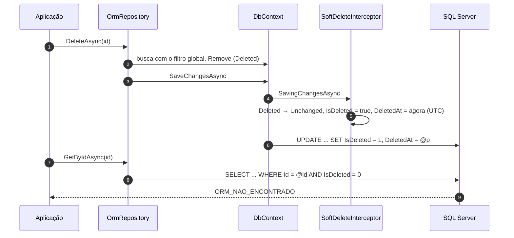
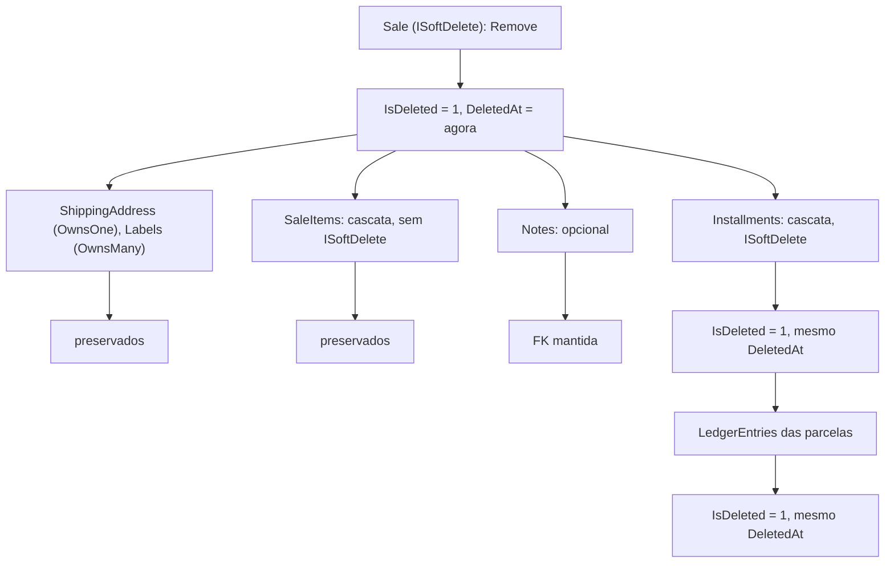

[🏠 TEC.ORM](../README.md) › [📚 Documentação](README.md) › 🗑️ Exclusão lógica

# 🗑️ Exclusão lógica

> Excluir nunca apaga a linha: marca `IsDeleted` e `DeletedAt`, todas as consultas passam a ignorar o registro e a
> exclusão se propaga aos dependentes em cascata que também têm exclusão lógica.

## 📑 Sumário

- [🎯 Visão geral](#-visão-geral)
- [🚀 Uso](#-uso)
  - [Entidades: IEntity, ISoftDelete e Entity](#entidades-ientity-isoftdelete-e-entity)
  - [Contexto: OrmDbContext e convenções](#contexto-ormdbcontext-e-convenções)
  - [Database first](#database-first)
  - [Propagação](#propagação)
  - [Auditoria e restauração](#auditoria-e-restauração)
- [⚙️ Opções](#️-opções)
- [❌ Erros](#-erros)
- [🛡️ Segurança](#️-segurança)
- [❓ Perguntas frequentes](#-perguntas-frequentes)

---

## 🎯 Visão geral



| Peça | Comportamento |
|---|---|
| `SoftDeleteInterceptor` (interno) | Ao salvar, toda entrada `ISoftDelete` com estado `Deleted` (por `Remove`, cascata ou repositório) volta a `Unchanged` e só `IsDeleted`/`DeletedAt` são gravados, com [propagação](#propagação). A hora vem do `TimeProvider` e é a mesma em todo o salvamento |
| `SoftDeleteQueryFilterConvention` (interna) | Ao **finalizar o modelo**, adiciona `!IsDeleted` a toda entidade raiz `ISoftDelete`. **EF Core 8:** filtro anônimo combinado com **E** ao da entidade. **EF Core 10:** filtro **nomeado** `TecOrm.SoftDelete`, que convive com os filtros nomeados da aplicação (se a aplicação usar filtro anônimo, ele é combinado com E). Idempotente; em herança fica só na raiz; *owned* seguem o dono |
| `OrmRepository.CreateAsync` / `UpdateAsync` | Criação nunca nasce excluída; atualização mantém `IsDeleted`/`DeletedAt` fora do `UPDATE` e não reativa filhos |
| Projeção para DTO | O filtro vale também dentro das coleções aninhadas |
| Relação obrigatória | Item removido de uma coleção (ex.: `ApplyTo` com `Sync`) vira órfão para o EF Core e é gravado como exclusão lógica |

---

## 🚀 Uso

### Entidades: IEntity, ISoftDelete e Entity

> `TEC.ORM.Entities` · pacote `TEC.ORM`

| Tipo | Membros | Observação |
|---|---|---|
| `IEntity<TKey>` | `TKey Id { get; }` | `TKey : notnull, IEquatable<TKey>` (`int`, `long`, `Guid`, `string`...) |
| `ISoftDelete` | `bool IsDeleted { get; }` · `DateTimeOffset? DeletedAt { get; }` | Só `get`: gravados pela implementação (setter privado ou campo) |
| `Entity<TKey>` (`abstract`) | `Id { get; set; }` · `IsDeleted { get; private set; }` · `DeletedAt { get; private set; }` | Base opcional |
| `AuditableEntity<TKey>` (`abstract`) | `Entity<TKey>` + `IAuditable` | Ver [🕵️ Auditoria](auditoria.md) |

```csharp
using TEC.ORM.Entities;

public sealed class Customer : Entity<Guid>
{
    public string Name { get; set; } = "";
    public string Email { get; set; } = "";
}
```

### Contexto: OrmDbContext e convenções

> `TEC.ORM.SqlServer.SoftDelete` · pacote `TEC.ORM.SqlServer`

| Membro | Retorno | Descrição |
|---|---|---|
| `OrmDbContext` (`abstract class`) | — | Base opcional: chama `AddTecOrmConventions()` em `ConfigureConventions` (ao sobrescrever, chame `base`) |
| `AddTecOrmConventions(this ModelConfigurationBuilder builder)` | `ModelConfigurationBuilder` | Filtro global de exclusão lógica e tamanho das colunas de auditoria |
| `HasSoftDelete<TEntity>(this EntityTypeBuilder<TEntity> builder, bool index = true)` | `EntityTypeBuilder<TEntity>` | `IsDeleted` com padrão `false`, `DeletedAt` mapeado e, com `index`, índice filtrado `[IsDeleted] = 0` |
| `SoftDeleteFilterName` | `const string` = `"TecOrm.SoftDelete"` | Nome do filtro no EF Core 10: `IgnoreQueryFilters([OrmModelConfigurationExtensions.SoftDeleteFilterName])` desliga só ele |

```csharp
using Microsoft.EntityFrameworkCore;
using TEC.ORM.SqlServer.SoftDelete;

public sealed class SalesContext(DbContextOptions<SalesContext> options) : OrmDbContext(options)
{
    public DbSet<Customer> Customers => Set<Customer>();

    protected override void OnModelCreating(ModelBuilder modelBuilder) =>
        modelBuilder.Entity<Customer>(e =>
        {
            e.HasIndex(c => c.Email).IsUnique().HasFilter("[IsDeleted] = 0");   // e-mail reaproveitável após excluir
            e.HasSoftDelete();
        });
}
```

> [!IMPORTANT]
> O filtro global é **obrigatório**. Contextos registrados com `AddTecOrm`/`UseTecOrm` já recebem a convenção, mesmo sem
> herdar de `OrmDbContext`; herdar ou chamar `AddTecOrmConventions` não duplica o filtro. Um contexto sem nenhum dos três
> faz o construtor do `OrmRepository` lançar `InvalidOperationException`, para que excluídos nunca voltem em silêncio.

### Database first

```csharp
public partial class Product : IEntity<int>, ISoftDelete { }      // colunas Id, IsDeleted e DeletedAt já geradas

public partial class CatalogContext
{
    protected override void ConfigureConventions(ModelConfigurationBuilder configurationBuilder) =>
        configurationBuilder.AddTecOrmConventions();
}
```

```sql
-- Colunas esperadas na tabela
IsDeleted bit NOT NULL CONSTRAINT DF_Product_IsDeleted DEFAULT (0),
DeletedAt datetimeoffset NULL
```

### Propagação

| Dependente | O que acontece |
|---|---|
| Tipo *owned* (`OwnsOne`/`OwnsMany`) | **Preservado** |
| Em cascata e **não** `ISoftDelete` | **Preservado**: nada é apagado |
| Opcional (`SetNull`/`ClientSetNull`) | **Preservado**: a chave estrangeira não é anulada |
| Em cascata e `ISoftDelete` | **Excluído logicamente**, recursivamente, com o **mesmo** `DeletedAt`; carregado pela navegação se ainda não estiver rastreado |
| Já excluído antes | Mantém o `DeletedAt` original |



> [!NOTE]
> Com `ChangeTracker.CascadeDeleteTiming = Immediate` (padrão do EF Core), um `Remove` direto no contexto já marca os
> dependentes e anula chaves opcionais antes do salvamento; o interceptor desfaz isso para os preservados. O
> `OrmRepository.DeleteAsync` desliga essa cascata durante a operação.

> [!WARNING]
> Dependente `ISoftDelete` em cascata **sem navegação no principal** só é propagado se já estiver rastreado. Declare a
> navegação (`HasMany(s => s.Installments)`) para a propagação completa.

### Auditoria e restauração

```csharp
var deleted = await db.Customers.IgnoreQueryFilters()
    .Where(c => c.IsDeleted && c.DeletedAt >= since)
    .ToListAsync(ct);

// Restaurar: Entity<TKey> tem set privado; grave pelo metadado do EF Core
var customer = await db.Customers.IgnoreQueryFilters().FirstAsync(c => c.Id == id, ct);
db.Entry(customer).Property(nameof(ISoftDelete.IsDeleted)).CurrentValue = false;
db.Entry(customer).Property(nameof(ISoftDelete.DeletedAt)).CurrentValue = null;
await db.SaveChangesAsync(ct);
```

> [!WARNING]
> `IgnoreQueryFilters()` desliga **todos** os filtros globais (inclusive os seus, como o de inquilino). No EF Core 10, use
> `IgnoreQueryFilters([OrmModelConfigurationExtensions.SoftDeleteFilterName])`; num repositório que herda de
> `OrmRepository`, use `IncludingSoftDeleted()`, que desliga só a exclusão lógica.

---

## ⚙️ Opções

Não há opções em `OrmOptions` para a exclusão lógica: ela é sempre ligada. O relógio é o `TimeProvider` registrado
(`TimeProvider.System` por padrão, com `TryAdd`: registre outro antes do `AddTecOrm` para testes).

| Parâmetro | Padrão | Descrição |
|---|---|---|
| `HasSoftDelete(index)` | `true` | Cria o índice filtrado `[IsDeleted] = 0` |

---

## ❌ Erros

| Código | Quando ocorre | O que fazer |
|---|---|---|
| `ORM_NAO_ENCONTRADO` | `GetByIdAsync`, `UpdateAsync` ou `DeleteAsync` de registro já excluído | Esperado: o registro "não existe" para a aplicação |
| `ORM_CONFLITO` | Índice único **sem** o filtro `[IsDeleted] = 0` impede recriar um valor de um excluído | Filtre o índice único por `[IsDeleted] = 0` |
| `InvalidOperationException` | Contexto sem o filtro global | Ver o alerta acima |

---

## 🛡️ Segurança

> [!IMPORTANT]
> As leituras do `IOrmQueryExecutor` (SQL próprio) **não** passam pelo filtro: inclua `IsDeleted = 0` em cada tabela do
> SQL, inclusive nos `JOIN`.

> [!CAUTION]
> Para remover a linha de fato (expurgo, LGPD), use `HardDeleteAsync`: aviso de compilação `TECORM014` e log `Warning`.
> Ela não passa pelo interceptor nem propaga exclusão lógica ([📝 Repositório](repositorio-crud.md#exclusão-física)).

---

## ❓ Perguntas frequentes

<details>
<summary>Posso usar o meu próprio filtro de inquilino junto?</summary>

Sim. No EF Core 10 use um filtro **nomeado** (`HasQueryFilter("Tenant", ...)`), que convive com o `TecOrm.SoftDelete`; no
EF Core 8 o filtro anônimo da aplicação é combinado com E. A exclusão física e `IncludingSoftDeleted()` mantêm o seu filtro.

</details>

<details>
<summary>Como recriar um cliente com o mesmo e-mail de um excluído?</summary>

Filtre o índice único: `HasIndex(c => c.Email).IsUnique().HasFilter("[IsDeleted] = 0")`.

</details>

---
⬅️ [📊 Consultas SQL](consultas-sql.md) · [📚 Índice](README.md) · [🕵️ Auditoria](auditoria.md) ➡️
