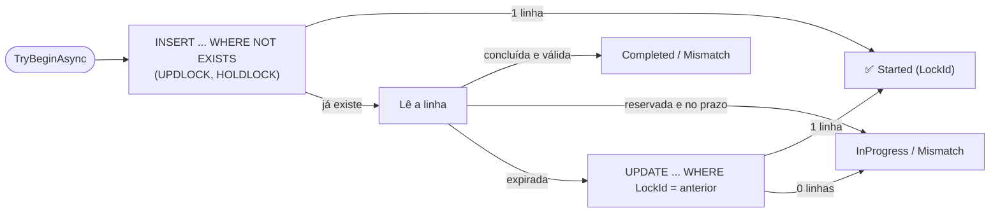

[🏠 TEC.ORM](../README.md) › [📚 Documentação](README.md) › Idempotência

# 🔂 Idempotência

> Guarda no banco da aplicação as respostas das requisições com `Idempotency-Key`, com reserva atômica: várias instâncias da API nunca executam a mesma operação duas vezes.

## 📑 Sumário

- [🎯 Visão geral](#-visão-geral)
- [🚀 Uso](#-uso)
  - [Mapear a tabela](#mapear-a-tabela)
  - [Registrar](#registrar)
  - [Limpeza](#limpeza)
- [⚙️ Opções](#️-opções)
- [❌ Erros](#-erros)
- [🛡️ Segurança](#️-segurança)
- [❓ Perguntas frequentes](#-perguntas-frequentes)

---

## 🎯 Visão geral

O `EfIdempotencyStore<TContext>` implementa o `IIdempotencyStore` do **TEC.Cqrs**, usado pelo middleware `UseTecIdempotency` do
`TEC.Cqrs.AspNetCore` (ver a [documentação da idempotência HTTP](https://github.com/tudoemcodigo/lib-tec-cqrs/blob/main/docs/idempotencia.md)).

| Tipo | Namespace | Para que serve |
|---|---|---|
| `modelBuilder.AddTecIdempotency(schema, tableName)` | `TEC.ORM.SqlServer.Idempotency` | Mapeia a tabela no modelo do contexto |
| `services.AddTecOrmIdempotency<TContext>(...)` | `TEC.ORM.SqlServer.DependencyInjection` | Registra o store (Scoped) e a limpeza |
| `EfIdempotencyStore<TContext>` | `TEC.ORM.SqlServer.Idempotency` | O store (`TryBeginAsync`, `CompleteAsync`, `AbandonAsync`, `PurgeExpiredAsync`) |
| `OrmIdempotencyOptions` | `TEC.ORM.SqlServer.Idempotency` | Opções da limpeza |



| Coluna | Tipo | Conteúdo |
|---|---|---|
| `Scope`, `IdempotencyKey` | `nvarchar(200)` (chave primária) | Usuário e chave do cliente |
| `RequestHash` | `varchar(128)` | SHA-256 da requisição |
| `LockId`, `State`, `LockedUntil` | — | Reserva (0 = em andamento, 1 = concluída) |
| `RetentionSeconds`, `ExpiresAt` | — | Retenção e expiração (índice em `ExpiresAt`) |
| `StatusCode`, `ContentType`, `HeadersJson`, `Body` | — | Resposta guardada |

---

## 🚀 Uso

### Mapear a tabela

```csharp
using TEC.ORM.SqlServer.Idempotency;

public sealed class AppDbContext(DbContextOptions<AppDbContext> options) : DbContext(options)
{
    protected override void OnModelCreating(ModelBuilder modelBuilder)
    {
        modelBuilder.AddTecIdempotency(schema: "app");   // tabela app.IdempotencyKeys
    }
}
```

Depois gere e aplique a migration (`dotnet ef migrations add Idempotencia`).

### Registrar

```csharp
builder.Services.AddTecOrm<AppDbContext>(o => o.ConnectionSecretName = "sql-app");
builder.Services.AddTecOrmIdempotency<AppDbContext>();

builder.Services.AddTecCqrs(o => o.RegisterServicesFromAssemblyContaining<Program>())
    .AddAspNetCore()
    .AddIdempotency();

app.UseAuthentication();
app.UseAuthorization();
app.UseTecIdempotency();
app.MapPost("/pedidos", ...).WithIdempotency();
```

### Limpeza

Um `BackgroundService` remove, a cada `CleanupInterval`, as respostas fora da retenção e as reservas vencidas, em lotes de
`CleanupBatchSize` (até `MaxBatchesPerCleanup` por ciclo). Para limpar por um job próprio, desligue com `EnableCleanup = false` e chame
`EfIdempotencyStore<TContext>.PurgeExpiredAsync(batchSize, ct)`.

---

## ⚙️ Opções

| Opção | Padrão | Descrição |
|---|---|---|
| `EnableCleanup` | `true` | Limpeza periódica em segundo plano |
| `CleanupInterval` | 1 h | Intervalo entre limpezas (1 min a 1 dia) |
| `CleanupBatchSize` | 1.000 | Linhas por comando (1 a 10.000) |
| `MaxBatchesPerCleanup` | 50 | Lotes por ciclo (1 a 1.000) |

Retenção, prazo da reserva e limites de tamanho são do `IdempotencyOptions` do TEC.Cqrs.AspNetCore.

## ❌ Erros

| Exceção | Quando ocorre | O que fazer |
|---|---|---|
| `InvalidOperationException` "A tabela de idempotência não está mapeada" | Contexto sem `AddTecIdempotency()` | Mapeie a tabela e gere a migration |
| `InvalidOperationException` "Já existe um IIdempotencyStore registrado" | Dois stores (ex.: também `AddInMemoryIdempotencyStore`) | Registre um só |
| `ArgumentOutOfRangeException` | Opção fora dos limites | Corrija a opção |
| Log 3201 (Warning) | Falha na limpeza (banco indisponível) | Nada: tenta de novo no próximo ciclo |

## 🛡️ Segurança

> [!WARNING]
> A tabela guarda o **corpo das respostas** por até `Retention` (padrão 24 h). Se as respostas tiverem dados pessoais, trate a tabela
> como os demais dados da aplicação (backup, acesso, LGPD) e prefira respostas enxutas (ids e `Location`) nos endpoints idempotentes.

- O store nunca chama `SaveChanges`: só comandos diretos e leituras sem rastreamento. Alterações pendentes da aplicação no mesmo
  contexto não são gravadas por ele.
- Identificadores do SQL vêm do modelo (escapados); todos os valores são parâmetros.

## ❓ Perguntas frequentes

<details>
<summary><b>Posso usar um banco ou contexto separado?</b></summary>

Sim: mapeie a tabela em outro contexto registrado com `AddTecOrm<OutroContext>` e use `AddTecOrmIdempotency<OutroContext>()`.
</details>

<details>
<summary><b>O store participa da transação do command?</b></summary>

Participa da transação corrente do contexto, se houver. O middleware HTTP roda antes e depois do pipeline, fora de transação; por
isso a reserva fica visível às outras instâncias imediatamente.
</details>

---

⬅️ [🔁 Transação](transacao.md) · [📚 Índice](README.md) · [🔄 Mapeamento](mapeamento.md) ➡️
