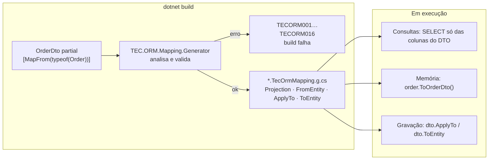

[🏠 TEC.ORM](../README.md) › [📚 Documentação](README.md) › 🔄 Mapeamento entidade ↔ DTO

# 🔄 Mapeamento entidade ↔ DTO

> Converte entidades em DTOs e de volta sem código de cópia: o DTO é `partial`, indica a entidade com `[MapFrom]` e o
> gerador do TEC.ORM escreve a conversão durante a compilação, recusando no build qualquer mapeamento inválido.

## 📑 Sumário

- [🎯 Visão geral](#-visão-geral)
- [🚀 Uso](#-uso)
  - [Requisitos](#requisitos)
  - [Primeiro DTO](#primeiro-dto)
  - [Correspondência automática e atributos](#correspondência-automática-e-atributos)
  - [Conversões automáticas](#conversões-automáticas)
  - [Objetos aninhados e achatamento](#objetos-aninhados-e-achatamento)
  - [Coleções](#coleções)
  - [Ciclos e MaxDepth](#ciclos-e-maxdepth)
  - [Conversores](#conversores)
  - [O que é gerado](#o-que-é-gerado)
  - [Atalhos genéricos](#atalhos-genéricos)
  - [DTO → entidade (ApplyTo / ToEntity)](#dto--entidade-applyto--toentity)
  - [Records, herança, visibilidade e partial](#records-herança-visibilidade-e-partial)
- [⚙️ Opções](#️-opções)
- [❌ Erros](#-erros)
- [🛡️ Segurança](#️-segurança)
- [❓ Perguntas frequentes](#-perguntas-frequentes)

---

## 🎯 Visão geral

| | |
|---|---|
| ⚡ **Sem reflexão** | C# comum gerado na compilação: compatível com Native AOT e trimming, sem *profile* nem configuração em execução |
| 🛑 **Erro de build, não de produção** | Propriedade sem origem, caminho errado, tipos incompatíveis, ciclo sem limite: o projeto **não compila** ([🛑 Diagnósticos](diagnosticos-do-gerador.md)) |
| 🗃️ **Projeção no banco** | A mesma regra vira uma `Expression` que o EF Core traduz num `SELECT` **só com as colunas do DTO**, com os aninhados, sem `Include` |
| 🧩 **Objetos complexos** | Aninhados em qualquer profundidade, achatamento (`"Customer.Address.City"`) seguro contra nulos, ciclos com `MaxDepth` |
| 🔐 **Volta segura** | `ApplyTo`/`ToEntity` nunca gravam `Id`, exclusão lógica, auditoria, achatados ou somente leitura |



---

## 🚀 Uso

### Requisitos

| Item | Requisito |
|---|---|
| Pacote | `TEC.ORM` (o `TEC.ORM.SqlServer` já o traz). O gerador vem **dentro** dele (`analyzers/dotnet/cs`): não há outro pacote nem registro no DI |
| Compilador | Visual Studio 17.12 / .NET SDK 9.0.100 ou mais novo (Roslyn 4.12); C# 11+ (membros `static abstract` de interface) |
| DTO | `class` ou `record class`, `partial`, não genérico, não abstrato, não estático, não aninhado, com construtor sem parâmetros `public`/`internal`; sem membros `Projection`, `FromEntity`, `ApplyTo`, `ToEntity` ou `__TecOrm*`; propriedades preenchidas com `set` ou `init` |
| Entidade | Classe ou interface **fechada** (genérico aberto: `TECORM015`). Para `ToEntity()`, classe concreta com construtor sem parâmetros acessível |

### Primeiro DTO

```csharp
using TEC.ORM.Mapping;

[MapFrom(typeof(Customer))]
public partial class CustomerDto
{
    public Guid Id { get; set; }          // mesmo nome e tipo: automático
    public string Name { get; set; } = "";
    public string Email { get; set; } = "";
}
```

```csharp
CustomerDto dto = customer.ToCustomerDto();                                     // memória
List<CustomerDto> list = customers.ToCustomerDtoList();                         // coleção em memória
IQueryable<CustomerDto> query = context.Customers.ProjectToCustomerDto();       // banco
var result = await repository.GetByIdAsync<CustomerDto>(id, ct);                // repositório
Customer created = dto.ToEntity();                                              // criação
dto.ApplyTo(trackedCustomer);                                                   // atualização
```

### Correspondência automática e atributos

Para cada propriedade pública de instância do DTO (inclusive herdadas), nesta ordem:

| Situação | Resultado |
|---|---|
| `[MapIgnore]` | Fora do mapeamento |
| `[MapFrom("caminho")]`, `[MapObject("caminho")]` ou `[MapList("caminho")]` | Origem no caminho indicado |
| Propriedade de **mesmo nome** na entidade (ou na base dela), legível | Origem automática |
| Tipo é um DTO com `[MapFrom]` | Objeto aninhado (como `[MapObject]`) |
| Tipo é coleção suportada e a origem também | Coleção (como `[MapList]`), de DTOs ou de valores simples |
| Nada encontrado | **`TECORM002`** |

| Atributo (`TEC.ORM.Mapping`) | Onde | Parâmetros | Efeito |
|---|---|---|---|
| `[MapFrom(typeof(Entidade))]` | Classe | entidade | Ativa a geração |
| `[MapFrom("Caminho")]` | Propriedade | caminho com `.` | Outro nome ou **achatamento**; nulo no caminho vira `null`/padrão |
| `[MapObject]` | Propriedade | caminho (opcional), `MaxDepth`, `Sync` | Objeto → DTO aninhado |
| `[MapList]` | Propriedade | caminho (opcional), `MaxDepth`, `Sync` | Coleção → coleção de DTOs ou valores |
| `[MapIgnore(MapDirection direction = MapDirection.Both)]` | Propriedade | `Both`, `ToDto`, `ToEntity` | Ignora nas duas direções ou numa só |
| `[MapReadOnly]` | Propriedade | — | Só entidade → DTO |
| `[MapConverter(typeof(T))]` | Propriedade | tipo do conversor | Conversão customizada |

`MaxDepth` (`int`): em ciclos, quantas vezes a propriedade é expandida num mesmo caminho (`0` = sem limite próprio;
negativo = `TECORM012`). `Sync` (`bool`, padrão `false`): grava de volta no `ApplyTo`/`ToEntity`.

### Conversões automáticas

| Entidade → DTO | Ida (entidade → DTO) | Volta (DTO → entidade) |
|---|---|---|
| Mesmo tipo | cópia | cópia |
| Implícita sem perda (`int` → `long`, `T` → `T?`, derivada → base) | cast | só se a volta também for implícita |
| `T?` → `T` | nulo vira `default(T)` | `T` → `T?`: cópia |
| `T` → `T?` (no DTO) | cast | só se tiver valor (nulo **mantém** o valor da entidade) |
| enum → `string` | nome do valor | nome ou número **definido**, sem diferenciar maiúsculas; inválido mantém o valor |
| `string` → enum | `Enum.Parse` sem diferenciar maiúsculas (nulo vira o padrão) | nome do valor |
| Qualquer outra | **`TECORM004`**: use `[MapConverter]` | — |

> [!WARNING]
> `string` → enum na **ida** confia no dado gravado: um texto que não existe no enum lança exceção. Se a coluna pode ter
> valores fora do enum, use um conversor.

### Objetos aninhados e achatamento

```csharp
[MapFrom(typeof(Order))]
public partial class OrderDto
{
    public long Id { get; set; }
    public ProductDto? Product { get; set; }               // ProductDto também tem [MapFrom(typeof(Product))]

    [MapFrom("Product.Category.Name")]
    public string? CategoryName { get; set; }              // achatamento em dois níveis

    [MapObject("Customer.ShippingAddress")]
    public AddressDto? Shipping { get; set; }              // objeto com outro caminho
}
```

O gerador expande os aninhados **em linha** (a projeção precisa ser uma única expressão) e protege cada passo contra nulos.
O tipo da origem precisa ser atribuível à entidade do DTO aninhado (senão `TECORM004`); `Nullable<T>` de struct no **meio**
do caminho exige conversor (`TECORM003`).

### Coleções

```csharp
public List<OrderItemDto> Items { get; set; } = [];        // coleção de DTOs: automática
public IReadOnlyList<string> Tags { get; set; } = [];      // valores simples (cópia, nunca a mesma instância)

[MapList("ActiveItems")]
public OrderItemDto[] Active { get; set; } = [];           // outro caminho, array
```

- **No DTO:** `List<T>`, `T[]`, `IList<T>`, `ICollection<T>`, `IEnumerable<T>`, `IReadOnlyList<T>`, `IReadOnlyCollection<T>`.
  Na entidade, qualquer `IEnumerable<T>` (exceto `string`).
- Coleção nula na entidade vira coleção **vazia** no DTO; valores simples aceitam conversão implícita (`List<int>` → `long[]`).
- O filtro de exclusão lógica vale dentro das coleções projetadas.

### Ciclos e MaxDepth

```csharp
[MapFrom(typeof(Customer))]
public partial class CustomerDto
{
    public Guid Id { get; set; }
    public List<OrderDto> Orders { get; set; } = [];
}

[MapFrom(typeof(Order))]
public partial class OrderDto
{
    public long Id { get; set; }

    [MapObject(MaxDepth = 1)]                              // basta UMA propriedade do ciclo com MaxDepth
    public CustomerDto? Customer { get; set; }
}
```

```text
OrderDto
└─ Customer: CustomerDto                (1ª expansão de OrderDto.Customer)
   └─ Orders: [OrderDto, ...]
      └─ Customer: null                 (cortado: MaxDepth atingido)
```

Sem limite o build falha com **`TECORM005`**; há também um teto de segurança de **32 níveis**. Cada nível a mais é mais
`JOIN` e mais dados trafegados: use o menor valor que atenda à tela ou à API.

### Conversores

| Interface (`TEC.ORM.Mapping`) | Membro | Uso |
|---|---|---|
| `IMapConverter<in TSource, out TDestination>` | `TDestination Convert(TSource value)` | Só entidade → DTO |
| `IBidirectionalMapConverter<TSource, TDestination>` | `+ TSource ConvertBack(TDestination value)` | Necessário para a propriedade voltar no `ApplyTo`/`ToEntity` |

```csharp
public sealed class CentsConverter : IBidirectionalMapConverter<long, decimal>
{
    public decimal Convert(long value) => value / 100m;
    public long ConvertBack(decimal value) => (long)Math.Round(value * 100m, MidpointRounding.AwayFromZero);
}

[MapFrom(typeof(Account))]
public partial class AccountDto
{
    [MapFrom(nameof(Account.BalanceInCents)), MapConverter(typeof(CentsConverter))]
    public decimal Balance { get; set; }
}
```

- Tipos genéricos do conversor **exatamente** iguais à origem e à propriedade do DTO (`TECORM007`).
- Classe concreta, não genérica aberta, com construtor sem parâmetros e **sem estado** (uma instância estática por propriedade).
- Na projeção para o banco, o conversor roda **na aplicação**, depois da leitura.

### O que é gerado

Arquivo `<Namespace>.<Dto>.<hash>.TecOrmMapping.g.cs` (nome completo do DTO, caracteres fora de `[A-Za-z0-9_.]` trocados por
`_`, mais um hash FNV-1a de 8 dígitos do nome exato), começando com `// <auto-generated/>`, `#nullable enable` e
`#pragma warning disable` (não gera avisos no seu projeto). Para `OrderSummaryDto` com `Id`, `Amount` e
`[MapFrom("Customer.Name")] CustomerName` (simplificado):

```csharp
partial class OrderSummaryDto : IDtoMap<Order, OrderSummaryDto>, IDtoReverseMap<Order>, IDtoEntityFactory<Order>
{
    public static Expression<Func<Order, OrderSummaryDto>> Projection => /* s0 => new OrderSummaryDto { ... } */;
    public static OrderSummaryDto FromEntity(Order entity) => new OrderSummaryDto { Id = entity.Id, Amount = entity.Amount,
        CustomerName = entity.Customer == null ? default(string) : entity.Customer.Name };
    public void ApplyTo(Order entity) { entity.Amount = this.Amount; }         // sem Id e sem o achatado
    public Order ToEntity() { var entity = new Order(); entity.Amount = this.Amount; return entity; }
}

public static partial class OrderSummaryDtoMappingExtensions
{
    public static OrderSummaryDto ToOrderSummaryDto(this Order entity);
    public static List<OrderSummaryDto> ToOrderSummaryDtoList(this IEnumerable<Order> entities);
    public static IQueryable<OrderSummaryDto> ProjectToOrderSummaryDto(this IQueryable<Order> query);
}
```

| Contrato gerado | Membros |
|---|---|
| `IDtoMap<TEntity, TDto>` | `static abstract Expression<Func<TEntity, TDto>> Projection` · `static abstract TDto FromEntity(TEntity entity)` |
| `IDtoReverseMap<in TEntity>` | `void ApplyTo(TEntity entity)` |
| `IDtoEntityFactory<out TEntity>` | `TEntity ToEntity()` (só com construtor sem parâmetros acessível na entidade) |

Para ver o código: **Dependências → Analisadores → TEC.ORM.Mapping.Generator** no Visual Studio/Rider (ou F12 em
`ToOrderDto`), ou grave em disco com `<EmitCompilerGeneratedFiles>true</EmitCompilerGeneratedFiles>`.

### Atalhos genéricos

> `TEC.ORM.Mapping.DtoMappingExtensions` · `static class`

| Membro | Retorno | Descrição |
|---|---|---|
| `ProjectToDto<TEntity, TDto>(this IQueryable<TEntity> query)` | `IQueryable<TDto>` | `query.Select(TDto.Projection)` |
| `ToDtoList<TEntity, TDto>(this IEnumerable<TEntity> entities)` | `List<TDto>` | Conversão em memória |
| `ToDtoPage<TEntity, TDto>(this PagedResult<TEntity> page)` | `PagedResult<TDto>` | Converte a página preservando a paginação |

### DTO → entidade (ApplyTo / ToEntity)

```csharp
[MapFrom(typeof(Order))]
public partial class OrderInputDto
{
    public long Id { get; set; }                           // usado na sincronização, nunca gravado
    public Guid CustomerId { get; set; }
    public decimal Amount { get; set; }

    [MapList(Sync = true)]
    public List<OrderItemInputDto> Items { get; set; } = [];
}

// Criação: ToEntity() cria o pedido e os itens (sem Id: o banco gera)
app.MapPost("/pedidos", async (OrderInputDto input, IOrmRepository<Order, long> orders, CancellationToken ct) =>
{
    var created = await orders.CreateAsync(input.ToEntity(), ct);
    return created.IsSuccess ? Results.Created($"/pedidos/{created.Value.Id}", created.Value.ToOrderDto())
                             : Results.BadRequest(created.Errors);
});

// Atualização: carregue COM rastreamento e com os itens, aplique e grave no mesmo escopo
app.MapPut("/pedidos/{id:long}", async (long id, OrderInputDto input, SalesContext db,
    IOrmRepository<Order, long> orders, CancellationToken ct) =>
{
    var current = await db.Orders.Include(o => o.Items).FirstOrDefaultAsync(o => o.Id == id, ct);
    if (current is null)
        return Results.NotFound();

    input.ApplyTo(current);                                // Id preservado; itens sincronizados pelo Id
    var saved = await orders.UpdateAsync(current, ct);
    return saved.IsSuccess ? Results.NoContent() : Results.Conflict(saved.Errors);
});
```

| Propriedade do DTO | `ApplyTo` / `ToEntity` |
|---|---|
| `Id`, `IsDeleted`, `DeletedAt` | **Nunca** |
| Campos de `IAuditable` | **Nunca** (o interceptor de auditoria preenche) |
| Valor simples com caminho direto | Copiado (com a conversão de volta) |
| Achatado, `[MapReadOnly]`, `[MapIgnore]`, conversão com perda, conversor só de ida, propriedade sem `set` acessível na entidade | Nunca |
| Objeto aninhado | Só com `[MapObject(Sync = true)]`: aplicado sobre o existente ou criado; nulo no DTO **não remove** |
| Coleção aninhada | Só com `[MapList(Sync = true)]`, sincronizada pelo `Id`: existente → `ApplyTo`; `Id` padrão ou desconhecido → `ToEntity()`; ausente → removido; coleção do DTO nula → intacta |

Requisitos do `Sync` em coleção (`TECORM008`): elementos DTO mapeados; elemento da entidade com `IEntity<TKey>`; DTO do
elemento com `Id` do mesmo `TKey`; coleção da entidade com `ICollection<T>`; construtor sem parâmetros; caminho direto.

> [!IMPORTANT]
> A coleção da entidade precisa estar **carregada e rastreada** (`Include`), senão os itens existentes parecem novos.
> Item removido numa relação obrigatória vira **exclusão lógica**; numa opcional, o EF Core só anula a chave estrangeira.

### Records, herança, visibilidade e partial

- **`record class`** com `init`: suportado (inicializador de objeto).
- **Herança de DTO:** propriedades públicas da base também são mapeadas; marque com `[MapIgnore]` as que não existem na entidade.
- **Visibilidade:** DTO `public` ou `internal` (as extensões acompanham). Entidade não pública com DTO público: os membros
  gerados ficam `internal` e os contratos são implementados explicitamente (o repositório continua funcionando). DTOs
  aninhados precisam estar no **mesmo projeto**.
- **Várias declarações `partial`:** se `[MapFrom]` aparecer em mais de uma (já é o erro CS0579), só a primeira (por
  arquivo e posição) gera o código, sem derrubar o gerador.
- **Nomes:** palavras-chave (`@class`, `@event`) saem com `@`; namespace global e entidade aninhada em outro tipo são suportados.

---

## ⚙️ Opções

| Propriedade MSBuild (no projeto que declara os DTOs) | Padrão | Descrição |
|---|---|---|
| `EmitCompilerGeneratedFiles` | `false` | Grava o código gerado em `obj/.../generated/TEC.ORM.Mapping.Generator/` |
| `dotnet_diagnostic.TECORMxxx.severity` (`.editorconfig`) | por regra | Ajusta a severidade (ex.: `TECORM014` como erro) |

---

## ❌ Erros

Todo erro de mapeamento é **de compilação** e impede a geração do DTO afetado; tabela completa, exemplos e correções em
[🛑 Diagnósticos do gerador](diagnosticos-do-gerador.md).

| Código | Título |
|---|---|
| `TECORM001`–`TECORM013` | Declaração, caminhos, tipos, ciclos, aninhados, conversores, `Sync`, coleções, forma do DTO e colisão de nomes |
| `TECORM015` | Entidade não suportada (genérico aberto ou tipo não encontrado) |
| `TECORM016` | Falha interna do gerador (relatada como erro, sem derrubar a compilação dos demais DTOs) |

Em execução, o código gerado não devolve `Result`: as únicas exceções possíveis vêm de dados (`string` → enum inválido) ou
dos seus conversores.

---

## 🛡️ Segurança

> [!WARNING]
> *Overposting*: use DTOs de **entrada** separados dos de saída, pegue o `Id` da rota e autorize o acesso ao registro
> antes do `ApplyTo`. Objetos e coleções só voltam com `Sync = true` explícito.

- O mapeamento não usa reflexão nem `Expression.Compile` em execução: nada é montado a partir de dados externos.
- Campos de identidade, exclusão lógica e auditoria nunca são gravados a partir do DTO.

---

## ❓ Perguntas frequentes

<details>
<summary><code>ToCustomerDto()</code>/<code>ProjectToCustomerDto()</code> não existem.</summary>

O gerador não rodou ou o DTO tem erro: compilador anterior ao VS 17.12/SDK 9.0.100, `TECORMxxx` na lista de erros ou o
projeto não referencia o `TEC.ORM`.

</details>

<details>
<summary>A sincronização com <code>[MapList(Sync = true)]</code> duplica os itens.</summary>

A coleção não foi carregada com `Include` nem está rastreada: carregue a entidade com rastreamento antes do `ApplyTo`.

</details>

<details>
<summary>Posso ter DTOs aninhados de outro projeto?</summary>

Não: a expansão em linha precisa do código do DTO aninhado no mesmo projeto (`TECORM006`).

</details>

---
⬅️ [🔂 Idempotência](idempotencia.md) · [📚 Índice](README.md) · [🛑 Diagnósticos do gerador](diagnosticos-do-gerador.md) ➡️
