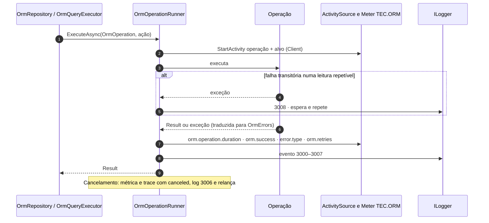

| Métrica | `orm.circuit.state_changes` (contador) | `orm.connection` (`escrita`/`leitura`), `orm.circuit.state` (`open`, `half_open`, `closed`) |
| `CircuitStateChangesName` | `"orm.circuit.state_changes"` |
| 3105 | Warning | ORM: circuito da conexão {Kind} aberto após falhas repetidas ao abrir conexões; aberturas recusadas por {BreakSeconds} s. |
| 3106 | Information | ORM: circuito da conexão {Kind} meio-aberto; testando o banco com uma abertura. |
| 3107 | Information | ORM: circuito da conexão {Kind} fechado; o banco voltou a aceitar conexões. |
| 3108 | Debug | ORM: abertura da conexão {Kind} recusada com o circuito aberto. |
[🏠 TEC.ORM](../README.md) › [📚 Documentação](README.md) › 📈 Observabilidade

# 📈 Observabilidade

> Toda operação do TEC.ORM gera um trace, uma medição de duração e um log de auditoria, em sucesso e em erro, sem nunca
> registrar SQL, valores ou dados da conexão.

## 📑 Sumário

- [🎯 Visão geral](#-visão-geral)
- [🚀 Uso](#-uso)
  - [Com o TEC.Observability](#com-o-tecobservability)
  - [Sem o TEC.Observability](#sem-o-tecobservability)
  - [IOrmOperationRunner e OrmOperation](#iormoperationrunner-e-ormoperation)
  - [OrmDiagnostics, traces e métricas](#ormdiagnostics-traces-e-métricas)
  - [Eventos de log](#eventos-de-log)
- [⚙️ Opções](#️-opções)
- [❌ Erros](#-erros)
- [🛡️ Segurança](#️-segurança)
- [❓ Perguntas frequentes](#-perguntas-frequentes)

---

## 🎯 Visão geral



O TEC.ORM **não depende** do TEC.Observability: emite `ActivitySource` e `Meter` da BCL com o nome `TEC.ORM`, que qualquer
OpenTelemetry pode assinar.

---

## 🚀 Uso

### Com o TEC.Observability

```csharp
builder.Services.AddTecObservability(builder.Configuration)     // já assina as fontes "TEC.*", inclusive "TEC.ORM"
    .HealthChecks.AddTecOrm();                                   // banco no /health/ready
builder.Services.AddTecOrm<SalesContext>(orm => orm.ConnectionSecretName = "sales-sql-rw");
```

### Sem o TEC.Observability

```csharp
using TEC.ORM.SqlServer.Diagnostics;

builder.Services.AddOpenTelemetry()
    .WithTracing(t => t.AddSource(OrmDiagnostics.ActivitySourceName))
    .WithMetrics(m => m.AddMeter(OrmDiagnostics.MeterName));
```

### IOrmOperationRunner e OrmOperation

> `TEC.ORM.SqlServer.Diagnostics` · pacote `TEC.ORM.SqlServer`

`IOrmOperationRunner` executa cada operação: cria o `Activity`, mede, registra, traduz exceções em `Result` e repete
leituras em falha transitória. É ponto de extensão (os repositórios dependem só da interface).

| Membro | Retorno | Descrição |
|---|---|---|
| `ExecuteAsync<T>(OrmOperation operation, Func<CancellationToken, Task<Result<T>>> action, CancellationToken ct)` | `Task<Result<T>>` | Operação com valor |
| `ExecuteAsync(OrmOperation operation, Func<CancellationToken, Task<Result>> action, CancellationToken ct)` | `Task<Result>` | Operação sem valor |

Implementação: `OrmOperationRunner(ILogger<OrmOperationRunner> logger, OrmOptions options, TimeProvider? time = null)`
(`time` é o relógio das esperas entre tentativas; `null` usa `TimeProvider.System`).

`OrmOperation(string provider, string operation, string target, bool isWrite)`:

| Membro | Tipo | Descrição |
|---|---|---|
| `Provider` | `string` | `entityframework` ou `dapper` |
| `Operation` | `string` | `create`, `get`, `update`, `delete`, `hard-delete`, `hard-delete-many`, `find`, `list`, `exists`, `count`, `get-dto`, `find-dto`, `list-dto`, `query`, `query-single`, `scalar`, `query-join` |
| `Target` | `string` | Nome da entidade ou `SqlQuery.Name` |
| `IsWrite` | `bool` | Escrita: log de auditoria em `Information` |
| `Identifier` | `object?` | Só no log, conforme `IdentifierLogMode`; pode ser definido durante a operação |
| `IsHardDelete` | `bool` (`init`) | Sucesso no log 3007 (`Warning`) em vez do 3001 |
| `IsRetryable` | `bool` (`init`) | Pode ser repetida em falha transitória (só leitura fora de transação; ignorado em escritas) |

### OrmDiagnostics, traces e métricas

| Constante (`OrmDiagnostics`) | Valor |
|---|---|
| `ActivitySourceName` / `MeterName` | `"TEC.ORM"` |
| `OperationDurationName` | `"orm.operation.duration"` |
| `EntityFrameworkProvider` / `DapperProvider` | `"entityframework"` / `"dapper"` |
| `DbSystem` | `"microsoft.sql_server"` |
| `CanceledErrorType` | `"canceled"` |

| Sinal | Nome | Atributos |
|---|---|---|
| Trace | `Activity` `Client` `"{operação} {alvo}"` (ex.: `create Customer`, `query reports.sales`) | `db.system.name`, `orm.provider`, `orm.operation`, `orm.target`, `orm.success`, `orm.retries` (só com nova tentativa) e, em falha, `error.type` + status `Error` |
| Métrica | `orm.operation.duration` (histograma, `s`) | `db.system.name`, `orm.provider`, `orm.operation`, `orm.target` e, em falha, `error.type` (código de `OrmErrors` ou `canceled`) |

A contagem por operação e resultado vem do próprio histograma (ex.: taxa de erro por entidade = contagem com
`error.type` ÷ total, agrupado por `orm.target`).

### Eventos de log

Mensagens geradas com `LoggerMessage`. Categorias: `TEC.ORM.SqlServer.Diagnostics.OrmOperationRunner`,
`TEC.ORM.SqlServer.Security.OrmConnectionSecurity` e `TEC.ORM.SqlServer.HealthChecks.OrmHealthCheck`.

| Evento | Nível | Mensagem (modelo) |
|---|---|---|
| 3000 | Debug | ORM {Provider}: {Operation} de {Target} ({Identifier}) concluída em {ElapsedMilliseconds} ms. |
| 3001 | Information | Auditoria ORM {Provider}: {Operation} de {Target} ({Identifier}) concluída em {ElapsedMilliseconds} ms. |
| 3002 | Information | ORM {Provider}: {Operation} de {Target} ({Identifier}) retornou {ErrorCode} em {ElapsedMilliseconds} ms. |
| 3003 | Warning | Auditoria ORM {Provider}: {Operation} de {Target} ({Identifier}) retornou {ErrorCode} em {ElapsedMilliseconds} ms. |
| 3004 | Error | ORM {Provider}: {Operation} de {Target} ({Identifier}) falhou por infraestrutura: {ErrorCode} ({ExceptionType}, SQL {SqlErrorNumber}) em {ElapsedMilliseconds} ms. |
| 3005 | Error | ORM {Provider}: {Operation} de {Target} ({Identifier}) lançou {ExceptionType} inesperada; convertida em {ErrorCode}. *(com a exceção)* |
| 3006 | Debug | ORM {Provider}: {Operation} de {Target} ({Identifier}) cancelada após {ElapsedMilliseconds} ms. |
| 3007 | Warning | Auditoria ORM {Provider}: EXCLUSÃO FÍSICA - {Operation} de {Target} ({Identifier}) removeu os registros de fato do banco (irreversível) em {ElapsedMilliseconds} ms. |
| 3008 | Warning | ORM {Provider}: {Operation} de {Target} teve falha transitória {ErrorCode} (SQL {SqlErrorNumber}); nova tentativa {Retry} de {MaxRetries}. |
| 3100 | Error | ORM: segredo da conexão {Kind} indisponível no cofre: {ErrorCode}. |
| 3101 | Error | ORM: segredo da conexão {Kind} recusado pela política de segurança: {Reason}. |
| 3102 | Error | ORM: falha ao abrir a conexão {Kind} (SQL {SqlErrorNumber}). |
| 3103 | Warning | ORM: TrustServerCertificate habilitado na conexão {Kind}: o certificado do servidor não é validado (use só em desenvolvimento). |
| 3104 | Warning | Health check do ORM falhou: {ErrorCode}. |
| 3200 | Debug | Limpeza da idempotência removeu {Count} chave(s) expirada(s) de {Context}. |
| 3201 | Warning | Falha na limpeza da idempotência de {Context}; nova tentativa no próximo ciclo. |

`{Kind}` é `escrita` ou `leitura`. Falhas esperadas de leitura saem em 3002; de escrita, em 3003; de infraestrutura
(`ExternalService`), em 3004. `{Identifier}` segue o `IdentifierLogMode` ([⚙️ Opções](opcoes.md#identifierlogmode)).

---

## ⚙️ Opções

| Configuração | Padrão | Descrição |
|---|---|---|
| `OrmOptions.IdentifierLogMode` | `Plain` | Identificador no log |
| `Logging:LogLevel:TEC.ORM.SqlServer.Diagnostics.OrmOperationRunner` | do host | Mantenha `Information` em produção (auditoria das escritas) |

```json
{ "Logging": { "LogLevel": { "TEC.ORM.SqlServer.Diagnostics.OrmOperationRunner": "Information" } } }
```

---

## ❌ Erros

| Código / situação | Onde aparece |
|---|---|
| Qualquer código de `OrmErrors` | `error.type` (métrica e trace) e `{ErrorCode}` (log) |
| `canceled` | `error.type` de operação cancelada (log 3006) |
| Exceção inesperada | `ORM_FALHA` + log 3005 com a pilha (ex.: navegação inexistente no `Include`) |

---

## 🛡️ Segurança

> [!IMPORTANT]
> Traces e métricas costumam ir para terceiros: **nunca** levam identificador, SQL, valores de parâmetros ou dados da
> conexão. O identificador fica só no log de auditoria.

- Exceções de banco não têm a mensagem registrada (pode trazer o valor de uma chave duplicada): só tipo, número do erro e
  código. Os eventos de erro do próprio EF Core que repetiriam essa mensagem ficam desligados pelo `AddTecOrm`.
- No modo `Plain`, caracteres de controle, de formatação (U+202E) e separadores U+2028/U+2029 do identificador viram `?`:
  sem injeção de linhas nem falsificação visual no log.

---

## ❓ Perguntas frequentes

<details>
<summary>Vale alertar em algum evento?</summary>

Sim: **3007** (exclusão física), **3004** (infraestrutura) e o aumento de **3008** (novas tentativas, sinal de rede ou
failover instável).

</details>

<details>
<summary>Antes era <code>AddEnterpriseObservability</code>; mudou?</summary>

O nome atual é `AddTecObservability`, que assina todas as fontes `TEC.*`.

</details>

---
⬅️ [🔁 Resiliência](resiliencia.md) · [📚 Índice](README.md) · [❌ Erros](erros.md) ➡️
