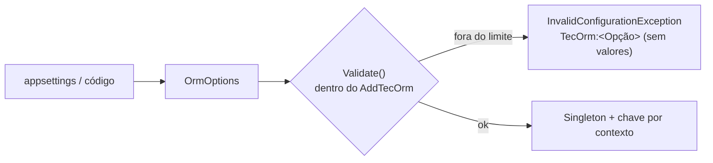

| `CircuitBreaker` nulo ou com valor fora do limite (ligado) | `InvalidConfigurationException("TecOrm:CircuitBreaker:<Opção>")` |
| `CircuitBreaker` | `OrmCircuitBreakerOptions` | ligado (50%, 10 aberturas, 30 s, 30 s) | ver [🔁 Resiliência](resiliencia.md#circuit-breaker-da-conexão) | Circuit breaker da abertura de conexões: `Enabled`, `FailureRatio` (> 0 e ≤ 1), `MinimumThroughput` (2 a 10.000), `SamplingDuration` e `BreakDuration` (0,5 s a 1 h) |
[🏠 TEC.ORM](../README.md) › [📚 Documentação](README.md) › ⚙️ Opções

# ⚙️ Opções

> Todas as opções do TEC.ORM, seus padrões e limites. Elas guardam só **nomes** de segredos, nunca a conexão, e por isso
> podem vir do `appsettings.json` sem risco.

## 📑 Sumário

- [🎯 Visão geral](#-visão-geral)
- [🚀 Uso](#-uso)
  - [appsettings.json](#appsettingsjson)
  - [Em código](#em-código)
- [⚙️ Opções](#️-opções-1)
  - [OrmOptions](#ormoptions)
  - [IdentifierLogMode](#identifierlogmode)
  - [Parâmetros do registro](#parâmetros-do-registro)
- [❌ Erros](#-erros)
- [🛡️ Segurança](#️-segurança)
- [❓ Perguntas frequentes](#-perguntas-frequentes)

---

## 🎯 Visão geral



A validação acontece **na subida** (dentro do `AddTecOrm`): configuração errada derruba a inicialização, não a primeira
requisição. Cada contexto registrado tem as próprias opções ([🗄️ SQL Server](sqlserver.md#vários-contextos)).

---

## 🚀 Uso

### appsettings.json

```json
{
  "TecOrm": {
    "ConnectionSecretName": "sales-sql-rw",
    "ReadOnlyConnectionSecretName": "sales-sql-ro",
    "ApplicationName": "Sales.Api",
    "CommandTimeoutSeconds": 30,
    "MaxPageSize": 100,
    "MaxFindResults": 1000,
    "MaxQueryRows": 10000,
    "TransientRetryCount": 2,
    "TransientRetryDelay": "00:00:00.200",
    "CircuitBreaker": { "Enabled": true, "FailureRatio": 0.5, "MinimumThroughput": 10, "SamplingDuration": "00:00:30", "BreakDuration": "00:00:30" },
    "EnforceReadOnlyQueries": true,
    "IdentifierLogMode": "Hashed"
  }
}
```

```csharp
builder.Services.AddTecOrm<SalesContext>(orm => builder.Configuration.GetSection("TecOrm").Bind(orm));
```

### Em código

```csharp
using TEC.ORM.SqlServer.Configuration;

builder.Services.AddTecOrm<SalesContext>(orm =>
{
    orm.ConnectionSecretName = "sales-sql-rw";
    orm.ReadOnlyConnectionSecretName = "sales-sql-ro";
    orm.ApplicationName = "Sales.Api";
    orm.IdentifierLogMode = IdentifierLogMode.Hashed;
    orm.AllowTrustServerCertificate = builder.Environment.IsDevelopment();   // só no SQL Server local
});
```

---

## ⚙️ Opções

### OrmOptions

> `TEC.ORM.SqlServer.Configuration` · `sealed class` · pacote `TEC.ORM.SqlServer`

| Opção | Tipo | Padrão | Limites | Descrição |
|---|---|---|---|---|
| `ConnectionSecretName` | `string` | `""` (**obrigatório**) | não vazio | Segredo no TEC.Vault com a conexão de leitura e escrita (EF Core) |
| `ReadOnlyConnectionSecretName` | `string?` | `null` | se informado, não vazio | Segredo das leituras complexas (login só com `SELECT`); `null` usa o principal |
| `ApplicationName` | `string` | `"TEC.ORM"` | 1 a 128 caracteres | `Application Name` da conexão (`sys.dm_exec_sessions`) |
| `AllowTrustServerCertificate` | `bool` | `false` | — | Aceita `TrustServerCertificate=True` no segredo (só desenvolvimento; log 3103) |
| `CommandTimeoutSeconds` | `int` | `30` (`DefaultCommandTimeoutSeconds`) | 1 a 600 | Tempo limite dos comandos (EF Core e Dapper) |
| `MaxPageSize` | `int` | `100` | 1 a 10.000 | Itens máximos por página |
| `MaxFindResults` | `int` | `1000` | 1 a 100.000 | Registros máximos do `FindAsync` |
| `MaxQueryRows` | `int` | `10000` | 1 a 1.000.000 | Linhas máximas de uma leitura complexa; acima, `ORM_LIMITE_EXCEDIDO` e o comando é cancelado no servidor |
| `TransientRetryCount` | `int` | `2` | 0 a 5 | Novas tentativas em falha transitória, **só em leituras fora de transação** (`0` desliga) |
| `TransientRetryDelay` | `TimeSpan` | `200 ms` | 10 ms a 10 s | Espera antes da primeira nova tentativa; dobra a cada tentativa, com até 50% de variação aleatória |
| `EnforceReadOnlyQueries` | `bool` | `true` | — | Verificação de somente leitura nas leituras complexas |
| `IdentifierLogMode` | `IdentifierLogMode` | `Plain` | valor definido | Como o identificador aparece nos logs de auditoria |
| `Validate()` | `void` | — | — | Valida tudo; lança `InvalidConfigurationException("TecOrm:<Opção>")` |

### IdentifierLogMode

| Valor | No log | Quando usar |
|---|---|---|
| `Plain` (0) | Valor como está, até 64 caracteres (mais `…`), com caracteres de controle, de formatação (ex.: inversão bidirecional U+202E) e separadores de linha/parágrafo (U+2028/U+2029) trocados por `?` | Chaves técnicas: `int`, `long`, `Guid` |
| `Hashed` (1) | `<N caracteres, hmac:xxxxxxxxxxxx>`: tamanho e prefixo do HMAC-SHA256 com chave aleatória **do processo** (`SensitiveDataMasker.DescribeUntrusted` do TEC.Core) | Chave que é dado pessoal (CPF, e-mail): correlaciona no mesmo processo sem expor |
| `Omitted` (2) | `-` | Nem o tamanho deve aparecer |

> [!NOTE]
> Com `Hashed`, o mesmo identificador gera hashes diferentes em processos diferentes (a chave muda a cada reinício). Em
> nenhum modo o identificador vai para traces ou métricas.

### Parâmetros do registro

| Método | Parâmetro | Padrão | Descrição |
|---|---|---|---|
| `AddTecOrm<TContext>` | `configure` | obrigatório | Preenche as `OrmOptions` |
| `AddTecOrm<TContext>` / `UseTecOrm` | `sqlServer` | `null` | Ajustes do provedor do EF Core (ex.: `MigrationsHistoryTable`). **Não** use `EnableRetryOnFailure` |
| `AddHealthChecks().AddTecOrm` | `name` / `failureStatus` / `tags` / `timeout` | `tec-orm` / `Unhealthy` / `ready`,`database` / 5 s | [Health check](sqlserver.md#health-check) |

---

## ❌ Erros

| Situação | Exceção |
|---|---|
| `ConnectionSecretName` vazio | `InvalidConfigurationException("TecOrm:ConnectionSecretName")` |
| `ReadOnlyConnectionSecretName` informado em branco | `InvalidConfigurationException("TecOrm:ReadOnlyConnectionSecretName")` |
| `ApplicationName` vazio ou com mais de 128 caracteres | `InvalidConfigurationException("TecOrm:ApplicationName")` |
| `CommandTimeoutSeconds`, `MaxPageSize`, `MaxFindResults`, `MaxQueryRows`, `TransientRetryCount`, `TransientRetryDelay` fora do limite | `InvalidConfigurationException("TecOrm:<Opção>")` |
| `IdentifierLogMode` não definido no enum | `InvalidConfigurationException("TecOrm:IdentifierLogMode")` |
| `AddTecOrm` duas vezes para o mesmo contexto | `InvalidOperationException` |

---

## 🛡️ Segurança

> [!CAUTION]
> Nunca coloque a string de conexão em `appsettings.json`, variável de ambiente da aplicação ou opção do EF Core. Ela
> pertence ao cofre; as opções só têm o **nome** do segredo.

- `AllowTrustServerCertificate = true` só em desenvolvimento (SQL Server local com certificado autoassinado).
- `IdentifierLogMode.Hashed` ou `Omitted` quando a chave for dado pessoal.

---

## ❓ Perguntas frequentes

<details>
<summary>Como desligar as novas tentativas?</summary>

`TransientRetryCount = 0`. Leituras passam a falhar na primeira falha transitória com `ORM_CONEXAO_INDISPONIVEL` ou
`ORM_CONCORRENCIA` (deadlock).

</details>

<details>
<summary>Posso subir o <code>MaxQueryRows</code> para 1 milhão?</summary>

Pode (é o teto), mas todas as linhas vão para a memória. Prefira paginar no SQL (`OFFSET/FETCH`).

</details>

---
⬅️ [🗄️ SQL Server](sqlserver.md) · [📚 Índice](README.md) · [🔁 Resiliência](resiliencia.md) ➡️
