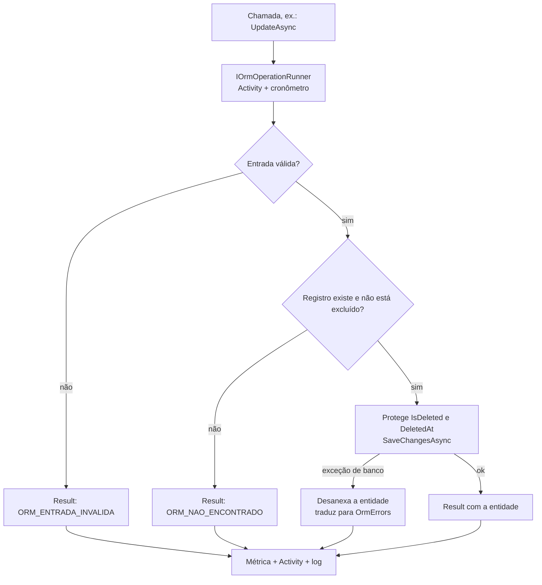

[🏠 TEC.ORM](../README.md) › [📚 Documentação](README.md) › 📝 Repositório genérico (CRUD)

# 📝 Repositório genérico (CRUD)

> Um único repositório para qualquer entidade e qualquer tipo de chave: criar, ler, atualizar, excluir (lógica ou, com
> alerta, fisicamente), buscar, listar paginado, verificar existência e contar, sempre devolvendo `Result`.

## 📑 Sumário

- [🎯 Visão geral](#-visão-geral)
- [🚀 Uso](#-uso)
  - [IOrmRepository\<TEntity, TKey\>](#iormrepositorytentity-tkey)
  - [OrmRepositoryExtensions](#ormrepositoryextensions)
  - [OrmRepository\<TEntity, TKey\> (EF Core)](#ormrepositorytentity-tkey-ef-core)
  - [Exclusão física](#exclusão-física)
  - [Projeção para DTO](#projeção-para-dto)
  - [Especializar o repositório](#especializar-o-repositório)
- [⚙️ Opções](#️-opções)
- [❌ Erros](#-erros)
- [🛡️ Segurança](#️-segurança)
- [❓ Perguntas frequentes](#-perguntas-frequentes)

---

## 🎯 Visão geral

`IOrmRepository<TEntity, TKey>` (pacote `TEC.ORM`) é o contrato; `OrmRepository<TEntity, TKey>` (pacote
`TEC.ORM.SqlServer`) é a implementação com EF Core, registrada pelo `AddTecOrm` como genérico aberto (*scoped*): injete
`IOrmRepository<Customer, Guid>` direto, sem registrar nada por entidade.



| Regra | Detalhe |
|---|---|
| `Result` sempre | Erros esperados (não encontrado, entrada inválida, conflito, concorrência, banco indisponível) são **falhas** com os códigos de [`OrmErrors`](erros.md), nunca exceções. Só o cancelamento (`OperationCanceledException`) e erros de programação lançam |
| Exclusão lógica | Nenhuma operação enxerga registros excluídos logicamente (ler, atualizar, excluir de novo, buscar, listar, existência, contagem). Só a [exclusão física](#exclusão-física) alcança as linhas já excluídas |
| Escrita imediata | Cada escrita chama `SaveChangesAsync` na hora. Para agrupar várias numa transação, use o [`IUnitOfWork`](transacao.md) |
| Leitura resiliente | Leituras **fora de transação** são repetidas em falha transitória; escritas nunca ([🔁 Resiliência](resiliencia.md)) |
| Restrições genéricas | `TEntity : class, IEntity<TKey>, ISoftDelete` e `TKey : notnull, IEquatable<TKey>` |

---

## 🚀 Uso

### IOrmRepository\<TEntity, TKey\>

> `TEC.ORM.Abstractions` · `interface` · pacote `TEC.ORM`

| Membro | Retorno | Descrição |
|---|---|---|
| `CreateAsync(TEntity entity, CancellationToken ct = default)` | `Task<Result<TEntity>>` | Cria e devolve a entidade com o `Id` gerado. `IsDeleted`/`DeletedAt` são zerados: nunca nasce excluída |
| `GetByIdAsync(TKey id, CancellationToken ct = default)` | `Task<Result<TEntity>>` | Lê pelo `Id`, sem rastreamento. Inexistente ou excluído: `ORM_NAO_ENCONTRADO` |
| `UpdateAsync(TEntity entity, CancellationToken ct = default)` | `Task<Result<TEntity>>` | Atualiza o registro existente; não altera `IsDeleted`/`DeletedAt` e não "ressuscita" um excluído |
| `DeleteAsync(TKey id, CancellationToken ct = default)` | `Task<Result>` | Exclusão **lógica** pelo `Id` |
| ⚠️ `HardDeleteAsync(TKey id, CancellationToken ct = default)` | `Task<Result>` | Exclusão **física** pelo `Id`, irreversível (aviso `TECORM014`) |
| ⚠️ `HardDeleteAsync(ISpecification<TEntity> specification, CancellationToken ct = default)` | `Task<Result<long>>` | Exclusão física em lote pelo critério (obrigatório); devolve quantas linhas saíram |
| `FindAsync(ISpecification<TEntity> specification, CancellationToken ct = default)` | `Task<Result<IReadOnlyList<TEntity>>>` | Busca por critério; acima de `MaxFindResults`: `ORM_LIMITE_EXCEDIDO` |
| `ListAsync(PageRequest page, ISpecification<TEntity>? specification = null, CancellationToken ct = default)` | `Task<Result<PagedResult<TEntity>>>` | Lista paginada com filtro e ordenação ([🔎 Especificações e paginação](especificacoes-e-paginacao.md)) |
| `ExistsAsync(TKey id, CancellationToken ct = default)` | `Task<Result<bool>>` | Existe registro (não excluído) com o `Id` |
| `ExistsAsync(ISpecification<TEntity> specification, CancellationToken ct = default)` | `Task<Result<bool>>` | Existe registro que atende ao critério |
| `CountAsync(ISpecification<TEntity>? specification = null, CancellationToken ct = default)` | `Task<Result<long>>` | Conta todos ou os que atendem ao critério |
| `GetByIdAsync<TDto>(TKey id, CancellationToken ct = default)` | `Task<Result<TDto>>` | Lê já como DTO (`TDto : class, IDtoMap<TEntity, TDto>`) |
| `FindAsync<TDto>(ISpecification<TEntity> specification, CancellationToken ct = default)` | `Task<Result<IReadOnlyList<TDto>>>` | Busca já como DTO |
| `ListAsync<TDto>(PageRequest page, ISpecification<TEntity>? specification = null, CancellationToken ct = default)` | `Task<Result<PagedResult<TDto>>>` | Lista já como DTO |

```csharp
using TEC.Core.Common.Results;
using TEC.Core.Responses.Pagination;
using TEC.ORM.Abstractions;
using TEC.ORM.Paging;
using TEC.ORM.Specifications;

public sealed class CustomerService(IOrmRepository<Customer, Guid> customers)
{
    public Task<Result<Customer>> CreateAsync(Customer customer, CancellationToken ct) =>
        customers.CreateAsync(customer, ct);                              // ORM_CONFLITO se o e-mail já existe

    public async Task<Result<Customer>> RenameAsync(Guid id, string name, CancellationToken ct)
    {
        var current = await customers.GetByIdAsync(id, ct);              // ORM_NAO_ENCONTRADO se excluído
        if (current.IsFailure)
            return current;

        current.Value.Name = name;
        return await customers.UpdateAsync(current.Value, ct);           // ORM_CONCORRENCIA se outro alterou antes
    }

    public Task<Result> DeleteAsync(Guid id, CancellationToken ct) => customers.DeleteAsync(id, ct);

    public Task<Result<PagedResult<Customer>>> ListAsync(int page, string? sortBy, CancellationToken ct) =>
        customers.ListAsync(new PageRequest(page, 20, sortBy), new Specification<Customer>(c => c.Name.StartsWith("A")), ct);
}
```

### OrmRepositoryExtensions

> `TEC.ORM.Abstractions` · `static class` · pacote `TEC.ORM`

Atalhos com `Expression<Func<TEntity, bool>>` em vez de especificação (criam `new Specification<TEntity>(criteria)`).

| Membro | Retorno | Descrição |
|---|---|---|
| `FindAsync(this IOrmRepository<TEntity, TKey> orm, Expression<Func<TEntity, bool>> criteria, CancellationToken ct = default)` | `Task<Result<IReadOnlyList<TEntity>>>` | Busca pelo filtro |
| `ExistsAsync(this ..., Expression<Func<TEntity, bool>> criteria, CancellationToken ct = default)` | `Task<Result<bool>>` | Existe registro que atende ao filtro |
| `CountAsync(this ..., Expression<Func<TEntity, bool>> criteria, CancellationToken ct = default)` | `Task<Result<long>>` | Conta pelo filtro |
| ⚠️ `HardDeleteAsync(this ..., Expression<Func<TEntity, bool>> criteria, CancellationToken ct = default)` | `Task<Result<long>>` | Exclusão física em lote pelo filtro (aviso `TECORM014`) |

```csharp
var inUse = await customers.ExistsAsync(c => c.Email == email, ct);
var total = await customers.CountAsync(c => c.Email.EndsWith("@empresa.com"), ct);
```

### OrmRepository\<TEntity, TKey\> (EF Core)

> `TEC.ORM.SqlServer` · `class` (não selada, membros `virtual`) · pacote `TEC.ORM.SqlServer`

Construtor: `OrmRepository(DbContext context, IOrmOperationRunner runner, OrmOptions options)`.

| Operação | Comportamento |
|---|---|
| Leituras | `AsNoTracking()`; o `Id` vira parâmetro (`@__id_0`), nunca literal. Chave sem operador `==` usa `IEquatable<TKey>.Equals` |
| Escritas | `SaveChangesAsync` imediato; se a gravação falhar, a entidade (com os *owned*) é desanexada para não ser regravada pela próxima operação do escopo |
| `UpdateAsync` | Confere a existência com o filtro global e grava **só a raiz**: anexa como `Modified` com os tipos *owned* (item de `OwnsMany` sem chave é inserido). Navegações para outras entidades são ignoradas (um filho excluído logicamente continua excluído). Outra instância com o mesmo `Id` já rastreada é desanexada e a recebida entra no lugar; se a recebida **é** a rastreada, vale o rastreador (o `SaveChanges` grava também o que mais estiver alterado no contexto) |
| Concorrência otimista | Os tokens (`rowversion`, `[ConcurrencyCheck]`) do objeto **recebido** são o valor esperado no banco: versão antiga = `ORM_CONCORRENCIA` |
| `DeleteAsync` | Procura no rastreador e depois no banco; `Remove` + `SaveChangesAsync`, convertido em exclusão lógica e **propagado** aos dependentes em cascata que também são `ISoftDelete` ([🗑️ Exclusão lógica](exclusao-logica.md#propagação)). A cascata do rastreador fica desligada durante a operação |
| `FindAsync` | Lê `MaxFindResults + 1`; se vier um a mais, `ORM_LIMITE_EXCEDIDO` (nunca carrega o resto) |
| `ListAsync` | Valida a página e o `SortBy` (lista branca), conta, ordena, desempata por `Id`, pagina. Página além do total responde sem buscar os itens. Contagem e itens são duas consultas fora de transação: sob escrita concorrente, trate `TotalItems` como aproximado |
| Construtor | Exige o filtro global de exclusão lógica no modelo (`AddTecOrm`, `OrmDbContext` ou `AddTecOrmConventions`); sem ele, `InvalidOperationException` |
| Novas tentativas | Leituras marcadas `IsRetryable` só quando não há transação (`Database.CurrentTransaction` nem `Transaction.Current`) |

Membros protegidos para especializar:

| Membro | Retorno | Descrição |
|---|---|---|
| `Context` | `DbContext` | Contexto do escopo |
| `Set` | `DbSet<TEntity>` | Conjunto da entidade (com o filtro de exclusão lógica) |
| `ApplyCriteria(ISpecification<TEntity>? specification)` | `IQueryable<TEntity>` | Consulta base: sem rastreamento, com `Include` e filtro (`virtual`) |
| `IncludingSoftDeleted()` | `IQueryable<TEntity>` | Enxerga também os excluídos (desliga **só** o filtro de exclusão lógica) |
| `HasId(TKey id)` | `Expression<Func<TEntity, bool>>` | Filtro parametrizado pelo `Id` (`static`) |

Operações observadas (`orm.operation`, provedor `entityframework`, alvo = nome da entidade):

| Método | `orm.operation` | Escrita (auditoria) | Repetida em falha transitória |
|---|---|:---:|:---:|
| `CreateAsync` / `UpdateAsync` / `DeleteAsync` | `create` / `update` / `delete` | ✅ log 3001 | ❌ |
| `HardDeleteAsync(id)` / `HardDeleteAsync(spec)` | `hard-delete` / `hard-delete-many` | ✅ log **3007** (`Warning`) | ❌ |
| `GetByIdAsync` / `FindAsync` / `ListAsync` | `get` / `find` / `list` | ❌ | ✅ fora de transação |
| `GetByIdAsync<TDto>` / `FindAsync<TDto>` / `ListAsync<TDto>` | `get-dto` / `find-dto` / `list-dto` | ❌ | ✅ fora de transação |
| `ExistsAsync` / `CountAsync` | `exists` / `count` | ❌ | ✅ fora de transação |

### Exclusão física

> [!CAUTION]
> `HardDeleteAsync` executa um `DELETE` de fato: sem exclusão lógica, sem `DeletedAt` e sem volta depois do commit. Para
> o fluxo normal, use `DeleteAsync`.

Usos típicos: expurgo de excluídos antigos, eliminação de dados pedida pelo titular (LGPD), limpeza de dados técnicos.

| Quando | Alerta |
|---|---|
| Compilação | Toda chamada gera o aviso **`TECORM014`** (também para *overrides* e implementações sem o atributo). Ver [🛑 Diagnósticos](diagnosticos-do-gerador.md#tecorm014--exclusão-física-o-registro-será-excluído-de-fato) |
| Execução | No sucesso, log de auditoria **3007** em `Warning` (em vez do 3001 em `Information`) |

```csharp
using TEC.Core.Common.Results;
using TEC.ORM.Abstractions;

public sealed class PurgeService(IOrmRepository<Customer, Guid> customers, TimeProvider time)
{
    // [HardDelete] repassa o alerta para quem chamar este método
    [HardDelete]
    public Task<Result<long>> PurgeDeletedAsync(CancellationToken ct)
    {
        var limit = time.GetUtcNow().AddYears(-5);
        return customers.HardDeleteAsync(c => c.IsDeleted && c.DeletedAt < limit, ct);
    }

    public async Task<Result> EraseOnRequestAsync(Guid id, CancellationToken ct)
    {
#pragma warning disable TECORM014 // LGPD: eliminação definitiva pedida pelo titular
        return await customers.HardDeleteAsync(id, ct);
#pragma warning restore TECORM014
    }
}
```

| Regra | Detalhe |
|---|---|
| Alcança os excluídos logicamente | Só o filtro de exclusão lógica é desligado; os filtros globais da aplicação (ex.: inquilino) continuam valendo |
| Dependentes | Seguem as chaves estrangeiras do **banco**: `ON DELETE CASCADE` remove junto; `NO ACTION`/`RESTRICT` com dependente = `ORM_CONFLITO` e nada é excluído. A propagação de exclusão lógica não se aplica |
| Lote | Critério obrigatório (sem ele: `ORM_ENTRADA_INVALIDA`); `Include` e ordenação ignorados; zero linhas não é falha. Instâncias rastreadas não são desanexadas: não as regrave |
| Transação | Participa do `IUnitOfWork` ativo; o rollback desfaz |
| Provedor | Exige provedor relacional (`ExecuteDelete`; o InMemory não executa) e não suporta herança TPT/TPC |

### Projeção para DTO

Os métodos `<TDto>` aplicam `TDto.Projection` (gerada pelo [🔄 Mapeamento](mapeamento.md)) depois do filtro e da ordenação:

- o banco devolve **só as colunas do DTO**, inclusive dos objetos e coleções aninhados, sem `Include`;
- o filtro de exclusão lógica vale também dentro das coleções aninhadas;
- `SortBy`, critérios e ordenação usam as propriedades da **entidade**; os `Include` da especificação são ignorados;
- limites, `Result`, auditoria e métricas são os mesmos dos métodos de entidade.

```csharp
app.MapGet("/clientes/{id:guid}", async (Guid id, IOrmRepository<Customer, Guid> customers, CancellationToken ct) =>
{
    var result = await customers.GetByIdAsync<CustomerDto>(id, ct);
    return result.IsSuccess
        ? Results.Ok(result.Value)
        : Results.Problem(statusCode: result.Error!.Type.ToHttpStatusCode(), title: result.Error.Code);
});
```

### Especializar o repositório

```csharp
using Microsoft.EntityFrameworkCore;
using TEC.Core.Common.Results;
using TEC.ORM.Abstractions;
using TEC.ORM.Specifications;
using TEC.ORM.SqlServer;
using TEC.ORM.SqlServer.Configuration;
using TEC.ORM.SqlServer.Diagnostics;

public sealed class CustomerRepository(DbContext context, IOrmOperationRunner runner, OrmOptions options)
    : OrmRepository<Customer, Guid>(context, runner, options)
{
    public override Task<Result<Customer>> CreateAsync(Customer entity, CancellationToken cancellationToken = default)
    {
        entity.Email = entity.Email.Trim().ToLowerInvariant();          // regra específica antes de gravar
        return base.CreateAsync(entity, cancellationToken);
    }

    protected override IQueryable<Customer> ApplyCriteria(ISpecification<Customer>? specification) =>
        base.ApplyCriteria(specification).Where(c => c.Active);         // filtro extra nas leituras por critério
}

// O registro fechado vence o genérico aberto do AddTecOrm
builder.Services.AddScoped<IOrmRepository<Customer, Guid>, CustomerRepository>();
```

> [!WARNING]
> `GetByIdAsync`, `ExistsAsync(TKey)`, `UpdateAsync` e `DeleteAsync` **não** passam por `ApplyCriteria`: filtros
> acrescentados ali valem para buscas, listagens, existência por critério e contagem.

---

## ⚙️ Opções

| Opção (`OrmOptions`) | Padrão | Efeito neste tema |
|---|---|---|
| `MaxFindResults` | `1000` | Teto do `FindAsync`/`FindAsync<TDto>` |
| `MaxPageSize` | `100` | Teto do `PageSize` da listagem |
| `CommandTimeoutSeconds` | `30` | Tempo limite de cada comando |
| `TransientRetryCount` / `TransientRetryDelay` | `2` / `200 ms` | Novas tentativas das leituras fora de transação |
| `IdentifierLogMode` | `Plain` | Como o `Id` aparece no log de auditoria |

Referência completa: [⚙️ Opções](opcoes.md).

---

## ❌ Erros

| Código | Quando ocorre | O que fazer |
|---|---|---|
| `ORM_ENTRADA_INVALIDA` | `entity`, `id`, `specification` ou `page` nulos; página inválida; `SortBy` fora da lista branca; lote de exclusão física sem critério | Corrigir a entrada (o campo vem em `Error.Field`) |
| `ORM_NAO_ENCONTRADO` | `GetByIdAsync`, `UpdateAsync` ou `DeleteAsync` de registro inexistente ou excluído; `HardDeleteAsync(id)` de linha inexistente | Responder 404 |
| `ORM_LIMITE_EXCEDIDO` | `FindAsync` acima de `MaxFindResults` | Usar `ListAsync` paginado |
| `ORM_CONFLITO` | Chave única ou estrangeira violada; exclusão física com dependente restrito | Responder 409 com mensagem própria |
| `ORM_CONCORRENCIA` | Token de concorrência divergente ou deadlock | Ler de novo e repetir |
| `ORM_AUDITORIA_SEM_IDENTIDADE` | Escrita de `IAuditable` sem identidade autenticada | Ver [🕵️ Auditoria](auditoria.md) |
| `ORM_CONEXAO_INDISPONIVEL` · `ORM_CONEXAO_INVALIDA` · `ORM_TEMPO_ESGOTADO` · `ORM_FALHA` | Infraestrutura | Ver [❌ Erros](erros.md) |
| `InvalidOperationException` | Contexto sem o filtro global de exclusão lógica | Registrar com `AddTecOrm`, herdar `OrmDbContext` ou chamar `AddTecOrmConventions` |

---

## 🛡️ Segurança

- Toda consulta é LINQ: valores viram parâmetros gerados pelo EF Core.
- `SortBy` só aceita propriedades escalares mapeadas e permitidas (`[Sortable]`); sombra, exclusão lógica e tokens de
  concorrência nunca ([🔎 Especificações e paginação](especificacoes-e-paginacao.md#sortable)).
- O `Id` vai ao log conforme `IdentifierLogMode` e **nunca** a traces ou métricas.

> [!WARNING]
> `UpdateAsync` grava o objeto recebido: pegue o `Id` da rota, autorize o acesso ao registro e use DTOs de entrada
> (`ApplyTo` nunca grava `Id`, exclusão lógica nem auditoria). Ver [🔄 Mapeamento](mapeamento.md#dto--entidade-applyto--toentity).

---

## ❓ Perguntas frequentes

<details>
<summary>Por que não há <code>SaveChanges</code> no repositório?</summary>

Cada escrita grava na hora. Para atomicidade entre várias escritas, use o `IUnitOfWork` (ou o pipeline do TEC.Cqrs, que
abre uma transação por command): [🔁 Transação](transacao.md).

</details>

<details>
<summary>Como ler os registros excluídos (auditoria, restauração)?</summary>

Num repositório que herda de `OrmRepository`, use `IncludingSoftDeleted()` (desliga só a exclusão lógica). No contexto,
`IgnoreQueryFilters()` desliga **todos** os filtros: veja [🗑️ Exclusão lógica](exclusao-logica.md#auditoria-e-restauração).

</details>

<details>
<summary>A leitura falhou uma vez por queda de rede e funcionou na repetição: é esperado?</summary>

Sim. Leituras fora de transação são repetidas até `TransientRetryCount` vezes em falha transitória, com log 3008 e a tag
`orm.retries` no trace ([🔁 Resiliência](resiliencia.md)).

</details>

---
⬅️ [📚 Índice](README.md) · [🔎 Especificações e paginação](especificacoes-e-paginacao.md) ➡️
