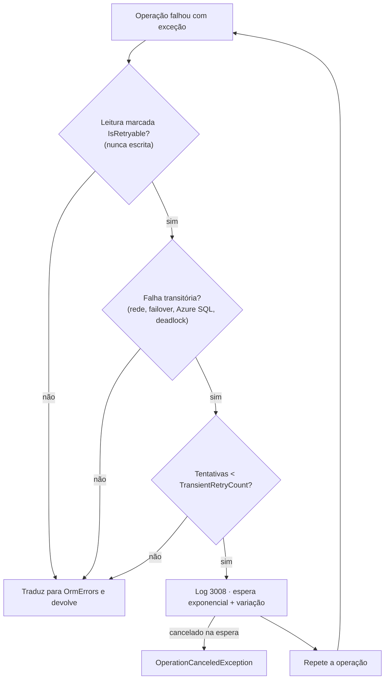

[🏠 TEC.ORM](../README.md) › [📚 Documentação](README.md) › 🔁 Resiliência

# 🔁 Resiliência

> Como o TEC.ORM se comporta quando o banco falha: novas tentativas seguras só para leituras, limites que impedem uma
> consulta de esgotar a memória e falhas de infraestrutura classificadas como tal (inclusive pool esgotado e Azure SQL).

## 📑 Sumário

- [🎯 Visão geral](#-visão-geral)
- [🚀 Uso](#-uso)
  - [Novas tentativas em falha transitória](#novas-tentativas-em-falha-transitória)
  - [O que é falha transitória](#o-que-é-falha-transitória)
  - [Pool de conexões esgotado](#pool-de-conexões-esgotado)
  - [Limites de leitura](#limites-de-leitura)
  - [Por que não EnableRetryOnFailure](#por-que-não-enableretryonfailure)
- [⚙️ Opções](#️-opções)
- [❌ Erros](#-erros)
- [🛡️ Segurança](#️-segurança)
- [❓ Perguntas frequentes](#-perguntas-frequentes)

---

## 🎯 Visão geral

| Operação | Repetida? | Por quê |
|---|:---:|---|
| Leituras do `IOrmRepository` **fora** de transação (`get`, `find`, `list`, `exists`, `count` e as `-dto`) | ✅ | Idempotentes e sem estado no servidor |
| Leituras do `IOrmRepository` **dentro** de transação | ❌ | A falha pode ter desfeito a transação no servidor; repetir leria fora dela |
| Leituras do `IOrmQueryExecutor` | ✅ | Somente leitura e conexão própria (nunca participam da transação) |
| Escritas (`create`, `update`, `delete`, `hard-delete*`) | ❌ | Um `SaveChanges`/`COMMIT` interrompido tem resultado desconhecido: repetir poderia duplicar |
| Tempo esgotado (`ORM_TEMPO_ESGOTADO`) | ❌ | Repetir agravaria a consulta cara |

---

## 🚀 Uso

### Novas tentativas em falha transitória

Nada a fazer: o padrão é `TransientRetryCount = 2` e `TransientRetryDelay = 200 ms`. A espera da tentativa *n* é
`TransientRetryDelay × 2^(n-1) × (1 + variação de 0 a 50%)` (ex.: ~200–300 ms e depois ~400–600 ms), usando o
`TimeProvider` registrado. A variação evita que muitas instâncias tentem ao mesmo tempo depois de um failover.

Cada nova tentativa gera:

| Sinal | Conteúdo |
|---|---|
| Log **3008** (`Warning`) | `ORM {Provider}: {Operation} de {Target} teve falha transitória {ErrorCode} (SQL {SqlErrorNumber}); nova tentativa {Retry} de {MaxRetries}.` |
| Tag `orm.retries` | No `Activity` da operação, só quando houve nova tentativa |
| Métrica | Uma medição por operação (a duração inclui as tentativas) |

O cancelamento durante a espera encerra a operação como cancelada (`error.type = canceled`, log 3006) e relança
`OperationCanceledException`. Quem implementa um repositório próprio marca leituras com
`new OrmOperation(...) { IsRetryable = true }` (ignorado em escritas).

### O que é falha transitória

Erros do SQL Server reconhecidos como transitórios (no `SqlException` ou em qualquer item de `Errors`):

| Números | Significado |
|---|---|
| 1205 | Vítima de deadlock |
| -1, 20, 64, 121, 233, 10053, 10054, 10060 | Rede, transporte ou conexão encerrada |
| 4060, 4221 | Banco do login indisponível (failover), réplica secundária ainda indisponível |
| 10928, 10929, 40143, 40197, 40501, 40540, 40613, 42108, 42109, 49918, 49919, 49920 | Azure SQL: limite de recursos, serviço ocupado/indisponível, banco em failover, gateway, operações em excesso |

> [!NOTE]
> Esgotadas as tentativas, os erros de conexão e os transitórios do Azure SQL viram **`ORM_CONEXAO_INDISPONIVEL`**
> (falha de infraestrutura, HTTP 502, log 3004 sem a mensagem do banco), e não `ORM_FALHA`. O deadlock vira
> `ORM_CONCORRENCIA`.

### Pool de conexões esgotado

Quando todas as conexões do pool do SqlClient estão em uso até o `Connect Timeout`, o driver lança um
`InvalidOperationException` sem número de erro (e com mensagem traduzida, que não dá para reconhecer pelo texto). O TEC.ORM
o reconhece **na abertura**, nos dois provedores, pelo critério estrito: `InvalidOperationException` **depois de esperar
praticamente todo o `Connect Timeout`** (≥ 90%), que é exatamente o que o esgotamento faz:

- EF Core: o interceptor de conexão marca a falha de abertura (usa a duração informada pelo EF);
- Dapper: o `OrmConnectionSecurity` mede o tempo da abertura.

Resultado: `ORM_CONEXAO_INDISPONIVEL` (infraestrutura), log 3004/3102 **sem pilha nem mensagem**, em vez de "exceção
inesperada" (`ORM_FALHA`, log 3005). Um `InvalidOperationException` **rápido** na abertura, ou fora dela, continua sendo
erro de programação (`ORM_FALHA`): o critério não mascara outras causas.

> [!TIP]
> Pool esgotado costuma ser consulta lenta segurando conexões. Ajuste o `Max Pool Size` **no segredo** da conexão,
> otimize a consulta e reduza `CommandTimeoutSeconds` se fizer sentido.

### Limites de leitura

| Limite | Padrão | Comportamento |
|---|---|---|
| `MaxFindResults` | 1.000 | `FindAsync` lê no máximo limite + 1 e devolve `ORM_LIMITE_EXCEDIDO` |
| `MaxPageSize` | 100 | Página maior é recusada antes de consultar |
| `MaxQueryRows` | 10.000 | Leitura complexa: a linha limite + 1 dispara `ORM_LIMITE_EXCEDIDO` (`OrmErrors.QueryTooManyRows`) e o comando é **cancelado no servidor** |
| `QuerySingleOrDefaultAsync` | 2 linhas | Lê no máximo duas; a segunda é falha |
| `ExecuteScalarAsync` | 1 linha | Lê só a primeira; havendo mais, o comando é cancelado |
| `CommandTimeoutSeconds` | 30 s | Tempo limite de cada comando (EF Core e Dapper) |

### Por que não EnableRetryOnFailure

> [!WARNING]
> **Não** configure `sql => sql.EnableRetryOnFailure()` no `AddTecOrm`/`UseTecOrm`. A estratégia de execução do EF Core
> com novas tentativas:
> - é incompatível com transações iniciadas pelo usuário: o EF recusa o `BeginTransaction` do `OrmUnitOfWork`, quebrando o
>   `IUnitOfWork` e o pipeline do TEC.Cqrs;
> - repetiria **escritas** (`SaveChanges`) de resultado desconhecido.
>
> As novas tentativas do TEC.ORM (`TransientRetryCount`) já cobrem as leituras com segurança.

---

## ⚙️ Opções

| Opção (`OrmOptions`) | Padrão | Limites | Descrição |
|---|---|---|---|
| `TransientRetryCount` | `2` | 0 a 5 | Novas tentativas por leitura (`0` desliga) |
| `TransientRetryDelay` | `200 ms` | 10 ms a 10 s | Espera inicial (dobra a cada tentativa, com variação) |
| `MaxQueryRows` | `10000` | 1 a 1.000.000 | Linhas máximas das leituras complexas |
| `MaxFindResults` | `1000` | 1 a 100.000 | Registros máximos da busca |
| `CommandTimeoutSeconds` | `30` | 1 a 600 | Tempo limite dos comandos |

---

## ❌ Erros

| Código | Quando ocorre | O que fazer |
|---|---|---|
| `ORM_CONEXAO_INDISPONIVEL` | Falha transitória persistente, rede, failover longo, pool esgotado, login recusado | Ver o log 3004/3102/3008; a borda (fila, cliente) pode repetir mais tarde |
| `ORM_CONCORRENCIA` | Deadlock em escrita (ou em leitura após as tentativas) | Ler de novo e repetir a escrita, se fizer sentido |
| `ORM_TEMPO_ESGOTADO` | `CommandTimeoutSeconds` excedido (nunca repetido) | Otimizar a consulta |
| `ORM_LIMITE_EXCEDIDO` | Busca ou leitura complexa acima do limite | Paginar |

---

## 🛡️ Segurança

- Os limites protegem contra negação de serviço por consulta enorme (memória e banda).
- Logs de nova tentativa e de infraestrutura nunca trazem a mensagem do banco (que pode ter servidor, usuário ou valores).

---

## ❓ Perguntas frequentes

Por que o ORM não repete o <code>SaveChanges</code> depois de uma queda de rede?

Porque não dá para saber se o servidor gravou antes de a conexão cair: repetir poderia duplicar o registro. Trate na borda,
com idempotência (ex.: chave natural única ou identificador da requisição).

Como vejo quantas vezes uma leitura foi repetida?

Pela tag `orm.retries` no trace da operação e pelos logs 3008.

---
⬅️ [⚙️ Opções](opcoes.md) · [📚 Índice](README.md) · [📈 Observabilidade](observabilidade.md) ➡️
