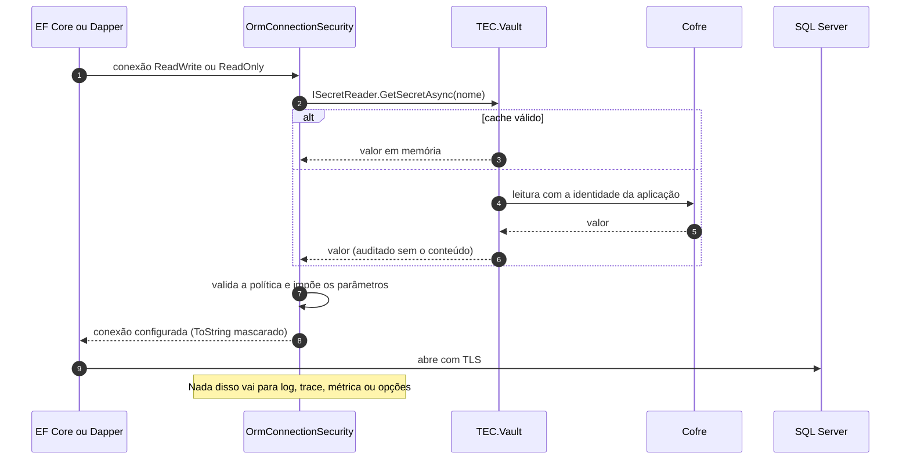

[🏠 TEC.ORM](../README.md) › [📚 Documentação](README.md) › 🛡️ Segurança

# 🛡️ Segurança

> Como o TEC.ORM aplica Zero Trust à persistência: a conexão só existe no cofre, toda entrada é parametrizada ou
> validada, nada sensível chega a logs, traces ou métricas, e o que fica sob responsabilidade de quem usa.

## 📑 Sumário

- [🎯 Visão geral](#-visão-geral)
- [🚀 Uso](#-uso)
  - [Ameaças e controles](#ameaças-e-controles)
  - [Fluxo da conexão segura](#fluxo-da-conexão-segura)
  - [O que nunca é registrado](#o-que-nunca-é-registrado)
  - [Responsabilidades de quem usa](#responsabilidades-de-quem-usa)
  - [Checklist de produção](#checklist-de-produção)
- [⚙️ Opções](#️-opções)
- [❌ Erros](#-erros)
- [🛡️ Segurança](#️-segurança-1)
- [❓ Perguntas frequentes](#-perguntas-frequentes)

---

## 🎯 Visão geral

| Princípio | Como o componente aplica |
|---|---|
| **Segredo só no cofre** | `UseSqlServer()` **sem** string de conexão; o interceptor pede ao `IOrmConnectionSecurity`, que lê do TEC.Vault antes de cada abertura |
| **Nunca confiar, sempre verificar** | Segredo com servidor e banco, `Encrypt` obrigatório, `TrustServerCertificate` só com opt-in; sempre impostos `Persist Security Info=False`, `Application Name`, `Command Timeout`; leitura com `ApplicationIntent=ReadOnly` |
| **Sem SQL injection** | CRUD 100% LINQ; `SortBy` em lista branca; leituras complexas só com `SqlQuery` (cada valor vira parâmetro); `SqlQuery.Parameters` somente leitura depois de validado |
| **Menor privilégio** | Segredo de leitura separado para um login só com `SELECT`; verificação de somente leitura como segunda barreira |
| **Assumir violação** | Conexão mascarada em trânsito; parse do segredo sem exceção registrada; `EnableSensitiveDataLogging` desligado; exceções de banco sem a mensagem original; eventos de erro do EF Core que a repetiriam desligados |
| **Limites contra abuso** | `MaxPageSize`, `MaxFindResults`, `MaxQueryRows` (comando cancelado no servidor), `CommandTimeoutSeconds`, tamanho e quantidade de parâmetros do `SqlQuery` |
| **Auditoria** | Escritas em `Information`, exclusão física em `Warning`; autoria gravada pela identidade com falha fechada |
| **Proteção contra *overposting*** | `ApplyTo`/`ToEntity` nunca gravam `Id`, exclusão lógica, auditoria, achatados ou somente leitura |

> [!IMPORTANT]
> A verificação de somente leitura é **defesa em profundidade**. A proteção principal das leituras complexas é o segredo
> de leitura ser de um login com permissão só de `SELECT`.

---

## 🚀 Uso

### Ameaças e controles

| Ameaça | Controle | Onde |
|---|---|---|
| Vazamento da string de conexão (repositório, imagem, `appsettings`, log) | Só no cofre; nunca nas opções; `ToString()` = `***`; `Persist Security Info=False` | `OrmConnectionSecurity`, `AddTecOrm` |
| Conexão sem criptografia / *man-in-the-middle* | `Encrypt=False`/`Optional` recusado; `TrustServerCertificate` só com opt-in e aviso 3103 | `OrmConnectionSecurity` |
| Injeção de SQL por valor | Parâmetros sempre (`@p0`, `@Nome`, `@__id_0`); `Parameters` imutável | `SqlQuery`, `OrmRepository.HasId` |
| Injeção ou inferência pela ordenação (`SortBy=PasswordHash`) | Lista branca `[Sortable]`; sombra, exclusão lógica e tokens sempre recusados | `OrmRepository` |
| Escrita pela conexão de leitura | Verificação de somente leitura + login só com `SELECT` | `OrmQueryExecutor` |
| Negação de serviço por consulta enorme | `MaxQueryRows` com cancelamento no servidor; `MaxFindResults`; `MaxPageSize`; tempo limite | `OrmQueryExecutor`, `OrmRepository` |
| Vazamento em erros da API | Mensagens fixas; `ExternalService`/`Failure` ocultas do cliente | `OrmErrors` |
| Vazamento em logs (valor de chave duplicada, senha em erro de parse) | Exceções de banco sem mensagem; parse sem exceção registrada | `OrmOperationRunner`, `OrmConnectionSecurity` |
| Dados pessoais em telemetria | Traces e métricas sem identificador, SQL ou valores | `OrmDiagnostics` |
| Injeção de linhas ou falsificação visual no log pelo identificador | Controle, formatação (U+202E) e U+2028/U+2029 viram `?`, até 64 caracteres; ou `Hashed` (`<N caracteres, hmac:…>`) / `Omitted` | `OrmOperationRunner` |
| Repetição perigosa de escrita | Novas tentativas só em leituras fora de transação; `EnableRetryOnFailure` desaconselhado | `OrmOperationRunner` |
| *Overposting* | Regras do `ApplyTo`/`ToEntity` | Código gerado |
| Leitura de dados excluídos | Filtro global obrigatório | Convenção do TEC.ORM |
| Autoria falsa ou gravação anônima | Autoria só da identidade (cópia imutável no `UseTecOrm`); sem identidade, recusa | `AuditInterceptor` |
| Configuração insegura descoberta só em produção | Validação no `AddTecOrm` | `OrmOptions.Validate` |
| Acesso a dados por tenant | **Fora do escopo do ORM** (registros globais): decisão da aplicação | Aplicação |

### Fluxo da conexão segura

> [!CAUTION]
> **Conexão que já vem com servidor (`Data Source`) pula a política.** `UseSqlServer("Server=...")`,
> `UseSqlServer(connection)` ou uma conexão de ferramenta passam **sem** validação (intencional, para não sobrescrever uma
> escolha explícita). Em produção, deixe a conexão sempre vir do cofre.

### O que nunca é registrado

| Dado | Log | Trace | Métrica | Mensagem de erro |
|---|:---:|:---:|:---:|:---:|
| String de conexão, senha, servidor, banco | ❌ | ❌ | ❌ | ❌ |
| Nome do segredo | ❌ (fica na auditoria do TEC.Vault) | ❌ | ❌ | ❌ |
| Texto do SQL, valores de parâmetros e colunas | ❌ | ❌ | ❌ | ❌ |
| Mensagem original do banco | ❌ | ❌ | ❌ | ❌ |
| Identificador do registro | ✅ conforme `IdentifierLogMode` | ❌ | ❌ | ❌ |
| Entidade ou nome da consulta, operação, duração, código do erro | ✅ | ✅ | ✅ | código |

### Responsabilidades de quem usa

| O componente garante | Quem usa é responsável por |
|---|---|
| Conexão lida só do cofre | Guardar a conexão no cofre e dar à identidade da aplicação só leitura de segredos |
| Política do segredo | `Encrypt=True`/`Strict` e certificado válido; `AllowTrustServerCertificate` só em desenvolvimento |
| Parametrização | Nunca montar o texto do SQL antes de passar ao `SqlQuery` |
| Verificação de somente leitura | Login só com `SELECT` em `ReadOnlyConnectionSecretName` |
| Logs sem dados sensíveis | Não registrar entidades ou DTOs com dados pessoais; `IdentifierLogMode.Hashed` se a chave for dado pessoal |
| Exclusão lógica no EF Core | `IsDeleted = 0` no SQL próprio; reaplicar filtros ao usar `IgnoreQueryFilters()` |
| *Overposting* | `Id` da rota, autorização antes do `ApplyTo`, DTOs de entrada separados |
| Login da aplicação | Sem `db_owner`/`sysadmin`; migrations com outro login, fora da aplicação |
| Mesma versão | `TEC.ORM` e `TEC.ORM.SqlServer` sempre na mesma versão (o satélite usa internos do núcleo) |

### Checklist de produção

- [ ] Conexões de escrita e de leitura no cofre, com `Encrypt=True` e sem `TrustServerCertificate=True`.
- [ ] `ReadOnlyConnectionSecretName` aponta para um login só com `SELECT`.
- [ ] `AllowTrustServerCertificate = false`.
- [ ] Nenhum `UseSqlServer("Server=...")`/conexão pronta no contexto.
- [ ] `[Sortable]` nas entidades cujo `SortBy` vem da requisição.
- [ ] Cache do TEC.Vault (`EnableSecretCache`) com duração compatível com a rotação de senha.
- [ ] `IdentifierLogMode.Hashed` ou `Omitted` se alguma chave for dado pessoal.
- [ ] Logs de `TEC.ORM.SqlServer` em `Information`; alerta para os eventos 3004 e 3007.
- [ ] Sem `EnableRetryOnFailure` no `AddTecOrm`.
- [ ] Health check `tec-orm` no readiness; imagem com ICU.
- [ ] `TEC.ORM` e `TEC.ORM.SqlServer` na mesma versão.

---

## ⚙️ Opções

| Opção | Padrão seguro | Quando mudar |
|---|---|---|
| `AllowTrustServerCertificate` | `false` | Só desenvolvimento local |
| `EnforceReadOnlyQueries` | `true` | Nunca, salvo login de leitura comprovadamente só com `SELECT` |
| `IdentifierLogMode` | `Plain` | `Hashed`/`Omitted` para chaves com dado pessoal |
| `MaxPageSize` / `MaxFindResults` / `MaxQueryRows` | 100 / 1.000 / 10.000 | Reduza em APIs públicas |

---

## ❌ Erros

| Código | Relação com segurança |
|---|---|
| `ORM_CONEXAO_INVALIDA` | Segredo fora da política (motivo no log 3101, sem valores) |
| `ORM_CONSULTA_NAO_PERMITIDA` | SQL de escrita bloqueado na conexão de leitura |
| `ORM_ENTRADA_INVALIDA` | `SortBy` fora da lista branca, parâmetros inválidos |
| `ORM_LIMITE_EXCEDIDO` | Consulta acima dos limites |
| `ORM_CONEXAO_INDISPONIVEL` | Identidade sem acesso ao segredo ou login recusado |
| `ORM_AUDITORIA_SEM_IDENTIDADE` | Gravação auditada sem identidade (falha fechada) |

---

## 🛡️ Segurança

Cadeia de suprimentos e build (padrões do [tec-workflows](https://github.com/tudoemcodigo/tec-workflows)):

- `packageSourceMapping`: `TEC.*` **nunca** vêm do nuget.org (contra *dependency confusion*).
- `packages.lock.json` versionado e restore `--locked-mode`; `NuGetAudit` com vulnerabilidade como erro.
- Analisadores de segurança como erro; no `TEC.ORM`, também os avisos de trimming/AOT.
- CodeQL `security-extended` em todo PR, dentro do CI central (alerta ≥ 7,0 bloqueia).
- Testes de segurança: fuzzing, fuzzing diferencial contra o parser do T-SQL, DoS, vazamento e injeção com tabela-canário
  ([🧪 Testes](testes.md)).

> [!CAUTION]
> Vulnerabilidades: não abra *issue* pública; escreva para [roberto@roberto.inf.br](mailto:roberto@roberto.inf.br).

---

## ❓ Perguntas frequentes

O ORM isola dados por tenant?

Não. O tenant é só auditoria; os registros são globais. Use filtros globais próprios (ex.: filtro nomeado no EF Core 10) e
autorização na aplicação.

Posso usar autenticação do Entra ID (sem senha) no SQL?

Sim: implemente `IOrmConnectionSecurity` (ex.: token de acesso na `SqlConnection`) e registre antes do `AddTecOrm`
([🗄️ SQL Server](sqlserver.md#extensão-e-substituição)).

---
⬅️ [❌ Erros](erros.md) · [📚 Índice](README.md) · [🧪 Testes](testes.md) ➡️
