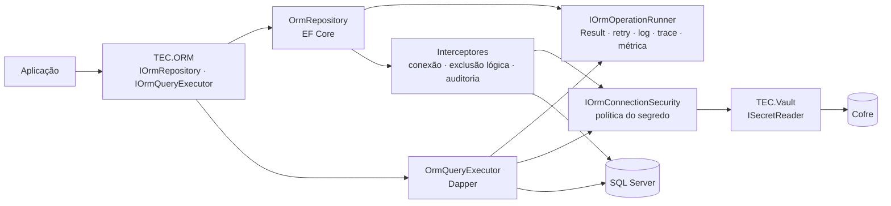
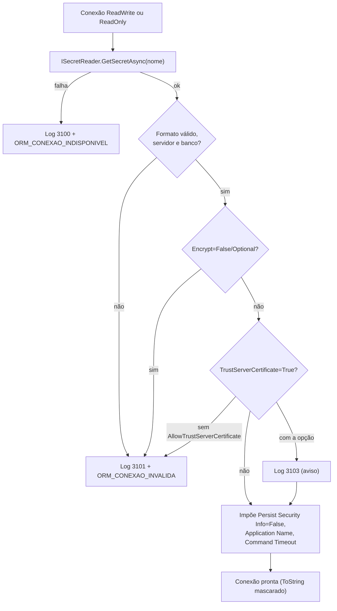

[🏠 TEC.ORM](../README.md) › [📚 Documentação](README.md) › 🗄️ SQL Server

# 🗄️ SQL Server

> Como o `TEC.ORM.SqlServer` é registrado, como obtém a conexão do cofre com segurança, como verifica a saúde do banco e
> como estendê-lo ou usá-lo com vários contextos.

## 📑 Sumário

- [🎯 Visão geral](#-visão-geral)
- [🚀 Uso](#-uso)
  - [AddTecOrm](#addtecorm)
  - [UseTecOrm](#usetecorm)
  - [Conexão: IOrmConnectionSecurity](#conexão-iormconnectionsecurity)
  - [Política do segredo](#política-do-segredo)
  - [Health check](#health-check)
  - [Vários contextos](#vários-contextos)
  - [Extensão e substituição](#extensão-e-substituição)
- [⚙️ Opções](#️-opções)
- [❌ Erros](#-erros)
- [🛡️ Segurança](#️-segurança)
- [❓ Perguntas frequentes](#-perguntas-frequentes)

---

## 🎯 Visão geral



O `DbContext` é configurado com `UseSqlServer()` **sem** string de conexão: ela é lida do cofre na abertura e nunca passa
por opções, configuração ou logs.

> [!IMPORTANT]
> **TEC.ORM e TEC.ORM.SqlServer na mesma versão.** O satélite usa tipos internos do núcleo (`InternalsVisibleTo`); versões
> diferentes podem falhar em execução com `MissingMethodException` ou `TypeLoadException`.

---

## 🚀 Uso

### AddTecOrm

> `TEC.ORM.SqlServer.DependencyInjection.ServiceCollectionExtensions` · pacote `TEC.ORM.SqlServer`

```csharp
public static IServiceCollection AddTecOrm<TContext>(this IServiceCollection services, Action<OrmOptions> configure,
    Action<SqlServerDbContextOptionsBuilder>? sqlServer = null) where TContext : DbContext
```

```csharp
using TEC.ORM.SqlServer.DependencyInjection;
using TEC.ORM.SqlServer.HealthChecks;
using TEC.Vault.AzureKeyVault;
using TEC.Vault.DependencyInjection;

builder.Services.AddTecVault(vault => vault
    .UseAzureKeyVault(o => o.VaultUri = new Uri("https://<nome-do-cofre>.vault.azure.net/"))
    .EnableSecretCache(TimeSpan.FromMinutes(5)));

builder.Services.AddTecOrm<SalesContext>(
    orm =>
    {
        orm.ConnectionSecretName = "sales-sql-rw";               // NOME do segredo, não a conexão
        orm.ReadOnlyConnectionSecretName = "sales-sql-ro";       // login só com SELECT
    },
    sql => sql.MigrationsHistoryTable("__EFMigrationsHistory", "sales"));

builder.Services.AddHealthChecks().AddTecOrm();
```

Pipeline aplicado ao contexto: `UseSqlServer()` com `CommandTimeout(CommandTimeoutSeconds)`; interceptores de conexão, de
exclusão lógica e de auditoria, nessa ordem; identidade da operação (`ICurrentUser` do escopo); convenções do TEC.ORM;
`EnableSensitiveDataLogging(false)`; e os eventos de erro do EF Core que repetiriam a mensagem do SQL Server
(`SaveChangesFailed`, `QueryIterationFailed`, `OptimisticConcurrencyException`, `CommandError`, `ConnectionError`,
`TransactionError`) desligados.

| Serviço | Implementação | Tempo de vida |
|---|---|---|
| `OrmOptions` (+ chave `typeof(TContext)`) | Instância validada | Singleton |
| `TimeProvider` | `TimeProvider.System` | Singleton |
| `IOrmConnectionSecurity` | `OrmConnectionSecurity` | Singleton |
| `IOrmOperationRunner` | `OrmOperationRunner` | Singleton |
| Interceptores (conexão, exclusão lógica, auditoria) | Internos | Singleton |
| `TContext` | `AddDbContext<TContext>` | Scoped |
| `DbContext` | O `TContext` do escopo | Scoped |
| `IOrmRepository<,>` | `OrmRepository<,>` (genérico aberto) | Scoped |
| `IOrmQueryExecutor` | `OrmQueryExecutor` | Scoped |
| `IUnitOfWork` (TEC.Cqrs) | `OrmUnitOfWork` | Scoped |

Todos com `TryAdd` (exceto o `AddDbContext`): registre a sua implementação **antes** para substituir. Requer o TEC.Vault
registrado (`AddTecVault`), que fornece o `ISecretReader`.

> [!WARNING]
> Não use `EnableRetryOnFailure` no parâmetro `sqlServer`: é incompatível com as transações do `IUnitOfWork` (o EF recusa
> iniciar a transação) e repetiria escritas. Use as novas tentativas do próprio ORM ([🔁 Resiliência](resiliencia.md)).

### UseTecOrm

```csharp
public static DbContextOptionsBuilder UseTecOrm(this DbContextOptionsBuilder builder, IServiceProvider provider,
    Action<SqlServerDbContextOptionsBuilder>? sqlServer = null)
```

Aplica o mesmo pipeline seguro, com as opções e a conexão do contexto **principal**, a um `AddDbContextFactory` ou a um
contexto montado à mão. Requer `AddTecOrm` já chamado.

```csharp
builder.Services.AddDbContextFactory<ReportsContext>((sp, options) => options.UseTecOrm(sp));
```

Como o `provider` de uma fábrica é o raiz, a identidade da auditoria é resolvida **num escopo próprio a cada gravação** e
guardada como **cópia imutável** (tipo, id, tenant) antes do descarte do escopo. Funciona com `ICurrentUser` ambiental (as
implementações do TEC.Security); para um `ICurrentUser` que dependa do estado *scoped* da requisição, chame
`UseTecOrmIdentity` depois ([🕵️ Auditoria](auditoria.md#configuração-por-cenário)).

### Conexão: IOrmConnectionSecurity

> `TEC.ORM.SqlServer.Security` · pacote `TEC.ORM.SqlServer`

| Membro | Retorno | Descrição |
|---|---|---|
| `OpenConnectionAsync(OrmConnectionKind kind, CancellationToken ct)` | `Task<Result<SqlConnection>>` | Cria e abre uma conexão (o chamador descarta) |
| `ConfigureConnectionAsync(DbConnection connection, OrmConnectionKind kind, CancellationToken ct)` | `Task<Result>` | Aplica o segredo a uma conexão **fechada** sem string de conexão; conexão aberta ou já com servidor não é alterada |

| `OrmConnectionKind` | Segredo | Uso |
|---|---|---|
| `ReadWrite` (0) | `ConnectionSecretName` | EF Core (CRUD) e health check |
| `ReadOnly` (1) | `ReadOnlyConnectionSecretName` (ou `ConnectionSecretName`) + `ApplicationIntent=ReadOnly` | Dapper (`IOrmQueryExecutor`); direciona para réplicas de leitura |

Implementação: `OrmConnectionSecurity(ISecretReader secrets, OrmOptions options, ILogger<OrmConnectionSecurity> logger)`.
Conexões derivadas pelo EF Core sem servidor (ex.: `master`, para criar o banco) recebem o segredo mantendo só o banco
pedido. Falha ao abrir: a conexão é descartada, o log 3102 leva só o número do erro SQL e o resultado é o erro traduzido;
**pool esgotado** (`InvalidOperationException` do SqlClient) vira `ORM_CONEXAO_INDISPONIVEL`, sem pilha no log.

### Política do segredo



| Regra | Se violada |
|---|---|
| Segredo existe e é legível | `ORM_CONEXAO_INDISPONIVEL` + 3100 (só o tipo da conexão e o código) |
| Formato válido de string de conexão | `ORM_CONEXAO_INVALIDA` + 3101 "formato inválido" (a exceção do parse nunca é registrada) |
| `Server` e `Database` informados | 3101 "servidor não informado" / "banco de dados não informado" |
| `Encrypt` diferente de `False`/`Optional` | 3101 "criptografia desabilitada (Encrypt=False)" |
| `TrustServerCertificate=True` só com `AllowTrustServerCertificate` | 3101 "TrustServerCertificate=True não permitido" |

Rotação de senha sem reiniciar: o segredo é lido a cada nova conexão do EF Core (uma por `DbContext`) e do Dapper; com o
cache do TEC.Vault (`EnableSecretCache`), a nova senha vale quando o cache expira.

### Health check

> `TEC.ORM.SqlServer.HealthChecks.OrmHealthChecksBuilderExtensions`

| Membro | Retorno | Descrição |
|---|---|---|
| `AddTecOrm(this IHealthChecksBuilder builder, string name = "tec-orm", HealthStatus failureStatus = HealthStatus.Unhealthy, IEnumerable<string>? tags = null, TimeSpan? timeout = null)` | `IHealthChecksBuilder` | Abre uma conexão `ReadWrite` pelo `IOrmConnectionSecurity` e executa `SELECT 1` |
| `ReadyTag` / `DatabaseTag` | `const string` | `"ready"` / `"database"` (as mesmas do TEC.Observability) |

Falha: `failureStatus` com **só o código do erro** na descrição e log 3104. Tags padrão `ready` e `database` (informar
`tags` substitui as duas); tempo limite padrão de 5 s.

```csharp
// Com o TEC.Observability: entra no /health/ready sem mais configuração
builder.Services.AddTecObservability(builder.Configuration)
    .HealthChecks.AddTecOrm();

// Sem ele
var app = builder.Build();
app.MapHealthChecks("/health/ready", new HealthCheckOptions
{
    Predicate = check => check.Tags.Contains(OrmHealthChecksBuilderExtensions.ReadyTag)
});
```

### Vários contextos

```csharp
builder.Services.AddTecOrm<SalesContext>(orm => orm.ConnectionSecretName = "sales-sql-rw");        // principal
builder.Services.AddTecOrm<ReportsContext>(orm =>
{
    orm.ConnectionSecretName = "reports-sql";            // segredo, política e timeout próprios
    orm.CommandTimeoutSeconds = 120;
});
```

| Regra | Detalhe |
|---|---|
| Mesmo contexto duas vezes | `InvalidOperationException` (as opções da segunda chamada não seriam usadas) |
| Conexão e opções | Cada contexto usa o **próprio** segredo, política, `ApplicationName` e `CommandTimeoutSeconds` |
| Serviços globais | `DbContext`, `IOrmRepository<,>`, `IOrmQueryExecutor`, `IUnitOfWork`, `OrmOptions` e `IOrmConnectionSecurity` do container são do **principal** (o primeiro registrado). Para o secundário, herde `OrmRepository` com o contexto dele |
| `IOrmConnectionSecurity` próprio | Registrado pela aplicação, atende a todos os contextos |

### Extensão e substituição

| Necessidade | Como |
|---|---|
| Regra específica numa entidade | Herde de `OrmRepository<TEntity, TKey>` e registre `IOrmRepository<Entidade, Chave>` fechado ([📝 Repositório](repositorio-crud.md#especializar-o-repositório)) |
| Outra forma de leitura complexa | Herde de `OrmQueryExecutor` ou implemente `IOrmQueryExecutor` |
| Autenticação por token do Entra ID, outra origem de conexão | Implemente `IOrmConnectionSecurity` e registre antes do `AddTecOrm` |
| Telemetria em outro destino | Implemente `IOrmOperationRunner` e registre antes do `AddTecOrm` |
| Relógio de testes | Registre um `TimeProvider` antes do `AddTecOrm` |

---

## ⚙️ Opções

`OrmOptions` completas, limites e `appsettings.json`: [⚙️ Opções](opcoes.md). Parâmetros do health check: tabela acima.

---

## ❌ Erros

| Código / exceção | Quando ocorre | O que fazer |
|---|---|---|
| `InvalidConfigurationException` (TEC.Core) | Opções inválidas no `AddTecOrm` (mensagem só com o nome, ex.: `TecOrm:ConnectionSecretName`) | Corrigir a opção |
| `InvalidOperationException` | `AddTecOrm<TContext>` duas vezes; `OrmRepository` sobre contexto sem o filtro de exclusão lógica | Registrar uma vez; aplicar as convenções |
| `ORM_CONEXAO_INDISPONIVEL` | Segredo indisponível (3100), login recusado ou rede (3102), pool esgotado, erro transitório do Azure SQL | Ver o log; conferir permissão no cofre e no banco |
| `ORM_CONEXAO_INVALIDA` | Segredo fora da política (3101) | Corrigir o segredo |
| Health check `Unhealthy` com `ORM_...` | Mesmas causas (3104) | Idem |

---

## 🛡️ Segurança

> [!CAUTION]
> Não configure o contexto com `UseSqlServer("Server=...")` nem entregue uma conexão pronta: conexão que já tem servidor
> (`Data Source`) **pula a política** (é intencional, para não sobrescrever uma escolha explícita), e a segurança dela
> passa a ser de quem a criou. Em produção, deixe a conexão vir sempre do cofre.

> [!WARNING]
> `UseTecOrm` usa as opções e o segredo do contexto **principal**: para outro banco, registre o contexto com `AddTecOrm`.

---

## ❓ Perguntas frequentes

<details>
<summary><code>NotSupportedException: Globalization Invariant Mode is not supported</code></summary>

O Microsoft.Data.SqlClient não abre conexões com `InvariantGlobalization=true`. Instale o ICU na imagem (as imagens
`mcr.microsoft.com/dotnet/*` padrão já trazem; no Alpine, `apk add icu-libs`) e mantenha `InvariantGlobalization=false`.

</details>

<details>
<summary>O <code>TEC.ORM.SqlServer</code> é compatível com Native AOT?</summary>

Não (`IsAotCompatible=false`): EF Core e Dapper dependem de reflexão e geração de código em execução. O pacote `TEC.ORM`
(abstrações e mapeamento gerado) é compatível.

</details>

<details>
<summary>Qual versão do EF Core é usada?</summary>

8.x no `net8.0` e 10.x no `net10.0` (definidas no `Directory.Packages.props`).

</details>

---
⬅️ [🛑 Diagnósticos do gerador](diagnosticos-do-gerador.md) · [📚 Índice](README.md) · [⚙️ Opções](opcoes.md) ➡️
