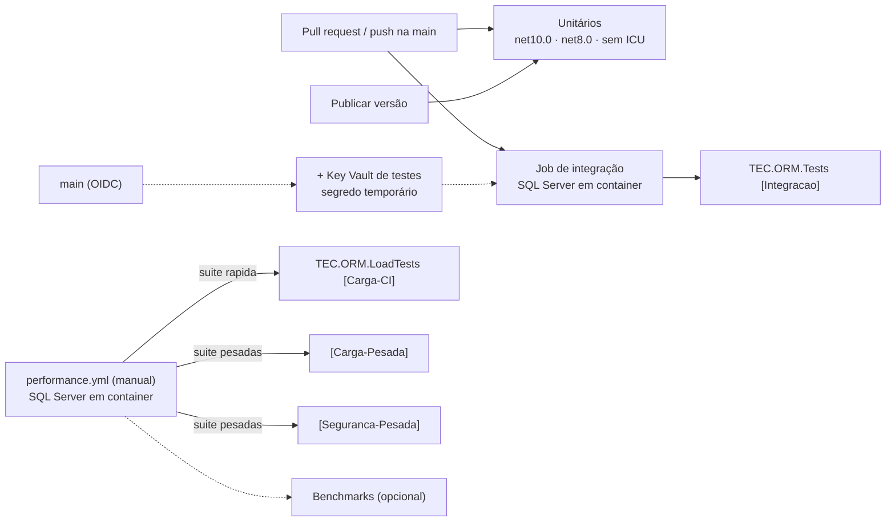
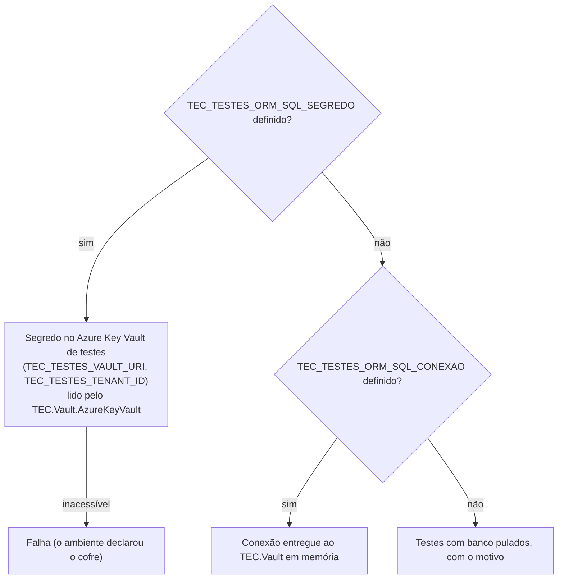

[🏠 TEC.ORM](../README.md) › [📚 Documentação](README.md) › 🧪 Testes

# 🧪 Testes

> Como a qualidade do TEC.ORM é verificada (unitários, integração com SQL Server real, segurança, carga e benchmarks), as
> categorias, como rodar cada suíte na sua máquina e as variáveis `TEC_TESTES_*` e `TEC_CARGA_*`.

## 📑 Sumário

- [🎯 Visão geral](#-visão-geral)
- [🚀 Uso](#-uso)
  - [Rodar localmente](#rodar-localmente)
  - [SQL Server local descartável](#sql-server-local-descartável)
  - [Conexão dos testes com banco](#conexão-dos-testes-com-banco)
  - [Suítes do TEC.ORM.Tests](#suítes-do-tecormtests)
  - [Testes de segurança](#testes-de-segurança)
  - [Testes de carga](#testes-de-carga)
  - [Benchmarks](#benchmarks)
  - [Banco de testes: code first e database first](#banco-de-testes-code-first-e-database-first)
  - [Escrevendo testes novos](#escrevendo-testes-novos)
- [⚙️ Opções](#️-opções)
- [❌ Erros](#-erros)
- [🛡️ Segurança](#️-segurança)
- [❓ Perguntas frequentes](#-perguntas-frequentes)

---

## 🎯 Visão geral

| Projeto | Ferramentas | Conteúdo |
|---|---|---|
| `TEC.ORM.Tests` | [TUnit](https://tunit.dev) (Microsoft.Testing.Platform), FsCheck, ScriptDom, Roslyn | Unitários (EF Core InMemory, TEC.Vault em memória), gerador sobre código compilado em memória, segurança e integração com SQL Server |
| `TEC.ORM.LoadTests` | TUnit | Concorrência, alocação por operação, fumaça de carga e, sob demanda, carga sustentada, tempestade no pool, volume e soak |
| `TEC.ORM.Benchmarks` | BenchmarkDotNet | Custo de cada operação em relação ao EF Core puro, consultas, observabilidade e mapeamento (fora do `dotnet test`) |

| Categoria (`[Category]`) | Projeto | Onde roda | Conteúdo | Quantidade |
|---|---|---|---|---|
| *(sem categoria)* | `TEC.ORM.Tests` | PR, push na `main` e publicação, matriz `net10.0` / `net8.0` / sem ICU | Unitários, regressão, segurança rápida, gerador | **288** (`net10.0`) · **286** (`net8.0`) |
| `Integracao` | `TEC.ORM.Tests` | PR e main, job com SQL Server em container | Tudo que usa banco | **40** + 1 pulado fora da main (Key Vault) |
| `Carga-CI` | `TEC.ORM.LoadTests` | `performance.yml` manual (`suite` = `rapida` ou `todas`), com SQL Server em container | Concorrência e fumaça de carga (segundos) | **13** |
| `Carga-Pesada` | `TEC.ORM.LoadTests` | `performance.yml` manual (`suite` = `pesadas` ou `todas`; `[Explicit]`) | Sustentada, pool, volume, soak, escalabilidade | 5 |
| `Seguranca-Pesada` | `TEC.ORM.Tests` | `performance.yml` manual (`suite` = `pesadas` ou `todas`; `[Explicit]`) | Fuzzing diferencial com 200 mil lotes | 1 |

Os testes de carga não rodam no PR nem na publicação: tempo de parede em runner compartilhado é ruidoso e não pode
bloquear PR nem versão.

As constantes ficam em `TestCategories` de cada projeto (`Integration = "Integracao"`, `HeavySecurity =
"Seguranca-Pesada"`, `LoadCi = "Carga-CI"`, `LoadHeavy = "Carga-Pesada"`). A seleção é **sempre por categoria**, nunca por
namespace nem por variável liga/desliga.



---

## 🚀 Uso

### Rodar localmente

> [!WARNING]
> Não use `-nologo` com o `dotnet test` (Microsoft.Testing.Platform): ele roda **0 testes** e sai com o código 5.

```bash
# Unitários (os mesmos do CI)
dotnet test --project TEC.ORM.Tests -c Release --treenode-filter "/*/*/*/*[Category!=Integracao]"

# Integração (pula com motivo sem conexão)
dotnet test --project TEC.ORM.Tests -c Release -f net10.0 --treenode-filter "/*/*/*/*[Category=Integracao]"

# Carga rápida (precisa do SQL Server para a maior parte)
dotnet test --project TEC.ORM.LoadTests -c Release -f net10.0 --treenode-filter "/*/*/*/*[Category=Carga-CI]"

# Pesados ([Explicit]: só rodam selecionados)
dotnet test --project TEC.ORM.LoadTests -c Release -f net10.0 --treenode-filter "/*/*/*/*[Category=Carga-Pesada]"
dotnet test --project TEC.ORM.Tests -c Release -f net10.0 --treenode-filter "/*/*/*/*[Category=Seguranca-Pesada]"

# Sem ICU, como no CI
DOTNET_SYSTEM_GLOBALIZATION_INVARIANT=1 dotnet test --project TEC.ORM.Tests -c Release -f net10.0 --treenode-filter "/*/*/*/*[Category!=Integracao]"
```

### SQL Server local descartável

Use um container **seu**, numa porta própria, e apague-o no fim (exemplo com a porta 11433):

```bash
export MSSQL_SA_PASSWORD="Tec1!$(openssl rand -hex 16)"
docker run -d --name tec-orm-mssql -p 127.0.0.1:11433:1433 -e ACCEPT_EULA=Y -e MSSQL_SA_PASSWORD \
  mcr.microsoft.com/mssql/server:2022-latest

# Depois que o log mostrar "SQL Server is now ready for client connections":
docker exec -e SQLCMDPASSWORD="$MSSQL_SA_PASSWORD" tec-orm-mssql /opt/mssql-tools18/bin/sqlcmd -S localhost -U sa -C -b \
  -Q "CREATE DATABASE tec_testes; ALTER DATABASE tec_testes SET READ_COMMITTED_SNAPSHOT ON WITH ROLLBACK IMMEDIATE;"

export TEC_TESTES_ORM_SQL_CONEXAO="Server=localhost,11433;Database=tec_testes;User ID=sa;Password=$MSSQL_SA_PASSWORD;Encrypt=True;TrustServerCertificate=True"
dotnet test --project TEC.ORM.Tests -c Release -f net10.0 --treenode-filter "/*/*/*/*[Category=Integracao]"

docker rm -f tec-orm-mssql
```

`READ_COMMITTED_SNAPSHOT ON` é o padrão do Azure SQL (leitores não disputam travas com escritores); se o banco não existir,
a própria preparação dos testes o cria e liga a opção. A fixture registra o TEC.ORM com `AllowTrustServerCertificate =
true` por causa do certificado autoassinado do container.

### Conexão dos testes com banco

O TEC.ORM sob teste **sempre** lê a conexão de um cofre (nunca de arquivo). `TestDatabase` (compartilhado pelos dois
projetos) resolve a origem uma vez por execução:



| Variável | Uso |
|---|---|
| `TEC_TESTES_ORM_SQL_CONEXAO` | Conexão do SQL Server de testes, entregue ao cofre em memória (container local ou do CI) |
| `TEC_TESTES_ORM_SQL_SEGREDO` | Nome de um segredo com a conexão no Key Vault de testes (o CI cria um temporário na main) |
| `TEC_TESTES_VAULT_URI` | URI `https` do Key Vault de testes (compartilhada pelos componentes); obrigatória com o segredo |
| `TEC_TESTES_TENANT_ID` | Tenant do Entra ID do cofre (opcional) |

Em desenvolvimento, as mesmas informações podem vir do `dotnet user-secrets` (id `tudoemcodigo-tec-testes`, comum a todos
os componentes) ou de um `appsettings.Local.json` na pasta do projeto de teste (ignorado pelo git), seção `TecTestes`,
chaves `OrmSqlConexao`, `OrmSqlSegredo`, `VaultUri` e `TenantId`:

```bash
dotnet user-secrets set TecTestes:OrmSqlConexao "Server=localhost,11433;Database=tec_testes;User ID=sa;Password=<senha>;Encrypt=True;TrustServerCertificate=True" --id tudoemcodigo-tec-testes
```

O banco é o da própria conexão: `Database` obrigatório e nunca de sistema (`master`, `model`, `msdb`, `tempdb`).

> [!NOTE]
> As variáveis antigas `TEC_ORM_SQL_CONEXAO`, `TEC_ORM_*`, `TEC_TESTES_INTEGRACAO`, `TEC_ORM_KEYVAULT` e
> `TEC_TESTES_SQL_SEGREDO` **não existem mais**: a integração é selecionada pela categoria e a conexão vem só das variáveis
> acima.

### Suítes do TEC.ORM.Tests

| Suíte | Banco | O que cobre |
|---|:---:|---|
| `OrmRepositoryTests` | ❌ | CRUD (InMemory), exclusão lógica, validações da exclusão física, chaves `string`/`int`/`Guid`/`long`, especificações, paginação, lista branca, limite da busca, cancelamento |
| `AggregateTests` | ❌ | Agregado (`Sale`, `Installment`, `LedgerEntry`, *owned*): propagação, atualização só da raiz, concorrência otimista, `[Sortable]` |
| `ConfigurationTests` | ❌ | Filtro obrigatório, filtros nomeados/anônimos (EF 8/10), convenções sem duplicar, vários contextos, `AddTecOrm` duplicado |
| `AuditTests` · `IdentityTests` | ❌ | Autoria e tenant por operação, recusa sem identidade, cópia imutável do `ICurrentUser` no `UseTecOrm` |
| `UnitOfWorkTests` | ❌ | `OrmUnitOfWork`: início duplicado, commit que falha (limpa o rastreador), rollback |
| `ObservabilityTests` | ❌ | `Activity`, métrica e log em cada resultado; identificador `Plain`/`Hashed`/`Omitted`; exclusão física em `Warning` |
| `ResilienceTests` | ❌ | Novas tentativas (só leitura repetível, nunca escrita, limite, cancelamento na espera), pool esgotado, Azure SQL, limites fora do intervalo, `Parameters` imutável, U+202E/U+2028 no log |
| `SecurityTests` | ❌ | Política do segredo, conexão derivada, mascaramento, DI sem string de conexão |
| `QueryTests` | ❌ | `SqlQuery`, verificação de somente leitura (com as regressões do fuzzing), `PageRequest` |
| `MappingTests` · `GeneratorShapeTests` · `GeneratorDiagnosticsTests` · `HardDeleteAnalyzerTests` | ❌ | Mapeamento gerado, formas de DTO, todos os `TECORMxxx` (inclusive 015 e 016), `// <auto-generated/>` e `#nullable enable`, incrementalidade, aviso `TECORM014` |
| `SqlServerIntegrationTests` | ✅ | Migrations, CRUD real, exclusão física (FK restrita, lote, rollback), conflito sem valor no log, paginação, `IUnitOfWork`, Dapper, projeção aninhada, database first, conexão do Key Vault, health check, senha errada sem vazamento |
| `ResilienceIntegrationTests` | ✅ | Command aninhado que falha desfaz o pai, `READ_COMMITTED_SNAPSHOT`, `MaxQueryRows` sem ler o resto, `QuerySingleOrDefault` na segunda linha, escalar `NULL` → `default`, join com `splitOn` e `LEFT JOIN`, pool esgotado nos dois provedores |

### Testes de segurança

| Classe | Técnica | O que garante | Banco |
|---|---|---|:---:|
| `Security/Fuzzing/FuzzingTests` | Propriedades com FsCheck (entradas hostis: aspas, comentários, Unicode parecido, NUL, RLO, surrogates) | Todo valor do `SqlQuery` vira parâmetro; verificação de somente leitura nunca lança e recusa escrita após qualquer separador; `PageRequest`, `SortBy`, chave e identificador no log seguros; segredo hostil só aceito dentro da política | ❌ |
| `FuzzingTests.ReadOnlyGuard_AgreesWithTheSqlServerParser` | **Fuzzing diferencial** contra o ScriptDom (parser oficial do T-SQL) | Tudo o que a verificação aceita é só leitura para o SQL Server. 3 mil lotes no PR; 200 mil em `Seguranca-Pesada` | ❌ |
| `Security/Adversarial/DosResistanceTests` | Pior caso e contagem de materialização | Verificação em tempo linear; limites recusados antes de consultar; no banco, consulta cara parada por tempo limite e cancelamento | ✅/❌ |
| `Security/Adversarial/LeakageTests` | Marcador secreto procurado em resultado, logs e telemetria | Mensagens do SQL Server que repetem valores (2601, 245, 208, 547) nunca saem do ORM | ✅/❌ |
| `Security/Adversarial/SqlInjectionTests` | Corpus de cargas com **tabela-canário** | Nada executa por valor, chave, `SortBy`, gravação (segunda ordem) ou filtro LINQ; comandos colados a leituras são recusados | ✅ |

### Testes de carga

Os testes com banco usam o mesmo SQL Server da integração, no schema **`loadtest`** (tabelas `Accounts`, auditada e com
`rowversion`, e `LedgerEntries`), criado pelo script idempotente `Infrastructure/loadtest.sql`. Cada teste grava com um
`Batch` próprio e o apaga no fim com o `HardDeleteAsync` do próprio ORM. Cada operação é uma "requisição": escopo novo
com a identidade do worker (`TestUser.As(worker)`).

| Classe | Categoria | Banco | Critério |
|---|---|:---:|---|
| `Concurrency/ConcurrencyTests` | `Carga-CI` | ❌ | Singletons do `AddTecOrm` sob 64 workers: dados e autoria certos, vereditos idênticos aos sequenciais |
| `Concurrency/SqlServerConcurrencyTests` | `Carga-CI` | ✅ | E-mail único (1 vence), `rowversion` sem atualização perdida, exclusão simultânea, transferências em transação |
| `Performance/PerformanceTests` (alocação) | `Carga-CI` | ❌ | Bytes a mais que o EF Core puro dentro do orçamento |
| `Load/SqlServerLoadTests` (fumaça) | `Carga-CI` | ✅ | 3 s de carga mista sem falhas e sem senha nos logs |
| `Security/SecurityLoadTests` | `Carga-CI` | ✅ | Auditoria nunca mistura usuários; conexão de leitura nunca escreve |
| `Load/SqlServerLoadTests` (sustentada, tempestade no pool) | `Carga-Pesada` | ✅ | Erro ≤ 0,1%, p99 < 2 s; no pool esgotado só `ORM_TEMPO_ESGOTADO`/`ORM_CONEXAO_INDISPONIVEL` e recuperação |
| `Performance/PerformanceTests` (escalabilidade) | `Carga-Pesada` | ✅ | Vazão paralela > 1,5× a de 1 worker |
| `Volume/VolumeTests` | `Carga-Pesada` | ✅ | `TEC_CARGA_LINHAS` contas, paginação profunda, limites, expurgo em lote |
| `Soak/SoakTests` | `Carga-Pesada` | ✅ | Memória, handles, conexões e vazão estáveis |

| Variável | Padrão local | `performance.yml` | Efeito |
|---|---|---|---|
| `TEC_CARGA_SOAK_SEGUNDOS` | `120` | `600` | Duração do soak |
| `TEC_CARGA_DURACAO_SEGUNDOS` | `60` | `120` | Duração da carga sustentada |
| `TEC_CARGA_CONCORRENCIA` | `32` | `32` | Workers da sustentada e do soak |
| `TEC_CARGA_LINHAS` | `50000` | `200000` | Contas do teste de volume |
| `TEC_CARGA_RELATORIOS` | — | definido pelo CI | Pasta onde os testes gravam `carga.md` (publicado no resumo da execução) |

Valores vazios, inválidos ou ≤ 0 usam o padrão. As sessões no servidor (`sys.dm_exec_sessions`) exigem `VIEW SERVER
STATE`; sem a permissão o relatório mostra `n/d`.

### Benchmarks

```bash
dotnet run -c Release --project TEC.ORM.Benchmarks -f net10.0 -- --filter "*"
dotnet run -c Release --project TEC.ORM.Benchmarks -f net10.0 -- --filter "*Repository*" --runtimes net8.0 net10.0
```

`RepositoryBenchmarks` (EF Core puro como linha de base), `QueryBenchmarks` e `InfrastructureBenchmarks`; resultados em
`BenchmarkDotNet.Artifacts/results`. No CI, só no disparo manual do `performance.yml`.

### Banco de testes: code first e database first

| | Code first | Database first |
|---|---|---|
| Schema | `codefirst` | `dbfirst` |
| Fonte da verdade | Modelo C# (`Database/CodeFirst`: `Category`, `Product`, `Customer`, `Order`) | `Database/DbFirst/dbfirst.sql` |
| Contexto | `CodeFirstContext : OrmDbContext` | `DbFirstContext` gerado + *partial* com `AddTecOrmConventions()` |
| Evolução | `dotnet ef migrations add` (migration inicial `InitialDbTecBase`) | Alterar o script e rodar `scaffold.ps1` |

```bash
dotnet tool restore
dotnet ef migrations add <Nome> --project TEC.ORM.Tests --context CodeFirstContext --output-dir Database/CodeFirst/Migrations --framework net10.0
dotnet ef migrations script --idempotent --project TEC.ORM.Tests --context CodeFirstContext --framework net10.0 --output TEC.ORM.Tests/Database/CodeFirst/codefirst.sql
```

```powershell
$env:TEC_TESTES_ORM_SQL_CONEXAO = Read-Host -Prompt 'Conexão do banco de testes' -MaskInput   # PowerShell 7+
./TEC.ORM.Tests/Database/DbFirst/scaffold.ps1                                                # da pasta do repositório
```

### Escrevendo testes novos

- Teste que usa banco: `[Category(TestCategories.Integration)]` e `await SqlServerFixture.RequireAsync()` no início (pula
  com motivo sem conexão ou sem ICU).
- Dados com sufixo único (`Guid.NewGuid()`): os testes rodam em paralelo e repetidamente, sem limpeza.
- Prove que nada vaza com o `CapturingLoggerProvider` (a senha em `SqlServerFixture.Password` nunca aparece).
- Regra nova do gerador: caso em `GeneratorDiagnosticsTests` e linha em `AnalyzerReleases.Unshipped.md`.
- Carga com banco: `await LoadDatabase.RequireAsync()`, `LoadDatabase.NewBatch()` e `LoadDatabase.PurgeAsync` no
  `finally`; curto → `Carga-CI`; longo → `[Explicit]` + `Carga-Pesada`.

---

## ⚙️ Opções

| Configuração | Onde | Descrição |
|---|---|---|
| `--treenode-filter "/*/*/*/*[Category=...]"` | `dotnet test` | Seleção por categoria |
| `-f net8.0` / `-f net10.0` | `dotnet test` | Um alvo só (sem `-f`, os dois) |
| `--coverage --coverage-output-format cobertura` | `dotnet test` | Cobertura local (o CI soma a dos unitários e da integração) |
| `TEC_TESTES_*` / `TEC_CARGA_*` | Ambiente | Tabelas acima |

---

## ❌ Erros

| Sintoma | Causa | O que fazer |
|---|---|---|
| Pulados com "SQL Server de testes não configurado: defina TEC_TESTES_ORM_SQL_CONEXAO..." | Nenhuma conexão | Suba o [SQL Server local](#sql-server-local-descartável) e defina a variável |
| "TEC_TESTES_ORM_SQL_SEGREDO exige TEC_TESTES_VAULT_URI..." | Segredo sem a URI do cofre | Defina a URI `https` |
| "...o segredo não pôde ser lido do Key Vault de testes" | Sem `az login`, sem permissão ou segredo inexistente | Confira a credencial ou use a conexão direta |
| "...deve indicar um banco exclusivo de testes" | `Database` ausente ou de sistema | Use `Database=tec_testes` |
| `Microsoft.Data.SqlClient não suporta o modo de globalização invariante` | Rodando sem ICU | Esperado no passo sem ICU: os testes de banco se pulam |
| 0 testes, código 5 | `-nologo` ou filtro que não casa | Remova `-nologo`; confira a categoria |
| Pesados não rodam | São `[Explicit]` | Selecione pela categoria |
| Teste de tempo/vazão falhou uma vez | Máquina disputada | Repita em `Release` com a máquina ociosa |

---

## 🛡️ Segurança

> [!WARNING]
> Nunca grave a conexão em arquivo versionado. Use variável da sessão, `dotnet user-secrets` ou o `appsettings.Local.json`
> (fora do git). No CI, a senha do container é aleatória por execução e mascarada no log.

- Use um container **próprio** e descartável para os testes; não aponte para bancos compartilhados ou de produção.
- O segredo temporário do Key Vault criado pelo CI expira em 1 dia e é apagado e purgado no fim do job.

---

## ❓ Perguntas frequentes

<details>
<summary>Por que 1 teste de integração aparece pulado no CI de PR?</summary>

`Connection_read_from_azure_key_vault_through_tec_vault` só roda quando há o segredo do Key Vault de testes, criado
apenas na `main` (login OIDC). Em PR a conexão vem do container, entregue ao cofre em memória.

</details>

<details>
<summary>Como o CI roda a integração?</summary>

Um job com SQL Server em container, preparado pelo `.github/scripts/integration-setup.sh`, roda `[Integracao]` no PR e
no push na `main`. A `[Carga-CI]` usa os mesmos scripts, mas só no `performance.yml` manual. Detalhes em
[⚙️ CI/CD](../.github/workflows/README.md).

</details>

---
⬅️ [🛡️ Segurança](seguranca.md) · [📚 Índice](README.md) · [💻 Desenvolvimento local](desenvolvimento.md) ➡️
