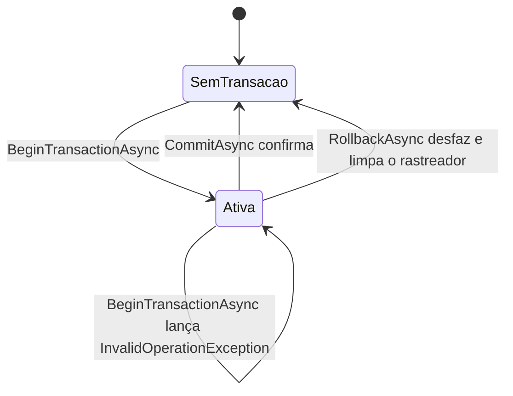
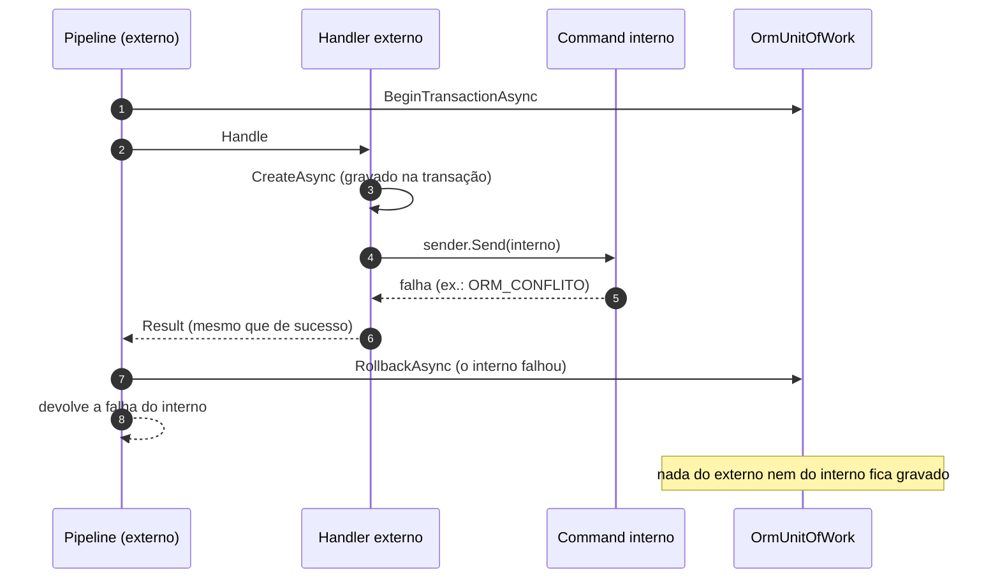

[🏠 TEC.ORM](../README.md) › [📚 Documentação](README.md) › 🔁 Transação

# 🔁 Transação

> Agrupa várias escritas numa única transação do banco, automaticamente em cada command do pipeline do TEC.Cqrs ou
> manualmente pelo `IUnitOfWork`.

## 📑 Sumário

- [🎯 Visão geral](#-visão-geral)
- [🚀 Uso](#-uso)
  - [OrmUnitOfWork](#ormunitofwork)
  - [Com o pipeline do TEC.Cqrs](#com-o-pipeline-do-teccqrs)
  - [Commands aninhados](#commands-aninhados)
  - [Manual](#manual)
- [⚙️ Opções](#️-opções)
- [❌ Erros](#-erros)
- [🛡️ Segurança](#️-segurança)
- [❓ Perguntas frequentes](#-perguntas-frequentes)

---

## 🎯 Visão geral

O `AddTecOrm` registra `OrmUnitOfWork` como o `IUnitOfWork` (`TEC.Cqrs.Persistence`) do escopo, sobre o mesmo `DbContext`
usado pelos `IOrmRepository` do escopo. Com o TEC.Cqrs registrado, o `TransactionBehavior` abre a transação antes do
handler de cada command, confirma no sucesso e desfaz em qualquer falha, sem código de transação no handler.



| Efeito da transação | Detalhe |
|---|---|
| Escritas do repositório | Já chamam `SaveChangesAsync`; ficam visíveis a outras conexões só depois do commit |
| Leituras do repositório | Dentro da transação **não** são repetidas em falha transitória (uma falha pode ter desfeito a transação no servidor) |
| `IOrmQueryExecutor` | Usa **outra** conexão e não participa |
| Exclusão física | Participa (o rollback desfaz o `DELETE`) |

---

## 🚀 Uso

### OrmUnitOfWork

> `TEC.ORM.SqlServer.UnitOfWork` · `sealed class OrmUnitOfWork(DbContext context) : IUnitOfWork` · pacote `TEC.ORM.SqlServer`

| Membro | Comportamento |
|---|---|
| `HasActiveTransaction` | `context.Database.CurrentTransaction is not null` |
| `BeginTransactionAsync(CancellationToken)` | Abre a transação; já existindo uma: `InvalidOperationException` ("Já existe uma transação ativa neste contexto.") |
| `CommitAsync(CancellationToken)` | `SaveChangesAsync` + `Commit` e descarta a transação. Se falhar, **limpa o `ChangeTracker`** e relança. Sem transação: `InvalidOperationException` |
| `RollbackAsync(CancellationToken)` | Sem transação, não faz nada; com transação, desfaz, descarta e limpa o `ChangeTracker` |

### Com o pipeline do TEC.Cqrs

```csharp
using TEC.Core.Common.Results;
using TEC.Cqrs.Abstractions;
using TEC.ORM.Abstractions;

public sealed record PlaceOrderCommand(Guid CustomerId, int ProductId, int Quantity, decimal Amount) : ICommand<long>;

internal sealed class PlaceOrderHandler(IOrmRepository<Order, long> orders, IOrmRepository<Product, int> products)
    : ICommandHandler<PlaceOrderCommand, long>
{
    public async Task<Result<long>> Handle(PlaceOrderCommand command, CancellationToken cancellationToken)
    {
        var created = await orders.CreateAsync(new Order
        {
            CustomerId = command.CustomerId, ProductId = command.ProductId, Quantity = command.Quantity, Amount = command.Amount
        }, cancellationToken);
        if (created.IsFailure)
            return created.ToFailure<long>();

        var product = await products.GetByIdAsync(command.ProductId, cancellationToken);
        if (product.IsFailure)
            return product.ToFailure<long>();          // o pipeline desfaz também o pedido criado

        product.Value.Stock -= command.Quantity;
        var updated = await products.UpdateAsync(product.Value, cancellationToken);
        return updated.IsSuccess ? created.Value.Id : updated.ToFailure<long>();
    }
}
```

> [!NOTE]
> O command segue as regras do pipeline do TEC.Cqrs (autorização declarada e validador obrigatório), omitidas aqui. Ver
> [💾 Transação no TEC.Cqrs](https://github.com/tudoemcodigo/lib-tec-cqrs/blob/main/docs/transacao.md).

### Commands aninhados

Um command enviado de dentro de outro participa da transação do externo. Se o interno **falhar**, o externo desfaz a
transação inteira e devolve a falha do interno (ex.: `ORM_CONFLITO`), mesmo que o handler externo ignore o erro e
devolva sucesso: nada do que foi gravado pelos dois fica no banco. Esse comportamento é verificado contra o SQL Server real nos testes de integração
(`Nested_command_failure_rolls_back_the_outer_transaction`).



### Manual

```csharp
using TEC.Core.Common.Results;
using TEC.Cqrs.Persistence;
using TEC.ORM.Abstractions;

public sealed class TransferService(IUnitOfWork unitOfWork, IOrmRepository<Account, Guid> accounts)
{
    public async Task<Result> TransferAsync(Account source, Account target, CancellationToken ct)
    {
        await unitOfWork.BeginTransactionAsync(ct);
        try
        {
            foreach (var account in new[] { source, target })
            {
                var updated = await accounts.UpdateAsync(account, ct);
                if (updated.IsFailure)
                {
                    await unitOfWork.RollbackAsync(CancellationToken.None);
                    return updated.ToFailure();                  // ex.: ORM_CONCORRENCIA
                }
            }
            await unitOfWork.CommitAsync(CancellationToken.None);
            return Result.Success();
        }
        catch
        {
            await unitOfWork.RollbackAsync(CancellationToken.None);
            throw;
        }
    }
}
```

---

## ⚙️ Opções

Não há opções próprias. O tempo limite dos comandos dentro da transação é `OrmOptions.CommandTimeoutSeconds`.

> [!WARNING]
> **Não** habilite o `EnableRetryOnFailure` do EF Core (parâmetro `sqlServer` do `AddTecOrm`): a estratégia de execução
> com novas tentativas é incompatível com transações iniciadas pelo usuário (o EF recusa o `BeginTransaction`, quebrando o
> `IUnitOfWork` e o pipeline do TEC.Cqrs) e repetiria escritas. As leituras fora de transação já têm novas tentativas
> seguras ([🔁 Resiliência](resiliencia.md)).

---

## ❌ Erros

| Situação | Resultado | O que fazer |
|---|---|---|
| `BeginTransactionAsync` com transação ativa | `InvalidOperationException` | Erro de programação: uma transação por escopo |
| `CommitAsync` sem transação | `InvalidOperationException` | Chamar `BeginTransactionAsync` antes |
| Falha de banco no `CommitAsync` | Exceção do EF Core/SqlClient (o `IUnitOfWork` não usa `Result`) | O `TransactionBehavior` do TEC.Cqrs desfaz; no uso manual, faça rollback |
| Concorrência otimista, deadlock ou violação de chave no `CommitAsync` | No pipeline do TEC.Cqrs: `Result` de falha `ORM_CONCORRENCIA`/`ORM_CONFLITO` (409), pelo `IExceptionErrorMapper` que o `AddTecOrm` registra | Nada a fazer: o cliente recebe 409 em vez de 500 ([detalhes](erros.md#exceções-fora-do-repositório)) |
| Escritas dentro da transação | Códigos de [`OrmErrors`](erros.md) | Devolver a falha para o pipeline desfazer |

---

## 🛡️ Segurança

- Commit e rollback com `CancellationToken.None` no uso manual: interromper no meio deixaria o resultado ambíguo.
- Rollback e commit que falha limpam o rastreador: nada pendente é regravado fora da transação pela próxima operação.

---

## ❓ Perguntas frequentes

<details>
<summary>Posso ler com o <code>IOrmQueryExecutor</code> o que gravei na transação?</summary>

Não: ele usa outra conexão. Leia pelo `IOrmRepository` do mesmo escopo.

</details>

<details>
<summary>Como ter novas tentativas de uma transação inteira?</summary>

Repita o command inteiro na borda (ex.: a mensagem volta à fila) quando a falha for transitória e o command for
idempotente. O ORM nunca repete escritas sozinho.

</details>

---
⬅️ [🕵️ Auditoria](auditoria.md) · [📚 Índice](README.md) · [🔂 Idempotência](idempotencia.md) ➡️
